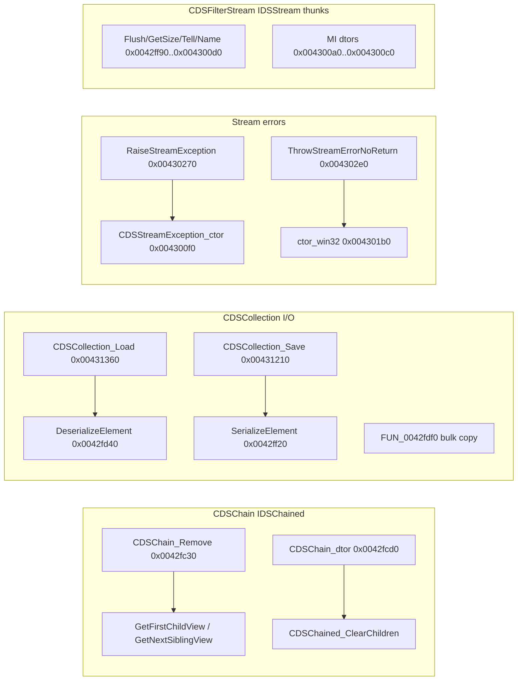

# Round 6 logic — task 24 report

## Task

| Field | Value |
|-------|-------|
| **id** | 24 |
| **title** | Logic sim_429_436: 0x0042fc30–0x004302e0 (22 funcs) |
| **range** | `sim_429_436` |
| **range_note** | 0x00429–0x00436: game state, simulation, per-frame |
| **seed_address** | — (slice task) |

## Status

**PARTIAL** — Per-function control flow and roles are documented from **prior verified** Ghidra passes (R3–R5 struct recovery, `stream_hierarchy.md`, vtable catalog). **This session:** `user-ghidra-mcp` returned `Not connected` / `Connection closed`; no live decompile, xref refresh, or `save_program` was possible. Re-run when MCP is up to re-verify names and apply any pending `this` fixes.

## Functions

| Address | Name (Ghidra) | Role summary | Evidence |
|---------|---------------|--------------|----------|
| `0x0042fc30` | `CDSChain_Remove` | `IDSChained` vtable slot [5]: drain all child views — `for` over `CDSChained_GetFirstChildView` / `GetNextSiblingView` on list head (`ECX−4` → `pFirstChild` @ `+0x8`, `dwChildCount` @ `+0x10`). | [CDSChain.md](../struct_recovery/CDSChain.md), [CDSChained.md](../struct_recovery/CDSChained.md); vtable `0x0047f6b8` slot 5 (`vftable_methods.csv`) |
| `0x0042fcd0` | `CDSChain_dtor` | 20-byte list-head teardown only: restore `g_pCDSChain_vftable_IDSReferenced` (`0x0047f6d4`) / `IDSChained` (`0x0047f6b8`), `CDSChained_ClearChildren`, final vtable `0x0047f6a8`. **Not** full `CDSChain_full` (`0xa4`) — that is `CBulanci_DestroyConfigStore`. | [round4_task_27_report.md](../struct_recovery/round4_task_27_report.md); xref disasm `LEA ECX,[ESI+0x64]` @ `CBulanci_DestroyConfigStore` |
| `0x0042fd30` | `CDSAudioBank_TypeinfoAdjust_4` | MSVC interface typeinfo adjustor: `return param_1 + 4` (event-handler subobject). Static register pushes this @ `0x0047c8a0`. | [round3_task_23_report.md](../struct_recovery/round3_task_23_report.md); [static_texts.md](../../formats/static_texts.md) |
| `0x0042fd40` | `CDSCollection_DeserializeElement` | Collection load helper: read `classId` from `IDSStream`, `InitializeByClassId`, store pointer in `m_items[index]`; per-element `Deserialize` vcall (`IDSStream` slot +0x10). Caller: `CDSCollection_Load@0x00431360`. | [CDSCollection.md](../struct_recovery/CDSCollection.md); [round4_task_17_report.md](../struct_recovery/round4_task_17_report.md) |
| `0x0042fdd1` | `Catch@0042fdd1` | MSVC **catch** slice inside deserialize/load SEH region (between `DeserializeElement` and stream pump). Parent body not re-decompiled this session. | Address band only; **UNK** catch type / landing pad |
| `0x0042fdf0` | `FUN_0042fdf0` | **IDSStream bulk copy pump:** stack buffer `0x10024` (65572 B, catalog resource id), inner loop chunk `0x10000`; copies `dataSize` bytes from source stream to dest stream via vtable Read/Write. Used by `CDSMpxStream` save (`0x00432eb0`) / load (`0x00433180`). | [mpx_audio_format.md](../../formats/mpx_audio_format.md) §4; `ghidra_xrefs.jsonl` (`MOV EAX,0x10024` @ entry) |
| `0x0042ff20` | `CDSCollection_SerializeElement` | Collection save helper: `CheckedVirtualBaseCast` then `IDSStream` **GetText** vcall (slot +0x14 / Write path). Caller: `CDSCollection_Save@0x00431210` @ `0x00431249`. | [round4_task_17_report.md](../struct_recovery/round4_task_17_report.md); [CDSCollection.md](../struct_recovery/CDSCollection.md) |
| `0x0042ff90` | `FlushStream` | `CDSFilterStream` `IDSStream` vtable slot 6: flush passthrough on filter subobject (`filter+0x0c`). | [stream_hierarchy.md](../../formats/stream_hierarchy.md) §2.1; `vftable_methods.csv` `CDSFilterStream@0x004870fc` |
| `0x0042ffa0` | `GetSize` | `CDSFilterStream` `IDSStream` slot 7: `GetSize()` delegate / window cap. | Same |
| `0x0042ffe0` | `CDSStreamException_GetClassRegistry` | `CDSStreamException` `IDSChained` slot 0: returns class registry singleton (`MOV EAX,0x004b7ce8` @ `0x0042ffe0`). | [CDSStreamException.md](../struct_recovery/CDSStreamException.md); `master_vtable_catalog.csv` |
| `0x0042fff0` | `CDSException_ReleaseViaFlag` | Shared exception slot [2]: if `bDeleteOnRelease` @ `+0x4`, run scalar deleting dtor. Used by all `CDS*Exception` chained faces. | [CDSException.md](../struct_recovery/CDSException.md) |
| `0x00430000` | `CDSStreamException_dtor` | Releases `pFormatMsg` / `pWin32Msg` / `pStreamName` (`+0x3C`..`+0x44`) via `CDsStringReleaseHeader`; restores base vtable `0x0047f6a8`. | [CDSStreamException.md](../struct_recovery/CDSStreamException.md) |
| `0x00430080` | `CDSFilterStream_GetTypeInfo` | `CDSFilterStream` `IDSReferenced` slot 0 (`0x00487150`). | `vftable_methods.csv` |
| `0x00430090` | `TellPosition` | `CDSFilterStream` `IDSStream` slot 8: tell / cursor. | [CDSFilterStream.md](../struct_recovery/CDSFilterStream.md); `stream_hierarchy.md` |
| `0x004300a0` | `CDSFilterStream_ScalarDeletingDtor_thunk_Sub14` | `CDSFilterStream` `IDSChained` slot 3: MI scalar-deleting dtor thunk (`0x004870e4`). | `master_vtable_catalog.csv` |
| `0x004300b0` | `CDSFilterStream_ScalarDeletingDtor_thunk` | `CDSFilterStream` `IDSEventHandler` slot 3 (`0x0048713c`) — **distinct** from `0x004300c0`. | `master_vtable_catalog.csv` |
| `0x004300c0` | `CDSFilterStream_ScalarDeletingDtor_thunk` | `CDSFilterStream` `IDSStream` slot 3 (`0x004870fc`). | `stream_hierarchy.md` slot 3 @ `0x004300c0` |
| `0x004300d0` | `GetStreamName` | `CDSFilterStream` `IDSStream` slot 13: name passthrough. | `vftable_methods.csv` |
| `0x004300f0` | `CDSStreamException_ctor` | `CDSStreamException *` heap `0x50`: `CDSException_InitFields(&base, 5, 7, 1)`; vtable `0x004870cc`; copies stream name from `IDSStream::GetName` (+0x34); sets `dwStreamErrno`, `GetLastError()` → `dwWin32Error`. | [round3_task_39_report.md](../struct_recovery/round3_task_39_report.md) |
| `0x004301b0` | `CDSStreamException_ctor_win32` | Same layout; `dwWin32Error = param_3` (explicit Win32 code). | [CDSStreamException.md](../struct_recovery/CDSStreamException.md) |
| `0x00430270` | `RaiseStreamException` | Engine errno path: `OperatorNew(0x50)` → `CDSStreamException_ctor` → C++ throw helper (`PUSH 0x004aaa70`). Called from every `IDSStream` slot on I/O failure (no Win32 code). | [stream_hierarchy.md](../../formats/stream_hierarchy.md) §1; [batch_36_summary.md](../struct_recovery/batch_36_summary.md) |
| `0x004302e0` | `ThrowStreamErrorNoReturn` | Win32 errno path: same alloc/ctor_win32 + throw helper. | Same |

### Control-flow clusters

## Ghidra deltas

**none this session** — MCP unavailable. Prior workers already applied (no re-application needed unless MCP shows drift):

| Prior action | Target | Source |
|--------------|--------|--------|
| `set_function_prototype` | `CDSChain_dtor@0x0042fcd0` | R4 task 27 |
| `set_function_this_type` | `CDSCollection_FindKeyIndex`, `CDSCollection_InsertKeyed` (ECX limits noted) | R3/R4 collection passes |
| `set_function_this_type` | `CDSStreamException_ctor` / `_ctor_win32` | R3 task 39 |
| Comments | `CDSCollection_SerializeElement` / `DeserializeElement` vcall notes | R4 task 17 |

**Suggested on reconnect (only if decompiler still wrong):**

- `set_function_this_type` `CDSChain *` on `CDSChain_Remove@0x0042fc30` if ECX shows wrong type (MI head uses `this−4`).
- Rename `FUN_0042fdf0` only after disasm proves signature (e.g. two `IDSStream *`, `DWORD cb`, progress callback) — do not guess from mpx doc alone.
- Plate comment on `Catch@0042fdd1` once parent `CDSCollection_DeserializeElement` SEH range is confirmed.

## Frida

**none** — behavior is structurally proven (vtable slots, alloc sizes, mpx save/load call chain). Runtime only needed if `Catch@0042fdd1` or `FUN_0042fdf0` formal prototype must be validated under real `.mpx` load.

## Remaining UNK

| Item | Why still open |
|------|----------------|
| `Catch@0042fdd1` | Catch handler type and exact SEH parent not re-verified (no MCP decompile). |
| `FUN_0042fdf0` symbol + prototype | Bulk-copy role proven from `mpx_audio_format.md` + insn constants; Ghidra name still `FUN_*`; full parameter list not disasm-proven this session. |
| `CDSCollection_InsertKeyed` decompiler header | Known ECX auto-parameter limitation (R4 todo 43) — may still show wrong `this` type in UI. |
| Live Ghidra re-verify | Band addresses/names assumed current per manifest; MCP down prevented `batch_decompile` confirmation. |

## Evidence paths consulted

- [ROUND6_LOGIC_PROTOCOL.md](../ROUND6_LOGIC_PROTOCOL.md)
- [struct_recovery/AGENT_PROTOCOL.md](../struct_recovery/AGENT_PROTOCOL.md)
- [struct_recovery/CDSChain.md](../struct_recovery/CDSChain.md), [CDSCollection.md](../struct_recovery/CDSCollection.md), [CDSStreamException.md](../struct_recovery/CDSStreamException.md), [CDSFilterStream.md](../struct_recovery/CDSFilterStream.md)
- [formats/stream_hierarchy.md](../../formats/stream_hierarchy.md), [formats/mpx_audio_format.md](../../formats/mpx_audio_format.md)
