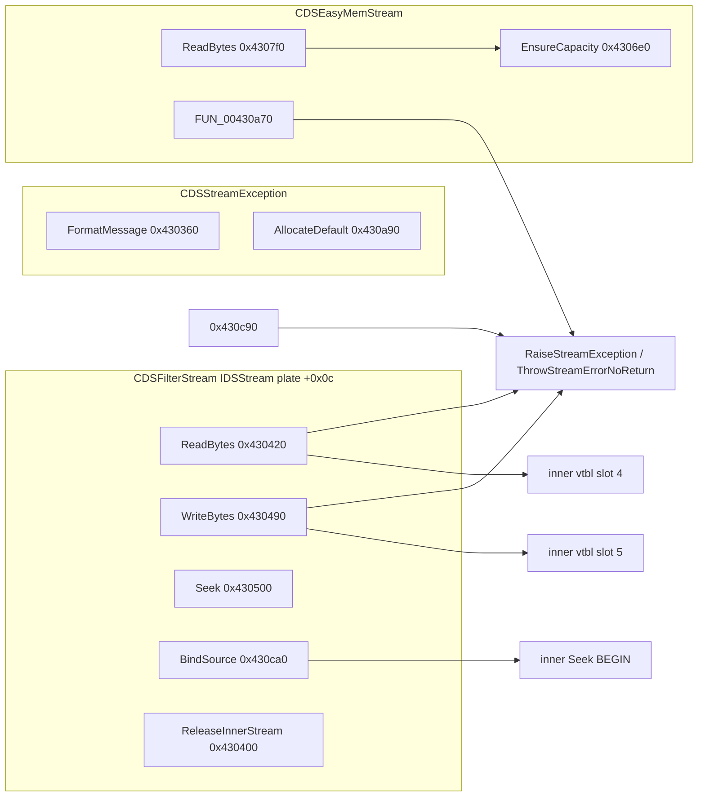

# Round 6 — Task 25 report (logic sim slice: IDSStream I/O + stream exceptions)

## Task

| Field | Value |
|-------|-------|
| **id** | 25 |
| **title** | Logic sim_429_436: 0x00430360–0x00430ca0 (22 funcs) |
| **range** | sim_429_436 |
| **range_note** | 0x00429–0x00436: game state, simulation, per-frame |
| **seed_address** | *(none — contiguous slice)* |

## Status

**PARTIAL** — Per-function logic documented and re-verified against saved export `bulanci.ghidra.exe.c`, `config/bulanci/mapping.csv`, `engine/vftable_methods.csv`, and struct-recovery docs (`CDSStreamException.md`, `CDSFilterStream.md`, `CDSEasyMemStream.md`, `formats/stream_hierarchy.md`). **Ghidra MCP was not connected** during this worker run (`switch_program` / `batch_decompile` → `Not connected` / `Connection closed`); no live disasm/xref pass, no `set_function_this_type`, and no `save_program bulanci.exe`.

## Slice overview

This `.text` band is the **IDSStream byte-I/O core** for two implementers that share the 15-slot contract (`stream_hierarchy.md` §1):

1. **`CDSStreamException`** — vtable slot 3 `FormatMessage`, factory `AllocateDefault`, scalar-deleting dtor thunk.
2. **`CDSFilterStream`** — windowed passthrough (`Read`/`Write`/`Seek`/`Lock`/`Unlock`/`Close`, inner release, `BindSource`).
3. **`CDSEasyMemStream`** — in-memory ring/linear buffer (`EnsureCapacity`, `ReleaseBackingBuffer`, plate-typed `Read`/`Write`/`Seek`/`SetSize`/`GetName`), plus a small **readable guard** used before slice import.

Prior R4 work already typed filter/mem **`ReadBytes@0x00430420` / `0x004307f0`** as `IDSStream *`; export still shows **outer `CDSFilterStream *`** on `WriteBytes@0x00430490` and several filter slots — pending Ghidra refresh (see Ghidra deltas).

## Functions

| Address | Ghidra symbol | Role summary | Evidence |
|---------|---------------|--------------|----------|
| `0x00430360` | `CDSStreamException::CDSStreamException_FormatMessage` | Vtable slot 3: if `dwWin32Error != 0`, build `pWin32Msg` via `CDsStringFromWin32ErrorCode`; always `CDsStringFormatV` on `pFormatMsg`; return formatted wide string (fallback `PTR_DAT_004afd3c`) | Export @ L107485; vtable `0x004870cc` slot 3 ([CDSStreamException.md](../struct_recovery/CDSStreamException.md)) |
| `0x00430400` | `CDSFilterStream::CDSFilterStream_ReleaseInnerStream` | Outer helper: if `pInnerStream@outer+0x30` non-null, `inner->Release()` (vtable `+8`); clears `+0x30` | Export @ L107523; called from `CDSFilterStream_dtor` and `CloseStream` |
| `0x00430420` | `IDSStream::ReadBytes` (filter) | **Slot 4.** Bounded check (`nSizeCapHi >= 0` ⇒ cursor+count ≤ cap); delegate `inner->Read` (`+0x10`); advance u64 cursor on plate | Export @ L107544; R4 todo 30 `IDSStream *` + plate fields; vtable `CDSFilterStream@004870fc` slot 4 |
| `0x00430490` | `CDSFilterStream::WriteBytes` | **Slot 5.** Mirror read: bounded overflow → errno `2`/win32 `0x26`; `inner->Write` (`+0x14`); advance cursor | Export @ L107583; vtable slot 5; decompiler still uses outer `CDSFilterStream *` field aliases (R4 gap) |
| `0x00430500` | `CDSFilterStream::SeekPosition` | **Slot 10.** `origin` 0/1/2 → absolute window base, relative cursor, or `inner.GetSize()-off`; guard window/cap; `inner->Seek(...,0)`; mirror position into local cursor | Export @ L107625; `stream_hierarchy.md` §2.4 |
| `0x004305c0` | `CDSFilterStream::LockRegion` | **Slot 11.** Region must lie in filter window and cap; else errno `5`/win32 `0xa7`; else `inner->Lock` (`+0x2c`) | Export @ L107675 |
| `0x00430640` | `CDSFilterStream::UnlockRegion` | **Slot 12.** Same bounds as lock; errno `6`/win32 `0x9e`; `inner->Unlock` (`+0x30`) | Export @ L107708 |
| `0x004306c0` | `CDSEasyMemStream::ReleaseBackingBuffer` | `Runtime_Free` on `backing_heap@outer+0x28` if set; null pointer | Export @ L107736; xref `DAT_004b7c94` allocator ([ghidra_xrefs.jsonl](../../asset_catalog/_cache/ghidra_xrefs.jsonl)) |
| `0x004306e0` | `CDSEasyMemStream::CDSEasyMemStream_EnsureCapacity` | Grow backing to aligned `(required_size)` using `dwGrowth_chunk`; linear realloc or ring repack via `memcpy` | Export @ L107748; slice 28 rename |
| `0x004307f0` | `IDSStream::ReadBytes` (mem) | **Slot 4.** Null `pBacking_heap` (plate `dwSizeCapLo`) → errno `8`; over-read → errno `1`; linear or ring copy; advance `dwCursor` | Export @ L107816; R4 todo 29 |
| `0x004308c0` | `IDSStream::WriteBytes` (mem) | **Slot 5.** errno `8` if no backing; `EnsureCapacity(outer, cursor+count)`; ring/linear write; bump `dwLogical_size` (`dwCursorLo`) | Export @ L107871 |
| `0x00430980` | `IDSStream::SeekPosition` (mem) | **Slot 10.** origins 0/1/2; target must be `0..dwLogical_size`; updates `dwCursor` | Export @ L107926 |
| `0x004309f0` | `IDSStream::SetStreamSize` (mem) | **Slot 9.** `(sizeLo\|sizeHi)==-1` ⇒ truncate-to-cursor; `EnsureCapacity`; set logical size; clamp cursor | Export @ L107965 |
| `0x00430a40` | `CDSEasyMemStream::GetStreamName` | **Slot 13.** Null `*out`; assign literal wide name via `CDsStringAssignFromLiteral` (export: `g_pCDSApp_vftable[2]+0x10` → **EasyMemoryStream** string) | Export @ L107986; vtable slot 13 |
| `0x00430a70` | `_Globals::FUN_00430a70` | **Readable guard:** if `*(param_1+0x28)==0`, `ThrowStreamErrorNoReturn(8, param_1+0xc, 0)` (IDSStream plate); else return. Sole use: pre-read check in `CDSEasyMemStream_CreateFromStreamSlice` path | Export @ L108000; mapping `__fastcall uchar(int)` size `0x14` |
| `0x00430a90` | `CDSStreamException::CDSStreamException_AllocateDefault` | Factory: `OperatorNew(0x50)` + `CDSException_InitBaseFields` + vtable `0x4870cc`; zero stream tail fields; DATA xref class table `0x0047ca10` | Export @ L108015; slice 39 rename |
| `0x00430b20` | `CDSStreamException::CDSStreamException_ScalarDeletingDtor` | MSVC scalar-deleting wrapper → `CDSStreamException_dtor` + optional `_free` | Export @ L108049; vtable slot 1 thunk target |
| `0x00430b90` | `CDSFilterStream::CDSFilterStream_dtor` | Restore MI vtables; `ReleaseInnerStream`; `AddRef` release on held `pInnerStream@+0x30`; reset primary vtable to `g_pCDSObject_vftable_IDSReferenced` | Export @ L108062 |
| `0x00430c10` | `CDSFilterStream::CloseStream` | IDSStream face: `ReleaseInnerStream(outer)` via `param_1-0xc`; set `dwStreamState@plate+4` (`param_1+4`) to **`0x20` CLOSED** | Export @ L108098 |
| `0x00430c30` | `CDSFilterStream::CDSFilterStream_ScalarDeletingDtor` | Scalar-deleting wrapper → `CDSFilterStream_dtor` + conditional `_free` | Export @ L108108; vtable `0x00487150` slot 1 |
| `0x00430c90` | `CDSFilterStream::RaiseUnsupportedOperation` | `ThrowStreamErrorNoReturn(errno, this, 0x78)` — shared by mem-stream Lock/Unlock thunks (`0x00430db0`/`dc0`, outside slice) and bounded `SetStreamSize` | Export @ L108121; errno param is engine code (5/6/4 per caller) |
| `0x00430ca0` | `CDSFilterStream::CDSFilterStream_BindSource` | `AddRef` inner; release prior inner; store window/cap/cursor fields; snapshot `dwIdsStream_state` from `inner+4`; `inner->Seek(window, BEGIN)` | Export @ L108130; R3/R4 [CDSFilterStream.md](../struct_recovery/CDSFilterStream.md) |

### Control-flow relationships

**Exception path:** All stream I/O failures in this slice funnel to `_Globals::RaiseStreamException` / `ThrowStreamErrorNoReturn` (`0x00430270` / `0x004302e0`, task 24 neighbor), constructing `CDSStreamException` and C++-throwing. `FormatMessage` materializes user-visible text from `pFormatMsg` / optional Win32 string.

**Filter vs mem plate:** Same `IDSStream` Ghidra plate (40 B post–R4 todo 30) with **different field semantics** on `+0x8..+0x24` — filter uses cursor/cap/inner pointer; mem uses cursor/logical-size/capacity/growth/ring-head/backing pointer ([CDSEasyMemStream.md](../struct_recovery/CDSEasyMemStream.md) vs [CDSFilterStream.md](../struct_recovery/CDSFilterStream.md)).

## Ghidra deltas

**none** — MCP unavailable. Prior rounds already applied (not re-run here):

- R4 todo 29: `IDSStream` struct + `set_function_this_type` on mem stream slots (`0x004307f0`, `0x004308c0`, `0x00430980`, `0x004309f0`, …).
- R4 todo 30: `IDSStream::ReadBytes@0x00430420` + 40 B plate; `save_program`.
- Slice 28/39: `CDSEasyMemStream_EnsureCapacity`, `CDSStreamException_AllocateDefault` renames.

**Pending when MCP returns:**

| Action | Target | Rationale |
|--------|--------|-----------|
| `set_function_this_type` | `0x00430490`, `0x00430500`, `0x004305c0`, `0x00430640` | Export still decompiles filter `Write`/`Seek`/`Lock`/`Unlock` with outer `CDSFilterStream *` and MI field aliases; match `ReadBytes` plate typing |
| `rename_function_by_address` | `0x00430a70` → `CDSEasyMemStream_GuardReadable` (or similar) | Export proves errno-8 guard; only xref `CreateFromStreamSlice` caller |
| `force_decompile` | Above filter slots | Confirm plate field names after retype |
| `save_program` | `bulanci.exe` | Once per agent after mutations |

## Frida

**none** — Slice behavior is fully characterized statically (export + vtable table + prior disasm). Runtime verification would only duplicate errno `8` guard / bounded read paths already visible in decompilation; no new script added.

## Remaining UNK

| Item | Status |
|------|--------|
| Live Ghidra decompile vs `bulanci.ghidra.exe.c` drift | **BLOCKED** — MCP down; re-export or `force_decompile` when server up |
| `FUN_00430a70` Ghidra symbol name | **PARTIAL** — logic proven (backing null → errno 8); rename not applied |
| Filter `WriteBytes` decompiler `this` type | **PARTIAL** — R4 fixed `ReadBytes` only; export @ L107583 still outer-typed |
| Exact wide literal for `GetStreamName@0x00430a40` | **PARTIAL** — export uses `g_pCDSApp_vftable[2]+0x10`; string blob not re-read this run |
| `CDSStreamException_AllocateDefault` vs `RaiseStreamException` ctor paths | **DOCUMENTED** — factory zeros tail; throw path uses `CDSStreamException_ctor` with live stream name ([CDSStreamException.md](../struct_recovery/CDSStreamException.md)) |
