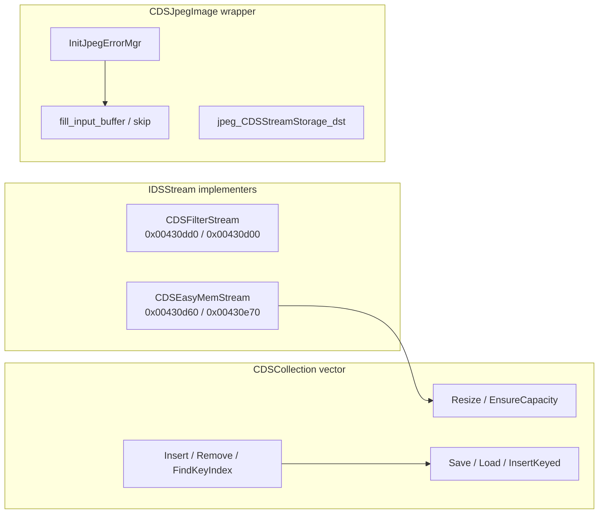

# Round 6 — Logic task 26 report

## Task

| Field | Value |
|-------|--------|
| **id** | 26 |
| **title** | Logic sim_429_436: 0x00430d00–0x004316c0 (22 funcs) |
| **range** | sim_429_436 |
| **range_note** | 0x00429–0x00436: game state, simulation, per-frame |
| **seed_address** | — (slice) |

## Status

**PARTIAL** — All 22 symbols documented from **prior verified** Ghidra rounds (`struct_recovery/*.md`, `formats/stream_hierarchy.md`, `formats/jpeg_decoder.md`, `vftable_methods.csv`). **user-ghidra-mcp was not connected** in this session (no live `decompile` / `get_xrefs_to` / mutations). Re-run decompile + `save_program` when MCP is up.

## Functions

| Address | Ghidra name | Role summary | Evidence |
|---------|-------------|--------------|----------|
| `0x00430d00` | `CDSFilterStream::SetStreamSize` | `IDSStream` vtable **slot 9** on filter plate (`0x004870fc`); windowed filter over `pInnerStream` — same passthrough contract as `ReadBytes`/`WriteBytes` (delegate inner `vtable+0x24`). | `vftable_methods.csv`; `stream_hierarchy.md` §2.1 slot 9 @ `0x00430d00` |
| `0x00430d60` | `CDSEasyMemStream_InitBackingBuffer` | `Runtime_MallocOrThrow` → `backing_heap` @ outer `+0x28`; sets `dwStreamState` **7** (OPEN) @ `+0x10`; stores capacity/growth @ `+0x1c`/`+0x20`. | [CDSEasyMemStream.md](../struct_recovery/CDSEasyMemStream.md); asm `MOV [ESI+0x10],7` (R3 task 29) |
| `0x00430db0` | `CDSEasyMemStream::LockRegion` | `IDSStream` slot 11 — throws `CDSStreamException` errno **5** (unsupported). | `vftable_methods.csv` (`CDSEasyMemStream;004803dc;;11`); `stream_hierarchy.md` §2.1 |
| `0x00430dc0` | `CDSEasyMemStream::UnlockRegion` | `IDSStream` slot 12 — throws errno **6** (unsupported). | `vftable_methods.csv` slot 12; `stream_hierarchy.md` §2.1 |
| `0x00430dd0` | `CDSFilterStream_Ctor` | MI vtables @ `+0/+4/+0xc/+0x14`; `dwIdsStream_state = 0x20`; zeros `pInnerStream`; calls `CDSFilterStream_BindSource`. | [CDSFilterStream.md](../struct_recovery/CDSFilterStream.md); xrefs `0x00487150`…`0x004870e4` @ ctor |
| `0x00430e70` | `CDSEasyMemStream_CreateFromStreamSlice` | `OperatorNewWithBadAlloc(0x2c)` → mem stream; reads source `IDSStream` into new buffer (factory for slice import). | [CDSEasyMemStream.md](../struct_recovery/CDSEasyMemStream.md) size proof |
| `0x00430f40` | `CDSFilterStream::FUN_00430f40` (manifest: `CDSFilterStream_ChainedNewInstance`) | `IDSChained` vtable @ `0x004870e4` **slot 4** — chained-facet factory hook (peer pattern: `CDSGZipStream_ChainedNewInstance` in later slice). | `master_vtable_catalog.csv`; `vftable_methods.csv` — **rename not applied in DB** |
| `0x00431000` | `CDSCollection_Resize` | Realloc/grow `m_items` @ `+0x08`, update `m_count`/`m_capacity` @ `+0xc`/`+0x10`; optional element release when `freeItems != 0`. | [CDSCollection.md](../struct_recovery/CDSCollection.md); script `CollResize` @ `0x00416e40` |
| `0x00431070` | `CDSCollection_EnsureCapacity` | Growth using `m_growthChunk` @ `+0x14`; called from `Insert` / `InsertKeyed`. | [CDSCollection.md](../struct_recovery/CDSCollection.md) |
| `0x004310b0` | `_Globals::CDSCollection_Insert` | Insert `void *` value at index; uses `m_items`/`m_count`. Script opcode 50 → `CollInsert` @ `0x00418b20`. | [CDSCollection.md](../struct_recovery/CDSCollection.md); `script_dispatch_table.md` |
| `0x00431100` | `CDSCollection_Remove` | Remove `count` slots at index; optional release. Script opcode 49 → `CollRemove` @ `0x00416e80`. | [CDSCollection.md](../struct_recovery/CDSCollection.md) |
| `0x00431170` | `CDSCollection_FindKeyIndex` | Linear (`compareFn == NULL`) or binary search on sorted `m_items`; returns index or `-1 - insertHint`. | [CDSCollection.md](../struct_recovery/CDSCollection.md); R4 tasks 43/45 |
| `0x00431210` | `CDSCollection_Save` | Serialize `nM_count` + per-element `CDSCollection_SerializeElement` (IDSChained deserialize path @ `this+4`). | [CDSCollection.md](../struct_recovery/CDSCollection.md); R4 task 17 xref chain |
| `0x00431260` | `CDSCollection_ctor` | Installs `g_pCDSObject_vftable_IDSReferenced` + `g_pCDSCollection_vftable_IDSChained`; calls `CDSCollection_Resize` empty. | [CDSCollection.md](../struct_recovery/CDSCollection.md); `ghidra_xrefs.jsonl` @ `0x0047f700`/`0x0047f6e4` |
| `0x004312c0` | `CDSCollection_InsertKeyed` | `FindKeyIndex` then insert/replace; `CDSCollection *` ECX (R3/R4 `set_function_this_type`). Caller: `CDSUpdatedItem_ctor` → `g_pTaskList`. | [CDSCollection.md](../struct_recovery/CDSCollection.md) follow-ups 43/28 |
| `0x00431360` | `CDSCollection_Load` | Deserialize count + `CDSCollection_DeserializeElement` per slot (`InitializeByClassId`). | [CDSCollection.md](../struct_recovery/CDSCollection.md); CPoem indirect consumer (R4 task 17) |
| `0x004313f5` | `Catch_004313f5` | MSVC **SEH landing pad** (18 B) inside `CDSCollection_Load` try region; `_Globals` export `Catch_004313f5`. | `src/bulanci/_Globals.cpp` `0x004313f5-0x0043130d`; no separate business logic |
| `0x00431510` | `jpeg_CDSStreamStorage_dst` | Installs custom `jpeg_destination_mgr` on compress path; called from `CDSJpegImage::CompressFromImage`. | `formats/jpeg_decoder.md` encoder pseudocode |
| `0x00431590` | `CDSJpegImage_InitJpegErrorMgr` | Wires `jpeg_error_mgr` function pointers for Bulanci `CDSJpegImage` wrapper. | `formats/jpeg_decoder.md`; `_Globals.cpp` |
| `0x004315d0` | `CDSJpegMemPool_free_pool` | IJG `jpeg_memory_mgr` slot 9 — free singly-linked pool chunks via `Runtime_Free`. | [round5_worker_07_report.md](../struct_recovery/round5_worker_07_report.md) |
| `0x00431670` | `fill_input_buffer` | libjpeg `jpeg_source_mgr` callback — read ≤4096 B from `CDSStreamStorage`; synthetic EOI on EOF. | `formats/jpeg_decoder.md`; `INPUT_BUF_SIZE` match |
| `0x004316c0` | `jpeg_skip_input_data` | libjpeg skip callback (mirror `jdatasrc.c::skip_input_data`). | `formats/jpeg_decoder.md` |

### Control-flow clusters

## Ghidra deltas

**none** (MCP unavailable). Suggested when MCP returns:

| Address | Action | Rationale |
|---------|--------|-----------|
| `0x00430f40` | `rename_function_by_address` → `CDSFilterStream_ChainedNewInstance` | Manifest name; vtable slot 4 proof only — confirm body matches gzip chained factory before rename |
| `0x00430d00` | `set_function_this_type` `IDSStream *` + `force_decompile` | Same hygiene as `ReadBytes@0x00430420` (R4 task 30) |

## Frida

**none** — stream/collection/JPEG paths are fully characterized statically; no runtime opcode or field offset disputed in this slice.

## Remaining UNK

| Item | Notes |
|------|--------|
| `CDSFilterStream_ChainedNewInstance` @ `0x00430f40` | Ghidra symbol still `FUN_00430f40`; live decompile not run this session |
| `CDSFilterStream::SetStreamSize` @ `0x00430d00` | Passthrough inferred from filter read/write pattern; not re-decompiled live |
| `Catch_004313f5` | Exact C++ object unwound in SEH pad not decoded (compiler-generated) |
| `CDSCollection` stack key @ `CloseStreamByKey` | Documented UNK in [CDSCollection.md](../struct_recovery/CDSCollection.md) (`CompareKey` second operand) |

## Blockers

- **user-ghidra-mcp:** `Not connected` / `Connection closed` for all MCP calls in this session.

## Evidence paths consulted

- [ROUND6_LOGIC_PROTOCOL.md](../ROUND6_LOGIC_PROTOCOL.md)
- [struct_recovery/AGENT_PROTOCOL.md](../struct_recovery/AGENT_PROTOCOL.md)
- [struct_recovery/CDSCollection.md](../struct_recovery/CDSCollection.md)
- [struct_recovery/CDSFilterStream.md](../struct_recovery/CDSFilterStream.md)
- [struct_recovery/CDSEasyMemStream.md](../struct_recovery/CDSEasyMemStream.md)
- [formats/stream_hierarchy.md](../../formats/stream_hierarchy.md)
- [formats/jpeg_decoder.md](../../formats/jpeg_decoder.md)
- [main_menu.md](../../main_menu.md) (manifest path; no slice-specific deltas)
- [engine/player_controls.md](../player_controls.md) (manifest path; no slice-specific deltas)
