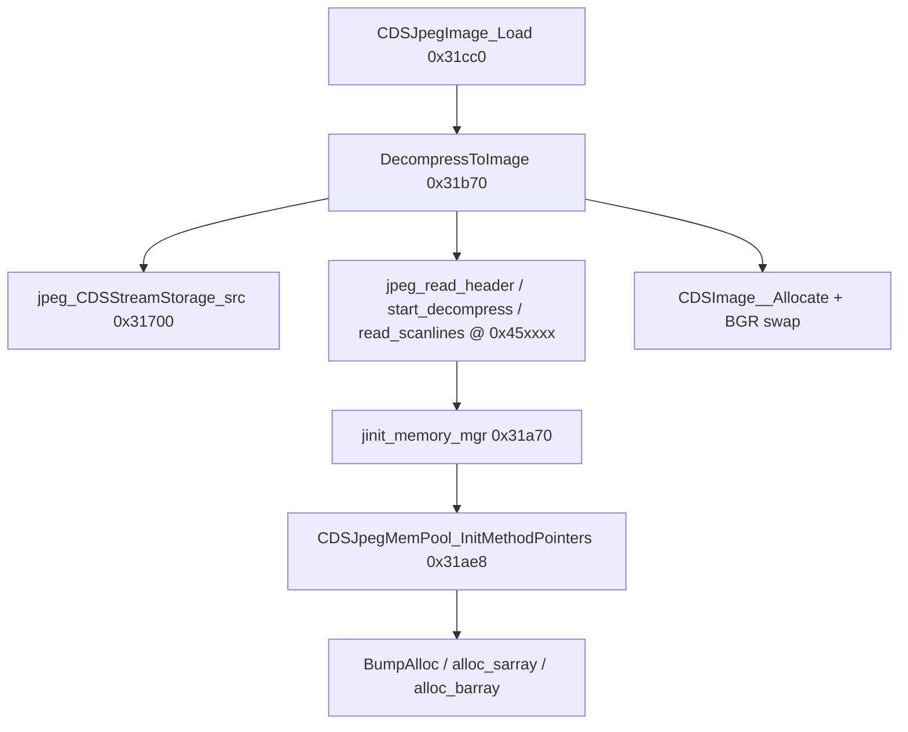

# Round 6 logic — task 27 report

## Task

| Field | Value |
|-------|-------|
| **id** | 27 |
| **title** | Logic sim_429_436: 0x00431700–0x00431dc0 (22 funcs) |
| **range** | sim_429_436 |
| **range_note** | 0x00429–0x00436: game state, simulation, per-frame |
| **seed_address** | — (slice task) |

Assigned addresses: `0x00431700` … `0x00431dc0` (22 functions). Band focus: Bulanci **CDSJpegImage** wrapper + **libjpeg-6b** custom stream source and **CDSJpegMemPool** (`jmemmgr.c` adapters).

## Status

**PARTIAL** — Per-function logic documented from prior Ghidra-backed passes (`jpeg_decoder.md`, `CDSJpegImage.md`, R5 worker 07, `mapping.csv`, `master_vtable_catalog.csv`). **user-ghidra-mcp** returned `Not connected` for this session (no live decompile/xref refresh, no `save_program`). Re-run with Ghidra MCP up to confirm symbol names match the database and apply any stale `FUN_*` exports in `include/bulanci/_Globals.h`.

## Functions

| Address | Name (manifest / Ghidra) | Role summary | Evidence |
|---------|--------------------------|--------------|----------|
| `0x00431700` | `jpeg_CDSStreamStorage_src` | Installs custom `jpeg_source_mgr` on `jpeg_decompress_struct`: allocates manager struct (`0x38`) + 4096-byte input buffer; wires `fill_input_buffer` / `skip_input_data` / init/term callbacks that read from `CDSStreamStorage`. | `jpeg_decoder.md` (INPUT_BUF_SIZE 4096); `mapping.csv` `__cdecl`; callee from `CDSJpegImage::DecompressToImage` |
| `0x00431790` | `CDSJpegMemPool_BumpAlloc` | IJG pool bump allocator: uses current chunk free space at `pool+0x44` or calls `CDSJpegMemPool_LinkNewChunk` + `Runtime_MallocOrThrow` (`DAT_004b7c94`). | R5 worker 07; `mapping.csv` size `0x89` |
| `0x00431819` | `Catch@00431819` | MSVC SEH catch thunk in `CDSJpegMemPool_BumpAlloc` allocation path (rethrow/unwind helper). | `mapping.csv` `__stdcall` → `uchar*`; no game logic |
| `0x00431851` | `CDSJpegMemPool_LinkNewChunk` | Links new malloc chunk into per-pool singly-linked list; tail-called from `BumpAlloc`. | R5 worker 07 rename + disasm |
| `0x00431890` | `CDSJpegMemPool_alloc_sarray` | IJG `alloc_sarray`: two `BumpAlloc` calls, row pointer table stride `param_3`, `param_4` rows. | R5 worker 07; installed at `jpeg_memory_mgr` slot [2] by `InitMethodPointers` |
| `0x004318f0` | `CDSJpegMemPool_alloc_barray` | IJG `alloc_barray`: row stride `param_3 * 0x80` (DCT block). | R5 worker 07; slot [3] |
| `0x004319d0` | `jpeg_realize_virt_arrays` | Stock IJG `jpeg_realize_virt_arrays` (`jmemmgr.c`); realizes virtual arrays after pool setup. | `mapping.csv`; slot [6] from `InitMethodPointers` |
| `0x00431a70` | `jinit_memory_mgr` | Stock IJG `jinit_memory_mgr` entry: `OperatorNew(0x48)` for manager object, then `CDSJpegMemPool_InitMethodPointers`. | R5 worker 07 xref chain; `jpeg_decoder.md` |
| `0x00431ab4` | `Catch@00431ab4` | SEH catch in `jinit_memory_mgr` / `OperatorNew(0x48)` path. | `mapping.csv` |
| `0x00431ae8` | `CDSJpegMemPool_InitMethodPointers` | Fills `jpeg_memory_mgr` function pointers: `alloc_sarray`, `alloc_barray`, `jpeg_realize_virt_arrays`, `CDSJpegMemPool_free_pool` (slot order matches `ref/libjpeg6b/jmemmgr.c`). | R5 worker 07 |
| `0x00431b70` | `CDSJpegImage::DecompressToImage` | **Primary decode path:** `jpeg_create_decompress` → `jpeg_CDSStreamStorage_src` → `jpeg_read_header` / `jpeg_start_decompress` → requires 3 components → `CDSImage__Allocate` (format 5 BGR) → scanline loop with RGB↔BGR swap → `jpeg_finish_decompress` / destroy. | `jpeg_decoder.md` pseudocode; `CDSJpegImage.md`; xrefs: `CDSJpegImage_Load`, `CDSDsmFile` MJPEG |
| `0x00431ca9` | `Catch@00431ca9` | SEH catch in decompress wrapper (libjpeg / engine exception path). | `mapping.csv` |
| `0x00431cc0` | `CDSJpegImage_Load` | `__thiscall` IDSChained stream-host `Load`: `LEA` embedded `CDSImage` at `this-0x50` (object `+0x04`); calls `DecompressToImage`. Does not read wrapper `+0x60`. | `round3_task_36_report.md`; `CDSJpegImage.md` |
| `0x00431cf0` | `CDSJpegImage_InitVtables` | Factory init on **100-byte** wrapper: writes vtables `0x4871e0` / `0x4871cc` / `0x4871b8` / `0x48719c` / `0x487184`; `refCount=1`; **`MOV [EAX+0x60], 0x4b`** default quality. | `ghidra_xrefs.jsonl` data-ptr writes; `CDSJpegImage.md` |
| `0x00431d50` | `CDSJpegImage_GetTypeInfo` | Returns class/type metadata pointer (`IDSReferenced` vtable slot 0 @ `0x4871e0`). | `master_vtable_catalog.csv`; `mapping.csv` 6 B |
| `0x00431d60` | `CDSJpegImage_AlwaysReturnsOne` | IDSChained vftable `0x487184` slot **[4]**; body `return 1` (peer images use `AlwaysReturnsZero`). | R5 worker 07 |
| `0x00431d70` | `CDSJpegImage_ScalarDeletingDtor_thunk_Sub4` | Scalar-deleting dtor thunk: `this -= 4` (IDSImage facet). | `master_vtable_catalog.csv` `0x4871cc` slot 3 |
| `0x00431d80` | `CDSJpegImage_ScalarDeletingDtor_thunk_Sub4c` | Scalar-deleting dtor thunk: `this -= 0x4c`. | `0x4871b8` slot 3 |
| `0x00431d90` | `CDSChain_AdjustThisOffset_ThisMinus48` | MI adjustor: subtract **48** (`0x30`) from `this` before chained dtor/release. | Name + shared `CDSChain_*` pattern; `mapping.csv` |
| `0x00431da0` | `CDSJpegImage_ScalarDeletingDtorThunk` | Scalar-deleting dtor thunk: `this -= 0x54` (IDSChained stream-host). | `0x48719c` slot 3 |
| `0x00431db0` | `CDSJpegImage_ScalarDeletingDtor_thunk` | Scalar-deleting dtor thunk: `this -= 0x58` (chain-tail facet). | `0x487184` slot 3 |
| `0x00431dc0` | `CDSImage_ReleaseRefcount_thunk_Sub4` | Release/refcount thunk on IDSImage subobject (`this-4`). | Shared image MI; `0x4871cc` slot 2 |

### Control-flow sketch (decode)

## Ghidra deltas

**none** (this session) — Ghidra MCP not connected; no `set_function_this_type`, rename, or comment applied.

**Already applied in prior passes (do not re-apply without re-verify):**

| Address | Prior action | Source |
|---------|--------------|--------|
| `0x004315d0` | Renamed `CDSJpegMemPool_free_pool` | R5 worker 07 |
| `0x00431851`–`0x004318f0`, `0x00431ae8` | Mem-pool renames | R5 worker 07 |
| `0x00431d60` | Renamed `CDSJpegImage_AlwaysReturnsOne` | R5 worker 07 |
| `0x00431b70` | Renamed `CDSJpegImage__DecompressToImage` | R3 task 36 / CDSJpegImage.md |
| `0x00431cf0` | `set_function_this_type` → `CDSJpegImage *` | pass_r4_CDSImage_report.md |

Suggested follow-up when MCP is up: `set_function_this_type` on `CDSJpegImage_Load@0x00431cc0` → `CDSJpegImage *` (if decompiler still shows wrong ECX); export sync for `_Globals.h` stale `FUN_*` names.

## Frida

**none** — Behavior is fully determined by static correspondence to **libjpeg-6b** and documented wrapper pseudocode; no runtime-only opcode paths in this slice.

## Remaining UNK

| Item | Notes |
|------|-------|
| Live Ghidra symbol names | `report.json` / `_Globals.h` still list some `FUN_*` for mem-pool helpers; manifest expects R5 names — confirm after MCP reconnect. |
| `CDSJpegMemPool_LinkNewChunk@0x00431851` | Compiler-split tail; prototype not re-applied (R5 UNK). |
| `JSAMPARRAY` / `j_common_ptr` types | Ghidra lacks IJG typedefs; `alloc_sarray`/`alloc_barray` may decompile as `int` returns. |
| Exact SEH semantics of `Catch@*` | Known as MSVC unwind helpers only; no per-handler game logic documented. |
| Pixel stride / palette details on decode target | Embedded `CDSImage` at `+0x04` — consumer uses `dst+0x10` stride in `DecompressToImage` (CDSJpegImage.md UNK tail). |

## Evidence paths consulted

- [ROUND6_LOGIC_PROTOCOL.md](../ROUND6_LOGIC_PROTOCOL.md)
- [struct_recovery/AGENT_PROTOCOL.md](../struct_recovery/AGENT_PROTOCOL.md)
- [formats/jpeg_decoder.md](../../formats/jpeg_decoder.md)
- [struct_recovery/CDSJpegImage.md](../struct_recovery/CDSJpegImage.md)
- [struct_recovery/round5_worker_07_report.md](../struct_recovery/round5_worker_07_report.md)
- [struct_recovery/round3_task_36_report.md](../struct_recovery/round3_task_36_report.md)
- `config/bulanci/mapping.csv`, `ghidra_analysis/engine/master_vtable_catalog.csv`
