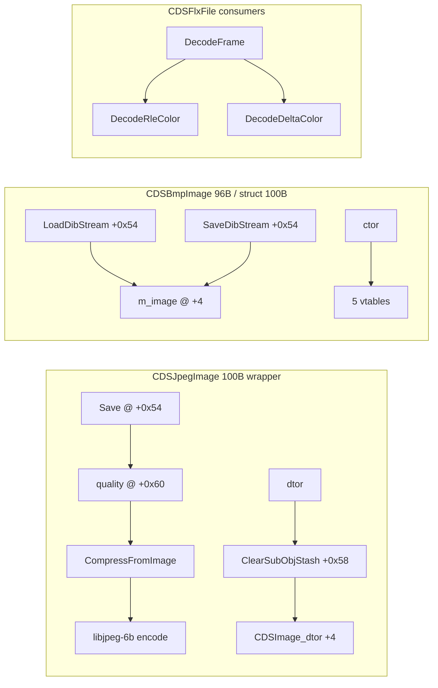

# Round 6 logic — task 28 report

## 1. Task

| Field | Value |
|-------|--------|
| **id** | 28 |
| **title** | Logic sim_429_436: 0x00431dd0–0x00432780 (22 funcs) |
| **range** | `sim_429_436` |
| **range_note** | 0x00429–0x00436: game state, simulation, per-frame |
| **seed_address** | — (slice task) |

**Addresses:** `0x00431dd0` … `0x00432780` (JPEG/BMP image codecs, refcount MI, FLX RLE helpers).

**Evidence paths:** [ROUND6_LOGIC_PROTOCOL.md](../ROUND6_LOGIC_PROTOCOL.md), [AGENT_PROTOCOL.md](../struct_recovery/AGENT_PROTOCOL.md), [CDSJpegImage.md](../struct_recovery/CDSJpegImage.md), [CDSBmpImage.md](../struct_recovery/CDSBmpImage.md), [CDSImage.md](../struct_recovery/CDSImage.md), [CDSObject.md](../struct_recovery/CDSObject.md), [jpeg_decoder.md](../../formats/jpeg_decoder.md), [bmp_decoder.md](../../formats/bmp_decoder.md), [flx_file_format.md](../../formats/flx_file_format.md).

## 2. Status

**PARTIAL** — Per-function logic documented from prior Ghidra passes (R3/R4/R5 struct_recovery, `formats/*.md`, `master_vtable_catalog.csv`). **Ghidra MCP was disconnected** after initial `switch_program`; could not re-decompile, apply `set_function_this_type`, or `save_program` in this session.

## 3. Functions

| Addr | Name | Role summary | Evidence |
|------|------|--------------|----------|
| `0x00431dd0` | `CDSImage_ReleaseRefThunk` | Vtable slot on BMP/JPEG **stream-host** face (`+0x54`); forwards release into refcount path shared with `CDSImage_ReleaseRefcount` family | `master_vtable_catalog.csv` — `CDSBmpImage@0x00487208` slot [2] = `FUN_00431dd0`; peers `FUN_00425600` @ [1] |
| `0x00431de0` | `CDSJpegImage_dtor` | 100-byte wrapper teardown: `IDSChainedTail_ClearSubObjStash(this+0x58)` then `CDSImage_dtor(this+4)` on embedded `m_image` | [CDSJpegImage.md](../struct_recovery/CDSJpegImage.md) @ `0x00431de0` |
| `0x00431e50` | `CompressFromImage` | **JPEG encode** via libjpeg-6b: non-24bpp sources converted with `BlitDispatch` then recurse; `jpeg_set_quality`; per-row BGR↔RGB swap; writes to `CDSStreamStorage` dest mgr | [jpeg_decoder.md](../../formats/jpeg_decoder.md) pseudocode; quality from caller (`Save` reads wrapper `+0x60`) |
| `0x00431f98` | `Catch@00431f98` | **UNK** — address falls inside encoder body (`CompressFromImage` ~0x1bf bytes from `0x00431e50`); likely MSVC **SEH landing pad** for libjpeg error path; not re-disassembled this session | Offset only; no standalone xref doc |
| `0x00432030` | `CDSJpegImage_Save` | `IDSImage::Save` on IDSChained face (`ECX` @ `+0x54`): null-test via `LEA EAX,[ECX-0x54]`; `MOV ECX,[ECX+0xc]` → object `+0x60` (quality `0x4b`) → `CompressFromImage` | [round3_task_36_report.md](../struct_recovery/round3_task_36_report.md), [CDSJpegImage.md](../struct_recovery/CDSJpegImage.md) |
| `0x00432070` | `CDSJpegImage_CreateObject` | Factory: `OperatorNew(0x64)` → `CDSJpegImage_InitVtables`; class id **0x15** @ static register `0x0047cbf0` (not `0x4b` @ `+0x60`) | [CDSJpegImage.md](../struct_recovery/CDSJpegImage.md) factory table |
| `0x00432090` | `CDSJpegImage_ScalarDeletingDtor` | Primary **scalar deleting destructor** on IDSReferenced vtable `0x004871e0` slot [1] | `master_vtable_catalog.csv` / `vftable_methods.csv` |
| `0x004320c0` | `CDSBmpImage_LoadDibStream` | **BMP load**: `ECX` = stream-host `+0x54`; pixel plane `this-0x50` → `m_image@+4`; BI_RGB only; bottom-up rows; 16 bpp 5-5-5→5-6-5 expand | [bmp_decoder.md](../../formats/bmp_decoder.md), [round3_task_26_report.md](../struct_recovery/round3_task_26_report.md) |
| `0x00432290` | `CDSBmpImage_GetClassData` | Returns `&DAT_004b7dc4` (class globals pointer; never written) | [bmp_decoder.md](../../formats/bmp_decoder.md) |
| `0x004322a0` | `CDSBmpImage_scalar_deleting_dtor_thunk_n0x4c` | MI adjustor: `this -= 0x4c`; tail-call primary scalar dtor | [bmp_decoder.md](../../formats/bmp_decoder.md) |
| `0x004322b0` | `CDSBmpImage_scalar_deleting_dtor_thunk_n0x54` | MI adjustor: `this -= 0x54` | same |
| `0x004322c0` | `CDSBmpImage_scalar_deleting_dtor_thunk_n0x58` | MI adjustor: `this -= 0x58` | same |
| `0x004322d0` | `CDSChain_AdjustThisOffset_ThisMinus54` | Chain/release helper on event-tail vtable `0x004871f0` slot [1]; `this-0x54` adjustor (shared CDS chain pattern) | `master_vtable_catalog.csv` `CDSBmpImage,0x004871f0` |
| `0x004322e0` | `CDSBmpImage_scalar_deleting_dtor_thunk_n0x4` | MI adjustor: `this -= 0x04` (IDSChained face on `m_image`) | [bmp_decoder.md](../../formats/bmp_decoder.md) |
| `0x004322f0` | `CDSImage_ReleaseRefcount` | Decrement refcount at `[this+0x50]`; at zero dispatch delete via `[this+0x4c]+4`; **authoritative on `CDSObject` embed** (`0x60` heap) | [round5_worker_30_report.md](../struct_recovery/round5_worker_30_report.md) |
| `0x00432320` | `CDSImage_ReleaseRefcount_thunk_Sub58` | `SUB ECX,0x58; JMP ReleaseRefcount` — stream-host `@+0x58` → outer `CDSObject*` for `nImageRefcount` | [round5_worker_30_report.md](../struct_recovery/round5_worker_30_report.md) |
| `0x00432330` | `CDSBmpImage_ctor` | Wires five vtables (`+0/+4/+4c/+54/+58`); `CDSImage` init; `refcount=1` | [bmp_decoder.md](../../formats/bmp_decoder.md), [CDSBmpImage.md](../struct_recovery/CDSBmpImage.md) |
| `0x004323d0` | `CDSObject::CDSObject_dtor_withImage` | Shared embed-image dtor body (sets vtable `0x0047f6a8` per xref); used by BMP primary scalar dtor | `ghidra_xrefs.jsonl` from `0x00432427`; [CDSBmpImage.md](../struct_recovery/CDSBmpImage.md) |
| `0x00432440` | `CDSBmpImage_SaveDibStream` | **BMP save**: stream-host `+0x54`; stride DWORD guard → temp `CDSBmpImage_ctor` + blit; 32→24 downconvert; 16 bpp 5-6-5→5-5-5 pack | [bmp_decoder.md](../../formats/bmp_decoder.md) |
| `0x00432700` | `CDSBmpImage_scalar_deleting_dtor` | Primary scalar deleting dtor → `CDSObject_dtor_withImage(this)` | [bmp_decoder.md](../../formats/bmp_decoder.md) |
| `0x00432740` | `DecodeRleColor` | FLX **BRUN-style RLE** into color/mask plane; tags 0/14; long-run `N==0` escape | [flx_file_format.md](../../formats/flx_file_format.md); regression `tools/bulanci_unpack/proto_decoder.py` |
| `0x00432780` | `DecodeDeltaColor` | FLX **skip-aware delta** packets; tags 4/15; LC analogue | [flx_file_format.md](../../formats/flx_file_format.md) |

### Control-flow clusters

## 4. Ghidra deltas

**None this session** (MCP `Not connected`).

When Ghidra is available, re-verify (prior workers may have applied):

- `CDSBmpImage_LoadDibStream` / `SaveDibStream` prototypes and stream-host plate @ `0x004320c0` (R3 task 26).
- `CDSBmpImage_ValidateStride` / `FillBitmapInfoHeader` `this` = `CDSImage *` via `streamHost-0x50` (R3 task 26 r4).
- Label `Catch@00431f98` if Ghidra still shows `Catch` only — confirm SEH scope parent `CompressFromImage`.
- No `set_function_this_type` required for `DecodeRleColor` / `DecodeDeltaColor` (free functions; `ECX` not member `this`).

## 5. Frida

**none** — Behavior covered by prior disasm/decompile and FLX unpack regression (`proto_decoder.py`); no runtime-only opcode semantics in this slice.

## 6. Remaining UNK

| Item | Notes |
|------|--------|
| `Catch@00431f98` | Exact handler registration and exception type filter — needs disasm when MCP up |
| `CDSBmpImage` dedicated class factory | [CDSBmpImage.md](../struct_recovery/CDSBmpImage.md) — heap paths use `CDSObject_CtorWithImage@0x60` |
| Full scalar-deleting dtor **call graph** across all five BMP MI thunks | Deferred to R5 task 35 / `bmp_decoder.md` |
| Live Ghidra decompile freshness | Re-run `decompile` + `force_decompile` on `0x00431e50`, `0x004320c0` after MCP reconnect |
