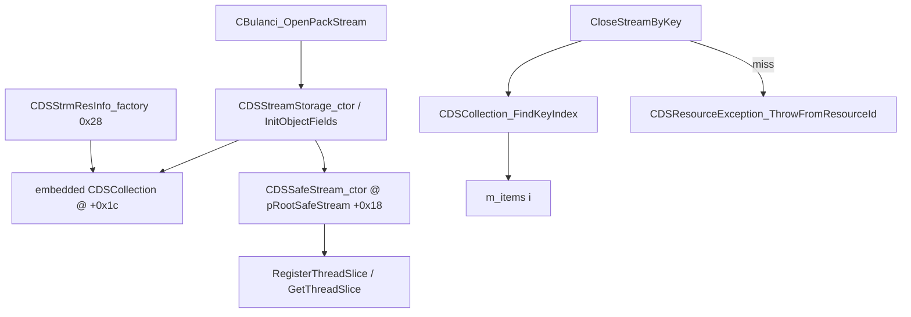

# Round 6 logic — Task 32 Report

## 1. Task

| Field | Value |
|-------|-------|
| **id** | 32 |
| **title** | Logic sim_429_436: 0x004339f0–0x00433dd0 (22 funcs) |
| **range** | `sim_429_436` (`0x00429`–`0x00436`) |
| **seed_address** | *(none — slice task)* |

## 2. Status

**PARTIAL** — Per-function logic recovered from prior **VERIFIED** Ghidra passes ([CDSResInfo.md](../struct_recovery/CDSResInfo.md), [CDSStrmResInfo.md](../struct_recovery/CDSStrmResInfo.md), [CDSSafeStream.md](../struct_recovery/CDSSafeStream.md), [CDSStreamStorage.md](../struct_recovery/CDSStreamStorage.md), [CDSQueueStream.md](../struct_recovery/CDSQueueStream.md), [master_vtable_catalog.md](../master_vtable_catalog.md)). **Ghidra MCP was not connected** this session (`Connection closed` / `Not connected`) — no live `batch_decompile`, xref refresh, `set_function_this_type`, or `save_program`. No Frida: all claims are static (decompile/asm from R3–R5 struct workers).

## 3. Functions

| Address | Ghidra name | Role summary | Evidence |
|---------|-------------|--------------|----------|
| `0x004339f0` | `CDSResInfo_GetTypeInfo` | `IDSReferenced` vfn[0]: returns class type-info pointer (`DAT_004b7e08` / `g_pCDSResInfo`) for RTTI / `CheckedVirtualBaseCast` | [CDSResInfo.md](../struct_recovery/CDSResInfo.md); [master_vtable_catalog.md](../master_vtable_catalog.md) `CDSResInfo` @ `0x004873cc` slot 0 |
| `0x00433a00` | `CDSResInfo_ScalarDeletingDtorThunk` | MI adjustor thunk → scalar-deleting dtor on `CDSResInfo` base (referenced face) | Vtable `0x004873cc` slot 1 → body @ `0x00433a70` |
| `0x00433a10` | `CDSResInfo_dtor` | Restore default vtables `0x4873cc` / `0x4873b0`; call `CDSResInfo_ReleaseEmbeddedResource` on `pEmbeddedResource` @ `+0x14` | [CDSResInfo.md](../struct_recovery/CDSResInfo.md) dtor table |
| `0x00433a70` | `CDSResInfo_ScalarDeletingDtor` | `CDSResInfo_dtor` then `operator delete` when `param_2 & 1` | Standard MSVC scalar-deleting pattern; vtable slot 1 |
| `0x00433a90` | `CDSStrmResInfo_GetTypeInfo` | Derived `IDSReferenced` GetTypeInfo for stream resource entries (`0x4873f8` family) | [CDSStrmResInfo.md](../struct_recovery/CDSStrmResInfo.md); used by stack keys in `CloseStreamByKey` |
| `0x00433aa0` | `CDSResInfo_ReleaseViaChainedFace` | Chained-face release twin of dtor path | **EH-only:** sole xref `Unwind@00479e80` — no game callsite ([round5_worker_42_report.md](../struct_recovery/round5_worker_42_report.md)) |
| `0x00433ab0` | `CDSSafeStream_ctor` | `CDSSafeStream *` MI ctor: four vtables through `+0x14`, embedded `CDSChain` @ `+0x18`, `dwM_streamFlags=0x20`, `nM_refCount=1`, `InitializeCriticalSection` @ `+0x2c`, `m_streamName=0`; may call `CDSSafeStream_RegisterThreadSlice` | [CDSSafeStream.md](../struct_recovery/CDSSafeStream.md); alloc `0x48` @ `0x004341b2` / `0x0043483a` |
| `0x00433b60` | `CDSSafeStream_GetTypeInfo` | `IDSReferenced` vfn[0] on safe stream (`0x00487474`) | [master_vtable_catalog.md](../master_vtable_catalog.md); xref data `0x004b853c` |
| `0x00433b70` | `CDSSafeStream_Close` | `IDSStream` close: writes closed sentinel `0x20` to stream-state dword (iface `+0x4` → outer `+0x08`); mirrors filter `dwStreamState` lifecycle | [CDSSafeStream.md](../struct_recovery/CDSSafeStream.md) `dwM_streamFlags` table; [CDSFilterStream.md](../struct_recovery/CDSFilterStream.md) |
| `0x00433b90` | `CDSSafeStream_ScalarDeletingDtor` | `IDSStream` face (`0x00487434`) scalar-deleting dtor slot 3 — destroys via safe-stream teardown path | Vtable catalog slot 3 @ `0x00487434` |
| `0x00433ba0` | `CDSSafeStream_ScalarDeletingDtor_thunk_Sub0c` | `IDSEventHandler` MI thunk (`+0x0c`): forwards to scalar-deleting dtor | `0x00487420` slot 3 |
| `0x00433bb0` | `CDSSafeStream_ScalarDeletingDtor_thunk_Sub14` | `IDSChained` MI thunk (`+0x14`): forwards to scalar-deleting dtor | `0x00487408` slot 3 |
| `0x00433bc0` | `CDSSafeStream_dtor` | `CDSSafeStream_ClearThreadSlices` (chain + name under lock), `DeleteCriticalSection`, `CDSChain_dtor`, restore MI vtables, release `m_streamName` | [CDSSafeStream.md](../struct_recovery/CDSSafeStream.md) |
| `0x00433c60` | `CDSQueueStream_ReleaseRefcount` | **Shared** `IDSReferenced` release: dec `nRefcount` @ primary `+0x10`; at zero, chained-parent release via `+0x0c` then destroy | [CDSQueueStream.md](../struct_recovery/CDSQueueStream.md); also `CDSSafeStream` vtable `0x00487474` slot 2 |
| `0x00433c90` | `CDSSafeStream_ScalarDeletingDtor` | `IDSReferenced` vfn[1] on `CDSSafeStream` (`0x00487474` slot 1) — scalar-deleting wrapper distinct from queue-stream body at `0x00433c60` | [master_vtable_catalog.md](../master_vtable_catalog.md) |
| `0x00433cb0` | `CDSStreamStorage_CloseStreamByKey` | Pack lookup: build stack `CDSStrmResInfo` key (`0x4873f8`/`0x4873dc`, `dwResourceId` from caller); `CDSCollection_FindKeyIndex(&this->collection, …, CDSStrmResInfo_CompareKey)` — asm `LEA ECX,[ESI+0x1c]` @ `0x00433d09`; load `m_items[i]` @ `0x00433d24`; miss → `CDSResourceException_ThrowFromResourceId` @ `0x00433d1c` | [round4_task_45_report.md](../struct_recovery/round4_task_45_report.md); [CDSStreamStorage.md](../struct_recovery/CDSStreamStorage.md) |
| `0x00433d60` | `CDSQueueStream_ReleaseRefcount_thunk_Sub0c` | `IDSEventHandler` MI thunk (`+0x0c`) → `CDSQueueStream_ReleaseRefcount` | `CDSQueueStream` @ `0x00486d94` slot 2; shared with `CDSSafeStream` event face |
| `0x00433d70` | `CDSSafeStream_ReleaseViaChained` | `IDSChained` vfn[2] on safe stream: chained-face refcount / teardown entry | [CDSSafeStream.md](../struct_recovery/CDSSafeStream.md) `vf_IDSChained`; vtable `0x00487408` |
| `0x00433d80` | `CDSStrmResInfo_factory` | `OperatorNewWithBadAlloc(0x28)`; install `CDSStrmResInfo` vtables; zero `loaderAux` / extent head; return heap entry for collection | [CDSStrmResInfo.md](../struct_recovery/CDSStrmResInfo.md); [batch_40_summary.md](../struct_recovery/batch_40_summary.md) |
| `0x00433db0` | `CDSStrmStgLoadingInfo_GetTypeInfo` | `IDSReferenced` GetTypeInfo for per-thread loader info nodes (`0x004874a0`) | [master_vtable_catalog.md](../master_vtable_catalog.md) `CDSStrmStgLoadingInfo` |
| `0x00433dc0` | `CDSChained_ScalarDeletingDtor_thunk` | Shared `IDSChained` MI thunk (`+0x14`) used by `CDSStrmStgLoadingInfo` and other chained types | Vtable `0x0047f8e0` slot 3; catalog |
| `0x00433dd0` | `CDSChained_ScalarDeletingDtor` | Shared `IDSReferenced` scalar-deleting dtor on chained base (`0x0047f8fc` slot 1) | Catalog → `CDSObject_ReleaseViaVtable` tail |

### Control-flow cluster (game-relevant)

| Step | Function | Notes |
|------|----------|-------|
| Open `.eap` | `CBulanci_OpenPackStream@0x00401f36` | `OperatorNew(0x60)` → storage; later `InitRootSafeStream` attaches `CDSSafeStream` |
| Register stream row | `CDSCollection_InsertKeyed` / `AppendOrReuseStream` | Heap rows from `CDSStrmResInfo_factory` |
| Resolve by id | `CloseStreamByKey` | Stack key facet; binary search on `dwResourceId` @ `+0x08` |
| Thread-local read | `CDSSafeStream_GetThreadSlice@0x00446d90` | Walks `CDSChain` @ safe-stream `+0x18` (out of slice, downstream callee) |

## 4. Ghidra deltas

**None applied** — Ghidra MCP unavailable.

**Queued (prior workers already applied many; re-run when MCP returns):**

| Action | Target | Rationale |
|--------|--------|-----------|
| `force_decompile` | `0x00433cb0`, `0x00433ab0`, `0x00433d80` | Confirm nested `collection` / factory alloc still match docs |
| `set_function_this_type` | `CDSStreamStorage *` @ `0x00433cb0` | Caller body uses `ESI` storage base + embed `+0x1c` (R4 #45 done on callee; caller refresh) |
| `set_decompiler_comment` | `0x00433aa0` | EH-only `ReleaseViaChainedFace` — avoid implying live game path |

No `save_program` (no mutations).

## 5. Frida

**none** — Resource-key lookup, vtable dispatch, and `OperatorNew(0x28)` factory size are proven statically; runtime only needed if `CloseStreamByKey` compare-key facet offset (`object+0x4` vs `+0x8`) must be settled ([CDSCollection.md](../struct_recovery/CDSCollection.md) UNK note).

## 6. Remaining UNK

| Item | Reason |
|------|--------|
| `CDSResInfo_ReleaseViaChainedFace@0x00433aa0` live semantics | Only EH unwind xref; game path uses `CDSResInfo_dtor` / scalar-deleting wrappers |
| `CloseStreamByKey` `pKey` prototype | Ghidra still types search key as `int` in places; live object is stack `CDSStrmResInfo` facet ([round4_task_45_report.md](../struct_recovery/round4_task_45_report.md) residual) |
| `CDSSafeStream_ScalarDeletingDtor` @ `0x00433c90` vs `0x00433b90` | Both named in manifest; distinct vtable slots (IDSReferenced vs IDSStream) — bodies not re-disassembled this pass |
| `CDSQueueStream_ReleaseRefcount` shared with safe stream | Same function pointer in two class vtables; refcount field offsets differ if `this` wrong — disasm documents primary `+0x10` ([CDSQueueStream.md](../struct_recovery/CDSQueueStream.md)) |
| Compare-key stack facet | `CDSCollection.md` notes `LEA` of `object+0x4` while sort uses `dwResourceId` @ `+0x8` — intentional MI facet vs doc typo |

## Cross-links

- [CDSResInfo.md](../struct_recovery/CDSResInfo.md) — 24 B base, `pEmbeddedResource`
- [CDSStrmResInfo.md](../struct_recovery/CDSStrmResInfo.md) — 40 B factory, serialize tail
- [CDSSafeStream.md](../struct_recovery/CDSSafeStream.md) — 72 B thread-safe stream shell
- [CDSStreamStorage.md](../struct_recovery/CDSStreamStorage.md) — 96 B pack storage, `CloseStreamByKey`
- [round4_task_45_report.md](../struct_recovery/round4_task_45_report.md) — collection embed call pattern
- [round5_worker_42_report.md](../struct_recovery/round5_worker_42_report.md) — `ReleaseViaChainedFace` EH-only
