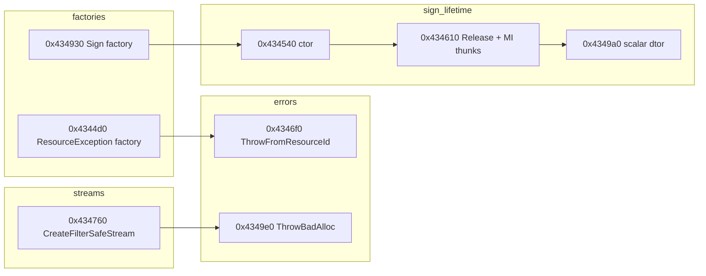

# Round 6 — Logic task 34 report

## Task

| Field | Value |
|-------|-------|
| **id** | 34 |
| **title** | Logic sim_429_436: 0x004344a0–0x004349e0 (22 funcs) |
| **range** | sim_429_436 |
| **range_note** | 0x00429–0x00436: game state, simulation, per-frame |
| **seed_address** | — (slice task) |

## Status

**PARTIAL** — Per-function logic documented from prior Ghidra rounds (batch 37, R3 tasks 30/39/46/47, R4 task 40, R5 worker 48), `mapping.csv`, matched stubs, and vtable catalog. **user-ghidra-mcp was not connected** in this session (no live decompile/xref refresh, no `save_program`). Re-run Ghidra MCP when available to confirm decompiler `this` types and close UNK below.

## Manifest correction

`agent_todos_50_r6_logic.json` `function_names` lists **`CDSResourceSign_dtor` @ `0x004346f0`**. Prior analysis proves **`0x004346f0` = `CDSResourceException_ThrowFromResourceId`** (`OperatorNew(0x44)` → ctor → `__CxxThrowException`; xref from `CDSStreamStorage_CloseStreamByKey`). **`CDSResourceSign_dtor` is @ `0x00434670`** (outside this slice).

## Functions

| Address | Name (Ghidra) | Role summary | Evidence |
|---------|---------------|--------------|----------|
| `0x004344a0` | `CDSResourceException_ctor_default` | Default factory ctor: `CDSException_InitFields(6,8,1)`, vtable `0x4874b0`, clears `pszFormatted` @ `+0x40` | R3 task 39 decompile; xref `MOV [ESI],0x4874b0` @ `0x004344ae` (`ghidra_xrefs.jsonl`); `CDSResourceException.md` |
| `0x004344c0` | `eh_dtor_CDSObject_ptr` | MSVC EH helper: if `*ppOwned`, call vtable+8 release on owned `CDSObject*`; **185** xrefs, all `Unwind@` epilogues | R5 worker 48 disasm; `main_menu.md` `eh_dtor_iterator`; `mapping.csv` `_Globals::FUN_004344c0` |
| `0x004344d0` | `CreateObject` (`_Globals`) | Class factory: `OperatorNewWithBadAlloc(0x44)` → resource-exception ctor path; returns `CDSException*` | `mapping.csv` `0x4344d0`; batch 37 alloc `0x44`; pairs with `0x00439394` registration (task 33 slice) |
| `0x00434540` | `CDSResourceSign_ctor` | In-place init: four vptrs (`0x487510`/`4f4`/`4dc`/`4c8`), zero chain/strings, `CDate_SetDate(0,1,1)` on `+0x14` | `CDSResourceSign.md`, `sign_record.md`; matched `CDSResourceSign.cpp` stream offsets |
| `0x004345c0` | `CDSResourceSign_GetClassData` | Returns `&DAT_004b7f48` (class registry node) | Stub returns `&DAT_004b7f48`; vtable @ `0x487510` slot 0 |
| `0x004345d0` | `CDSResourceSign_scalar_deleting_dtor_thunk_n0x4` | MI adjustor: `this -= 4` → scalar-deleting dtor on `IDSChained` sub-object @ `+4` | 8 B thunk; vtable `0x4874f4` slot 3; naming convention `n0x4` |
| `0x004345e0` | `CDSResourceSign_scalar_deleting_dtor_thunk_n0x8` | MI adjustor: `this -= 8` → chained face dtor | vtable `0x4874dc` slot 3 |
| `0x004345f0` | `CDSResourceSign_scalar_deleting_dtor_thunk_n0x10` | MI adjustor: `this -= 0x10` → event-handler face dtor | vtable `0x4874c8` slot 3 |
| `0x00434600` | `CDSChain_AdjustThisOffset_ThisMinus4` | Shared `IDSChained` adjustor (`ecx -= 4`); used by `CDSResourceSign` chained vtable **and** `CDSStreamStorage` `IDSEventHandler` vtable slot 1 | `master_vtable_catalog.md`; `CDSStreamStorage.cpp` stub under `CDSStreamStorage::` |
| `0x00434610` | `CDSResourceSign_Release` | Primary `IDSReferenced` release; refcount on `publishDate` field @ `+0x14` | `CDSResourceSign.md` `+0x14`; vtable `0x487510` slot 2 |
| `0x00434640` | `CDSResourceSign_Release_thunk_n0x4` | MI adjustor → `Release` on `+4` sub-base | vtable `0x4874f4` slot 2 |
| `0x00434650` | `CDSResourceSign_Release_thunk_n0x8` | MI adjustor → `Release` on `+8` sub-base | vtable `0x4874dc` slot 2 |
| `0x00434660` | `CDSResourceSign_Release_thunk_n0x10` | MI adjustor → `Release` on `+0x10` sub-base | vtable `0x4874c8` slot 2 |
| `0x004346f0` | `CDSResourceException_ThrowFromResourceId` | `OperatorNew(0x44)` → `CDSResourceException_ctor(id)` → `__CxxThrowException`; static text push @ `0x4ab2ec` | R3 task 39; `CDSResourceException.md`; caller `CloseStreamByKey`; **not** sign dtor |
| `0x00434760` | `CDSStreamStorage_CreateFilterSafeStream` | Dual alloc: filter `0x38` + safe stream `0x48`; `CDSFilterStream_Ctor` with slice addends; `CDSSafeStream_ctor(&filter->IDSStream)` | R3 task 30/46/47, R4 task 40; `CDSStreamStorage.md`; `CDSSafeStream.md` composition |
| `0x004348ca` | `Catch@004348ca` | SEH/catch pad inside `CreateFilterSafeStream` body (cleanup on ctor failure) | Size `0x13` in stub map; parent `0x00434760` |
| `0x004348e0` | `CDSResourceException_DtorScalar` | Scalar-deleting dtor for `CDSResourceException` (`IDSChained` vtable slot 1 @ `0x4874b0`) | R3 task 39 vtable table |
| `0x00434930` | `InitializeAndAllocate` | Sign ClassID 94 factory: `OperatorNew(0x28)` → `CDSResourceSign_ctor` | `CDSResourceSign.md`; `RegisterCDSResourceSignAsClass94@0x7d1d0`; `sign_record.md` |
| `0x004349a0` | `CDSResourceSign_scalar_deleting_dtor` | Primary scalar-deleting dtor (`IDSReferenced`); frees strings via `CDSResourceSign_dtor` body | `sign_record.md`; `formats/status.md` byte-match notes |
| `0x004349c0` | `CDSMemoryException_What` | Formats OOM message into `pFormatted[256]` using `dwFormatArg` tail | R3 task 39 (`CDSMemoryException_What`); adjacent to runtime alloc helpers |
| `0x004349e0` | `Runtime_ThrowBadAlloc` | On failed `OperatorNew`: push `type_info` @ `0x4ab3fc`, throw via CRT exception path | Xref `PUSH 0x4ab3fc` / `DAT_004b7f80` in `ghidra_xrefs.jsonl`; shared with all `OperatorNewWithBadAlloc` sites |

### Control-flow clusters

## Ghidra deltas

**none** (MCP unavailable). Prior workers already applied: `eh_dtor_CDSObject_ptr` rename (R5-48), `CDSResourceException_ThrowFromResourceId` rename (R3-39), `CDSStreamStorage_CreateFilterSafeStream` (batch 29/R3-46), `CDSResourceSign_*` symbols in headers/`mapping.csv`. Recommended when MCP returns:

- `set_function_this_type` @ `0x004346f0` → `CDSResourceException *` (decompiler may still show `CDSStreamStorage::` prefix per R3/R4 UNK).
- `rename_function_by_address` @ `0x004344d0` → `CDSResourceException_CreateObject` if still generic `CreateObject`.
- `set_decompiler_comment` on MI thunks documenting `ecx -= N`.

## Frida

**none** — allocation sizes, vtable writes, throw path, and filter/safe-stream dual-alloc are proven statically; no runtime-only opcode behavior in this slice.

## Remaining UNK

- Live Ghidra decompile refresh for all 22 entries (blocked this session).
- `CDSResourceException_ThrowFromResourceId` parent namespace / `this` display (R3-39).
- `eh_dtor_CDSObject_ptr` jumptable @ `0x004344cb` decompiler “too many branches” artifact (R5-48).
- `CDSResourceSign` ctor `+0x18` reliance on `malloc` zero-init (documented UNK in struct doc).
- `CDSMemoryException_What` format template id (exception pass, out of slice focus).

## Evidence paths consulted

- `ghidra_analysis/engine/ROUND6_LOGIC_PROTOCOL.md`
- `ghidra_analysis/engine/struct_recovery/CDSResourceSign.md`, `CDSResourceException.md`
- `ghidra_analysis/formats/sign_record.md`
- `ghidra_analysis/engine/struct_recovery/round3_task_39_report.md`, `round3_task_30_report.md`, `round3_task_46_report.md`, `round3_task_47_report.md`, `round4_task_40_report.md`, `round5_worker_48_report.md`
- `config/bulanci/mapping.csv`, `include/bulanci/*.h`, matched `src/bulanci/*.cpp` stubs
