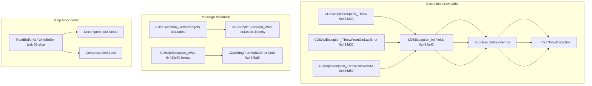

# Round 6 — Logic task 35 report

## Task

| Field | Value |
|-------|-------|
| **id** | 35 |
| **title** | Logic sim_429_436: 0x00434a10–0x00434f90 (22 funcs) |
| **range** | sim_429_436 |
| **range_note** | 0x00429–0x00436: game state, simulation, per-frame |
| **seed_address** | none (slice task) |

Slice spans the **CDS exception hierarchy** (base init, throw helpers, vtable thunks) plus **zlib single-shot helpers** used by `CDSGZipStream`, and a shared **IDSStream Unlock** unsupported stub.

## Status

**PARTIAL** — Per-function logic documented from prior Ghidra struct-recovery rounds (R3–R5), `ghidra_xrefs.jsonl`, `vftable_methods.csv`, matched `src/bulanci/_Globals.cpp` gzip bodies, and struct docs. **Ghidra MCP was not connected** during this worker run; live `batch_decompile` / `get_xrefs_to` refresh and any `set_function_this_type` fixes were not applied.

## Functions

| Addr | Name | Role summary | Evidence |
|------|------|--------------|----------|
| `0x00434a10` | `CDSException_InitBaseFields` | Minimal ctor helper: writes base vtable `0x00487520` to `*param_1` only (24 B). Distinct from full `InitFields`. | Xref cache: `MOV dword ptr [EAX],0x487520` @ `+0x14`; size `0x18` in `CDSException.cpp` marker |
| `0x00434a30` | `CDSException_GetTypeInfo` | IDSEventHandler slot `[0]`: returns `&DAT_004b81c0` (class meta; same `.data` span as static `CDSMemoryException` singleton tail). | Matched body in `CDSException.cpp`; xref `MOV EAX,0x4b81c0`; vtable catalog @ `0x00487520` |
| `0x00434a40` | `CDSException_InitFields` | Shared 60 B prefix init: vtable `0x487520`, `bDeleteOnRelease`, zero `pMessageCache`, set `dwCodePrimary` / `dwStaticTextIndex`. All subclass ctors/throws call this. | [CDSException.md](../struct_recovery/CDSException.md); R3 task 29/39; xref `MOV [EAX],0x487520` |
| `0x00434a70` | `CDSMemoryException_ctor` | `CDSException_InitFields(&base,1,1,0)`; override vtable `0x487534`; zero tail `dwFormatArg` / `pFormatted`. | [CDSMemoryException.md](../struct_recovery/CDSMemoryException.md); xref `MOV [ESI],0x487534` |
| `0x00434a90` | `CDSMemoryException_GetClassTable` | Registry / RTTI helper: returns `&DAT_004b81d4`. | Matched body; xref `MOV EAX,0x4b81d4` |
| `0x00434aa0` | `CDSMemoryException_Factory` | Class factory (id **5** @ `0x0047d2d0`): `OperatorNewWithBadAlloc(0x240)` → `CDSMemoryException_ctor`. | [batch_33_followup_summary.md](../struct_recovery/batch_33_followup_summary.md) disasm |
| `0x00434ac0` | `CDSSimpleException_GetClassTable` | Returns `&DAT_004b81fc`. | Matched body; xref; [CDSSimpleException.md](../struct_recovery/CDSSimpleException.md) vtable table |
| `0x00434ad0` | `CDSSimpleException_What` | Vtable slot `[3]`: identity — returns `this` unchanged (static-text path via `GetMessageW`). | Matched body `return param_1`; [CDSSimpleException.md](../struct_recovery/CDSSimpleException.md) |
| `0x00434ae0` | `CDSException_DtorScalar` | Base scalar dtor: reparents object to neutral `CDSObject` vtable `0x0047f6a8` before teardown. Used as slot `[1]` on `CDSSimpleException` and shared across siblings. | Xref `MOV [ESI],0x47f6a8`; [CDSException.md](../struct_recovery/CDSException.md) |
| `0x00434b00` | `CDSApiException_GetClassTable` | Returns `&DAT_004b81e8`. | Matched body; xref `MOV EAX,0x4b81e8`; [CDSApiException.md](../struct_recovery/CDSApiException.md) |
| `0x00434b10` | `CDSObject_GetThis` | Shared vtable slot `[4]` on exception types: returns `(uint)this` (3 B thunk). Also on `CItemInfo` primary vtable. | Matched body in `CItemInfo.cpp`; R4 task 39 catalog |
| `0x00434b20` | `CDSApiException_dtor` | Instance dtor: neutral vtable `0x47f6a8`; `CDsString` release on `pFormattedMessage` (`this[0xf]` / `+0x3C`). | [CDSApiException.md](../struct_recovery/CDSApiException.md); xref vtable store |
| `0x00434b80` | `CDSException_GetMessageW` | Lazy wide message: if static-text index resolves, use pool; else `__swprintf` into inline buffer `@ this+0x14` (`wchar_t[20]`). Uses format from app vtable slot. | R3 task 29; [CDSException.md](../struct_recovery/CDSException.md); xref pushes `0x487578` |
| `0x00434bd0` | `CDsStringFromWin32ErrorCode` | Formats Win32 error code into a `CDsString` handle (global helper). Consumed by `CDSStreamException_FormatMessage` and `CDSRegKeyException_What`. | [CDSStreamException.md](../struct_recovery/CDSStreamException.md); decl @ `_Globals.h` |
| `0x00434c20` | `CDSSimpleException_Throw` | `OperatorNewWithBadAlloc(0x3C)` → `InitFields(code,text,1)` → vtable `0x48754c` → `__CxxThrowException`. | [CDSSimpleException.md](../struct_recovery/CDSSimpleException.md); xrefs `0x48754c`, `0x4ab468` |
| `0x00434c70` | `CDSApiException_What` | Formats message via `CDsStringFormatV` into `pFormattedMessage` using `dwWin32Error` @ `+0x40`. | [batch_22_summary.md](../struct_recovery/batch_22_summary.md); [CDSApiException.md](../struct_recovery/CDSApiException.md) |
| `0x00434d00` | `CDSApiException_ThrowFromGetLastError` | `OperatorNew(0x44)` → `InitFields(0xE,2,1)` → vtable `0x487564` → zero `+0x3C` → `GetLastError()` → `+0x40` → throw (`0x4ab4d4` type info). | R4 task 39 throw-site typing; xrefs |
| `0x00434d50` | `CDSApiException_ThrowFromWin32` | Same layout as `ThrowFromGetLastError` but Win32 code from parameter instead of `GetLastError()`. | [CDSApiException.md](../struct_recovery/CDSApiException.md); xref `0x487564`, `0x4ab4d4` |
| `0x00434e10` | `CDSApiException_DtorScalar` | Scalar deleting dtor for `CDSApiException` (slot `[1]` @ `0x487564`): frees formatted string tail then base teardown. | [CDSApiException.md](../struct_recovery/CDSApiException.md) vtable table |
| `0x00434e30` | `CDSGZipStream_Decompress_static` | Single-shot zlib inflate: `inflateInit_("1.1.3",0x38)` → `inflate(Z_FINISH)` → `*destLen=total_out` → `inflateEnd`. Maps to C# `GZipStream.Decompress`. | Matched 170/170 B in `_Globals.cpp`; [gzip_stream.md](../../formats/gzip_stream.md); xref `PUSH 0x487594` |
| `0x00434ee0` | `CDSGZipStream_Compress_static` | Single-shot zlib deflate level 9: `deflateInit_(9,"1.1.3",0x38)` → `deflate(Z_FINISH)` → `*destLen=total_out` → `deflateEnd`. | Matched 172/172 B in `_Globals.cpp`; [formats/status.md](../../formats/status.md) |
| `0x00434f90` | `IDSStream_UnlockRegion_ThrowUnsupported` | IDSStream slot `[12]` on `CDSGZipStream`, `CDSQueueStream`, `CDSSafeStream`: raises stream “operation not supported” (shared with Lock @ `0x43bff0` on other types). 7 B thunk. | [stream_hierarchy.md](../../formats/stream_hierarchy.md) slot table; `vftable_methods.csv`; [formats/status.md](../../formats/status.md) |

### Control-flow clusters

## Ghidra deltas

**none** — Ghidra MCP unavailable (`Not connected`). Prior rounds already renamed most symbols and applied exception structs (R3 tasks 27/29/39, R4 task 39, batch 33 factory). No `save_program` this run.

Recommended follow-up when MCP returns (only if decompile still wrong):

- Confirm `CDSException_InitBaseFields` vs `InitFields` call graph (no duplicate vtable writes).
- `set_function_prototype` on throw helpers if locals regress to `CDSException *` (R4 task 39 already fixed `0x434d00`).

## Frida

**none** — Exception throw/layout and gzip static helpers are fully evidenced statically (prior Ghidra decompile, disasm, matched C++ mirrors, C# `GZipStream.cs` parity).

## Remaining UNK

- **`CDSException_InitBaseFields` call sites**: xref cache proves vtable write only; full caller list not refreshed (MCP down).
- **`CDsStringFromWin32ErrorCode` internals**: helper body still `STUB_BODY()` in matched source; only consumers documented.
- **`IDSStream_UnlockRegion_ThrowUnsupported`**: proven as shared unsupported slot (7 B); exact `RaiseStreamException` errno constant not re-disassembled this run (stream_hierarchy documents errno 5/6 family for Lock/Unlock unsupported).
- **`CDSSimpleException_Throw` decompiler cast**: R4 task 39 notes `InitFields((CDSException *)local_4, …)` cosmetic remains.
- **Live Ghidra re-verify**: `batch_decompile` all 22 addresses + `get_xrefs_to` on throw sites when MCP reconnects.

## Evidence paths consulted

- [ROUND6_LOGIC_PROTOCOL.md](../ROUND6_LOGIC_PROTOCOL.md)
- [struct_recovery/AGENT_PROTOCOL.md](../struct_recovery/AGENT_PROTOCOL.md)
- [struct_recovery/CDSException.md](../struct_recovery/CDSException.md), [CDSApiException.md](../struct_recovery/CDSApiException.md), [CDSSimpleException.md](../struct_recovery/CDSSimpleException.md), [CDSMemoryException.md](../struct_recovery/CDSMemoryException.md)
- [struct_recovery/round3_task_29_report.md](../struct_recovery/round3_task_29_report.md), [round4_task_39_report.md](../struct_recovery/round4_task_39_report.md)
- [formats/gzip_stream.md](../../formats/gzip_stream.md), [formats/stream_hierarchy.md](../../formats/stream_hierarchy.md)
- `ghidra_analysis/asset_catalog/_cache/ghidra_xrefs.jsonl`, `ghidra_analysis/engine/vftable_methods.csv`
- Matched sources: `src/bulanci/_Globals.cpp`, `CDSException.cpp`, `CDSApiException.cpp`, `CDSSimpleException.cpp`, `CDSMemoryException.cpp`, `CItemInfo.cpp`
