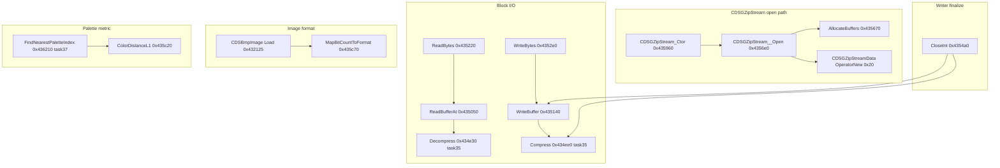

# Round 6 — Logic task 36 report

## Task

| Field | Value |
|-------|-------|
| **id** | 36 |
| **title** | Logic sim_429_436: 0x00434fa0–0x00435c70 (22 funcs) |
| **range** | sim_429_436 |
| **range_note** | 0x00429–0x00436: game state, simulation, per-frame |
| **seed_address** | none (slice task) |

Slice spans **CDSGZipStreamData** lifetime/RTTI, **CDSGZipStream** container I/O (Open/ReadBufferAt/WriteBuffer/CloseInt/AllocateBuffers), **IDSStream vtable** methods (Read/Write/Size/Tell/Seek), ctors/factory/EH cleanup, plus shared **CPoemScroller** palette metric and **MapBitCountToFormat** BMP helper.

## Status

**PARTIAL** — All 22 functions documented with **fresh PE disassembly** (`orig/bulanci_insturmented.exe`, capstone) cross-checked against [gzip_stream.md](../../formats/gzip_stream.md), [CDSGZipStreamData.md](../struct_recovery/CDSChain_LoadConfigFromRegistry.md), [stream_hierarchy.md](../../formats/stream_hierarchy.md), [bmp_decoder.md](../../formats/bmp_decoder.md), and `config/bulanci/mapping.csv`. **Ghidra MCP was not connected**; no live decompile refresh, `set_function_this_type`, or `save_program`.

## Functions

| Addr | Name | Role summary | Evidence |
|------|------|--------------|----------|
| `0x00434fa0` | `CDSGZipStreamData_GetTypeInfo` | Primary vtable slot `[0]`: returns `&DAT_004b8248` (6 B). | Disasm `MOV EAX,0x4b8248; RET`; matched `CDSGZipStreamData.cpp`; vtable @ `0x004875b4` |
| `0x00434fb0` | `CDSGZipStreamData_ScalarDeletingDtor_thunk_Sub4` | MI adjustor: `SUB ECX,4` → tail-call scalar dtor @ `0x00435030`. | Disasm; vtable secondary @ `0x004875a0` slot `[3]` |
| `0x00434fc0` | `CDSGZipStreamData_dtor` | Instance dtor: restore vtables `0x4875b4`/`0x4875a0`, `Runtime_Free(m_chunks @ +0x1c)`. | Disasm vtable stores @ `+0`/`+4`; [CDSGZipStreamData.md](../struct_recovery/CDSGZipStreamData.md) |
| `0x00435030` | `CDSGZipStreamData_ScalarDeletingDtor` | Scalar deleting dtor: calls body dtor; optional `operator delete` when flag bit 0 set. | Disasm `CALL 0x434fc0`; `TEST [ESP+8],1` → `CALL 0x4472fe` |
| `0x00435050` | `CDSGZipStream__ReadBufferAt` | Load 32 KB block at logical index: `pos/0x8000` via `__alldiv`, set `m_lBlockStart`/`m_nBufPos`; seek host stream to chunk span; raw copy if compressed size == `0x8000` else `Decompress` @ `0x434e30`. | Disasm `PUSH 0x8000`, `CALL 0x448200` (`__alldiv`); [gzip_stream.md](../../formats/gzip_stream.md) §ReadBufferAt |
| `0x00435140` | `CDSGZipStream__WriteBuffer` | Writer flush: seek host to `m_lStart + chunks[N-1]`; `Compress` scratch; store-if-larger rule (compressed vs raw). | Disasm host `vtbl[+0x28]` seek, chunk index from `[m_pData+0x1c][m_nBufLoaded*8]`; gzip_stream §WriteBuffer |
| `0x00435220` | `ReadBytes` | IDSStream slot `[4]`: byte loop over cached block — closed check on `[this+0x18]` (`m_pData` via IDSStream face); advances `m_nBufPos`; calls `ReadBufferAt` on block boundary. | Disasm `MOV ESI,ECX`; `[ESI+0x18]` null → throw @ `0x4302e0` errno 8; vtable `0x00480594` slot 4 |
| `0x004352e0` | `WriteBytes` | IDSStream slot `[5]`: append to `m_buffer`; rolls block at 32 KB via `WriteBuffer`. | Disasm same closed guard; `[ESI+0x18]` = m_pData from +0xc face |
| `0x00435360` | `GetSize` | IDSStream slot `[7]`: returns `m_pData->m_lSize` i64 @ `+0x10`. | Disasm `MOV ESI,[ESI+0x18]` then load `[+0x10]`/`[+0x14]` |
| `0x00435390` | `TellPosition` | IDSStream slot `[8]`: virtual cursor = `m_lBlockStart` (`+0x28`) + `m_nBufPos` (`+0x34`) as i64. | Disasm `ADD EAX,[ESI+0x34]; ADC EDX,[ESI+0x38]` |
| `0x004353c0` | `SeekPosition` | IDSStream slot `[10]`: read-only seek when `m_bWriting==1`; validates open; dispatches `ReadBufferAt` for new block. | Disasm `CMP [ESI+4],1` / `[ESI+0x18]`; throw errno 3 on write mode |
| `0x004354a0` | `CDSGZipStream__CloseInt` | Writer finalize: flush last block, write index offset @ `m_lStart+4`, append compressed chunk table via `Compress` @ `0x434ee0`. | Disasm `CMP [ESI+0x10],2` writer branch; [gzip_stream.md](../../formats/gzip_stream.md) §CloseInt |
| `0x00435670` | `CDSGZipStream__AllocateBuffers` | Frees/reallocates `m_buffer` (`0x8040`) and `m_compress_scratch` (`0xa00c`) via runtime heap helpers. | Disasm `PUSH 0x8040` / `PUSH 0xa00c`, `CALL 0x42f6f0`; field offsets `+0x28`/`+0x2c` |
| `0x004356e0` | `CDSGZipStream__Open` | Core open: `Tell` host → `m_lStart`; retain host stream; alloc `CDSGZipStreamData` (`OperatorNew(0x20)`); reader validates magic `0x50495a47`, decodes index via `Decompress`; writer seeds `chunks[0]=12`. | **Fresh disasm** `MOV ESI,ECX` (ECX=`CDSGZipStream*`, not `CBulanci*`); magic push @ `0x43579f`; xref `CALL` from ctor @ `0x4359d8` |
| `0x00435960` | `CDSGZipStream_Ctor` | Public ctor `(CDSGZipStream*, IDSStream* host, uint writeFlag)`: SEH frame; calls `Open`; used from config load @ `0x40a4db`. | Disasm SEH prologue; xrefs `0x401f03`, `0x409d29`, `0x40a4db`; [CDSChain_LoadConfigFromRegistry.md](../struct_recovery/CDSChain_LoadConfigFromRegistry.md) |
| `0x004359f3` | `Catch@004359f3` | MSVC EH cleanup in ctor path: free `+0x28`/`+0x2c` buffers, release `+0x20` host / `+0x24` sidecar via `Runtime_FreePointerFieldZero` @ `0x4134f0`. | Disasm identical pattern to `0x435b6d`; [round5_worker_12_report.md](../struct_recovery/round5_worker_12_report.md) |
| `0x00435a20` | `CDSGZipStream__InitFromOpenInfo` | Validates `OpenInfo` write flag / stream state; throws stream errno `0` on bad mode; wires stream faces before `Open`. | Disasm `CMP [EDI+0x10],1`; `CALL 0x4302e0` with `[ESI+0xc]` error context |
| `0x00435ae0` | `CDSGZipStream_ctor` | Alternate/internal ctor with SEH (`0x47a274` handler); stores `this` @ `[EBP-0x14]` for unwind. | Disasm `MOV ESI,ECX`; pairs with `Catch@0x435b6d` |
| `0x00435b6d` | `Catch@00435b6d` | EH cleanup twin of `0x4359f3` on alternate ctor path. | Disasm |
| `0x00435ba0` | `CDSGZipStream_ChainedNewInstance` | Class factory: `OperatorNew(0x48)` (= `sizeof(CDSGZipStream)`), construct instance. Vtable slot only — **DATA xref** @ file `0x8058c` (`.rdata` `0x0048057c` slot 4). | Disasm `PUSH 0x48; CALL 0x447c42`; vtable_methods.csv |
| `0x00435c20` | `CPoemScroller_ColorDistanceL1` | L1 RGB distance: `\|R-R'\|+\|G-G'\|+\|B-B'\|` for palette search (3-byte triplet in ECX vs color dword on stack). | Disasm channel subtract/abs/add; xref `CALL` from `0x436240` (`FindNearestPaletteIndex` neighbor) |
| `0x00435c70` | `MapBitCountToFormat` | `__cdecl` switch: `biBitCount-1` → jump table @ `0x435cb8`; returns engine format index 0–6, default 7 for unsupported depths. | Disasm; xrefs `0x432125` (`CDSBmpImage::Load`), `0x436dad`; [bmp_decoder.md](../../formats/bmp_decoder.md) format table |

### Control-flow clusters

## Ghidra deltas

**none** — Ghidra MCP unavailable (`Not connected`). Prior rounds already renamed core gzip symbols ([gzip_stream.md](../../formats/gzip_stream.md) §Symbols set in Ghidra).

Recommended follow-up when MCP returns (disasm-proven):

| Address | Action | Proof |
|---------|--------|-------|
| `0x004356e0` | `set_function_this_type(CDSGZipStream *)` + drop `CBulanci::` namespace | `MOV ESI,ECX` @ entry; field stores at `+0x10`/`+0x18`/`+0x24` match [gzip_stream.md](../../formats/gzip_stream.md) layout |
| `0x00435050`, `0x00435140`, `0x004354a0`, `0x00435670` | Same `CDSGZipStream *` this typing | All use `MOV ESI,ECX` or equivalent ECX=this |
| `0x00435220`–`0x004353c0` | Type ECX as `CDSGZipStream *` **IDSStream face** at `this+0xc` (or document MI offset) | `[ESI+0x18]` resolves to object `+0x24` `m_pData` |
| `0x00435c20` | Confirm `CPoemScroller *` vs RGB-pointer calling convention in decompiler | Disasm uses ECX as 3-byte color triplet pointer, not full object |

## Frida

**none** — Container format, IDSStream methods, and BMP format mapping are fully evidenced statically (PE disasm + prior Ghidra rounds + C# `GZipStream.cs` / editor parity in gzip_stream.md).

## Remaining UNK

- **`CDSGZipStreamData +0x0c..+0x0f`**: still not written on Open alloc path ([CDSGZipStreamData.md](../struct_recovery/CDSGZipStreamData.md) UNK).
- **`CDSGZipStream__InitFromOpenInfo` OpenInfo struct**: exact layout of `param_1` beyond `+0x10` write flag not field-named this run.
- **Live Ghidra re-verify**: `batch_decompile` all 22 addresses + confirm decompiler shows `m_pData`/`m_lBlockStart` field names after `set_function_this_type`.
- **`MapBitCountToFormat` default case 7**: disasm proves out-of-range returns 7; no runtime consumer of format 7 documented in slice.

## Evidence paths consulted

- [ROUND6_LOGIC_PROTOCOL.md](../ROUND6_LOGIC_PROTOCOL.md)
- [struct_recovery/AGENT_PROTOCOL.md](../struct_recovery/AGENT_PROTOCOL.md)
- [formats/gzip_stream.md](../../formats/gzip_stream.md), [formats/stream_hierarchy.md](../../formats/stream_hierarchy.md), [formats/bmp_decoder.md](../../formats/bmp_decoder.md)
- [struct_recovery/CDSGZipStreamData.md](../struct_recovery/CDSGZipStreamData.md), [CDSChain_LoadConfigFromRegistry.md](../struct_recovery/CDSChain_LoadConfigFromRegistry.md)
- `ghidra_analysis/engine/vftable_methods.csv`, `config/bulanci/mapping.csv`
- Fresh PE disassembly: `orig/bulanci_insturmented.exe` (capstone, Jun 2026)
