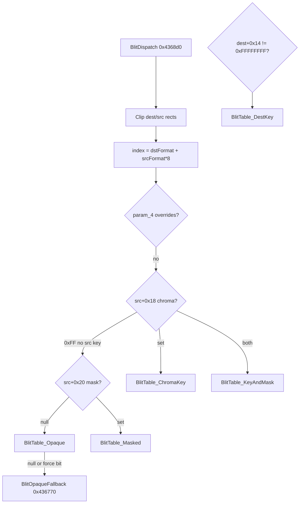

# Round 6 logic — Task 38 Report

## 1. Task

| Field | Value |
|-------|-------|
| **id** | 38 |
| **title** | Logic sim_429_436: 0x004362f0–0x00436ff0 (21 funcs) |
| **range** | `sim_429_436` (`0x00429`–`0x00436`) |
| **seed_address** | *(none — slice task)* |

## 2. Status

**PARTIAL** — All 21 addresses analyzed from frozen decompile (`bulanci.ghidra.exe.c`), `config/bulanci/mapping.csv`, and prior struct docs (`CDSImage.md`, `CDSBackBuffer.md`, `sprite_container.md`, `flx_file_format.md`, `CPoemScroller.md`). **Ghidra MCP disconnected** (`Not connected`) — no live `decompile`, `get_xrefs_to`, `set_function_this_type`, or `save_program`. Raster alloc, draw primitives, master blit dispatch, FLX observer fan-out, and stream-host `Save` are statically closed. No Frida.

**Doc re-verify:** `flx_file_format.md` / `sprite_container.md` label `0x00436ef0` as `NotifyFrameTime`; live export and R5 w31 use **`BroadcastFrameTimeHint`**. `FUN_00436d20` export comment (CDSAudioBank resize) is **stale** — body is generic `CDSPtrSlotVec_Resize` + `FUN_00403240` bulk copy; sole in-slice caller chain is `FUN_00436f20` → `FUN_004370b0` (audio track switch, **outside slice**).

## 3. Functions

| Address | Ghidra name | Role summary | Evidence |
|---------|-------------|--------------|----------|
| `0x004362f0` | `ComputeAllocationSize` | **12-byte align** primary plane: `((ComputeBufferSize(image,0) + 11) / 12) * 12`. | Export @ `114354`; caller `CDSImage__Allocate`; `dsm_file_format.md` stride question |
| `0x00436310` | `CDSImage_DrawHorizontalLine` | Clip `y=param_2` to engine clip rect; clamp `[param_1,param_3)`; dispatch by **dest format** `nField_0c`: 16bpp gradient span, 24/32bpp fast fills, else per-row `PTR_LAB_004b0074` put-pixel table. Dest plane = `pVftable_IDSEventHandler`, src = `GetColorPlane(this)`. | Export @ `114365`; callers `DrawRectOutline`, widget chrome (`widgets.md`); `CRuch` debug lines use `DrawVerticalLine` sibling |
| `0x00436420` | `CDSImage_DrawVerticalLine` | Clip `x=param_1`; clamp `[param_2,param_3)`; same format dispatch as horizontal (16bpp uses `DrawVerticalLineGradient_16bpp`). | Export @ `114423`; `CRuch::CRuch_Render_DrawVerticalLine` @ `94042`; `main_menu.md` / `status.md` |
| `0x00436530` | `CPoemScroller_DrawRectOutline` | Build rect from `param_1` or default engine bounds (`pVftable_IDSChained_04`, `nField_08`); draw top/bottom horizontals + left/right verticals (inset by 1px) via `DrawHorizontalLine`/`DrawVerticalLine`. | Export @ `114481`; callers `CColorSet_Render`, `CEdit` caret, selection grids (`widgets.md`, `post_match_lobby.md`) |
| `0x004365f0` | `CPoemScroller_FillRect` | Resolve rect (`param_1` or full bounds); **`rect_Intersect`** vs engine clip; fill by format: 16bpp `BlitAlphaFill_RGB565`, 24bpp `BlitAlphaFill_BGR24`, 32bpp `FillRect32bpp`, else nested put-pixel loops. | Export @ `114520`; poem scroll, `CBlackView`, HUD fills (`94298`, `widgets.md`) |
| `0x00436750` | `CDSBackBuffer_ClearPreFlipFields` | Zero **`embeddedImage.pM_pixels`** and **`pM_auxBuffer`** before DDraw flip (surface owns live bits). | Export @ `114592`; caller `CDSBackBuffer_Flip@0x00429930` @ `100116`; `CDSBackBuffer.md` |
| `0x00436760` | `FUN_00436760` | **`*(this+0x20) = 0`** after masked poem blit — pairs with `SetBlitMask` (stores mask ptr at `nBounds_left` / `+0x20` on engine singleton `g_pApp+0x80`). | Export @ `114602` (UNCERTAIN comment); callers `PickNextPoem` fade path @ `94308`, `94347` |
| `0x00436770` | `BlitOpaqueFallback` | **Slow opaque blit** when no table kernel or forced (`param_4&0x10`): if src palette ≤256 entries, build 256-byte remap via `GetPaletteEntry` + `FindNearestPaletteIndex`, else per-pixel `OpaqueBlitPixel_Indexed1` + `BlitPixelViaFormatTable`. | Export @ `114614`; tail of `BlitDispatch` @ `114874` |
| `0x004368d0` | `BlitDispatch` | **Master compositor** (`g_pApp+0x80`): validate dest/src rects same size; clip to src/dst bounds; index `(dstFormat + srcFormat*8)` into **`BlitTable_Opaque` / `_DestKey` / `_ChromaKey` / `_Masked` / `_KeyAndMask`** (`0x004b08c8`…); reads src **`+0x14` dest chroma**, **`+0x18` src chroma**, **`+0x20` mask plane**, **`nBounds_left` mask ptr** on engine path; optional `param_4` flag overrides. | Export @ `114693`; decision tree `sprite_container.md` §5; consumers `TM_TickBlit@0x00439080`, `CBulPicture_DrawSurface`, `CDSImageMouse_Draw`, JPEG `CompressFromImage` |
| `0x00436c60` | `CDSImage_Save` | **Stream-host MI** (`ECX=this+0x54`): write header fields then **`ComputeBufferSize`** bytes from `m_pixels`; optional aux plane sized `width*height` when flag set. Export annotates **`[EDI-0x44]` = `m_stride` @ +0x10**, not bpp tag. | Export @ `114889`; `CDSImage.md` MI table; `round3_task_35_report.md` |
| `0x00436d20` | `FUN_00436d20` | **`CDSPtrSlotVec_Resize(this, count)`** then **`FUN_00403240`** bulk-copies `count` dwords from `param_1[0]`. | Export @ `114919`; callee `FUN_00436f20`; **not** main `CDSAudioBank_Deserialize` |
| `0x00436d50` | `CDSImage__FreeBuffers` | `Runtime_Free` **`m_pixels`** and **`m_auxBuffer`**; null both. | Export @ `114934`; callers dtor, `Allocate`, `Load`, `FreeImageMember`, flip teardown |
| `0x00436d90` | `FUN_00436d90` | **`CDSImage__FreeBuffers`** then bind from **108-byte DDraw surface descriptor** (`param_1`): copy width/height, `MapBitCountToFormat(bpp@+0x54)`, stride, palette entry count; **assign external pixel pointer @ +0x24** without malloc. Caller **`FUN_004298d0`** on `CDSBackBuffer+4` (`GetSurfaceDesc` COM vtable+100). | Export @ `114950`; `FUN_004298d0` @ `100102`; `FUN_0042a590` render dirty path |
| `0x00436e10` | `CPoemScroller_SetBlitMask` | Free prior mask at **`nBounds_left` (+0x20)**; store new `param_1` pointer (poem fade alpha ramp). | Export @ `114984`; `PickNextPoem` @ `94305`, `94344` |
| `0x00436e40` | `NotifyDirtyRect` | Walk **`m_slotCount@+0x40`**, slots @ **`+0x38`**: call each subscriber **`vtable[0](consumer, rect, flag)`**. | Export @ `114998`; `NotifyDirtyAll@0x00437080` (adjacent, out of slice); FLX post-decode redraw |
| `0x00436e80` | `NotifyMove` | Observer fan-out: loop count @ **`+0x40`**, slot table @ **`+0x38`**, **`vtable[+4](consumer, {x,y})`**. FLX chunk tag **10**. | Export @ `115017`; `DecodeFrame` @ `110519`; **decompiler `this=CDSFlxFile*` wrong** — runtime `param_3` is decode consumer |
| `0x00436eb0` | `NotifyRegionList` | Fan-out **`vtable[+0xc](consumer, count, table)`** after `DecodeRegionList`. Tag **11**. | Export @ `115036`; task 29 report; `DecodeRegionList@0x00432850` |
| `0x00436ef0` | `BroadcastFrameTimeHint` | FLX opcode **0x0C**: foreach subscriber, **`vtable[+0x10](consumer, u16)`**. | Export @ `115052`; `CDSImage.md` §subscriber; `ODSImage.md`; **not** frame-delay override (`anim_runtime.md`) |
| `0x00436f20` | `FUN_00436f20` | Zero `this+8`; **`FUN_00436d20(this, param_1)`**; copy `param_1[2]` → `this+8`. Wrapper for audio-bank child list (`FUN_004370b0`). | Export @ `115067` |
| `0x00436f40` | `CDSImage__Allocate` | **`FreeBuffers`**; set width/height/format/stride (`DAT_004b0050` bpp table, optional 4-byte align); palette entries; **`malloc(ComputeAllocationSize)`**; init marker/copy dims. | Export @ `115080`; layout writers `CDSImage.md`; callers ctor, BMP/JPEG load, `PickNextPoem`, gun/cursor draw |
| `0x00436ff0` | `AllocMaskPlane` | Lazy **`width*height`** byte mask @ consumer **`+0x20`**: free/realloc via `Runtime_MallocOrThrow`. FLX tags **14/15**. | Export @ `115124`; `flx_file_format.md`; `sprite_container.md` §5 |

### Slice grouping

1. **`0x004362f0`, `0x00436f40`, `0x00436d50`, `0x00436ff0`** — heap plane sizing, allocation, free, FLX mask plane.
2. **`0x00436310`–`0x004365f0`** — software raster helpers on **`g_pApp+0x80`** (lines, outlines, fills); format-specific fast paths.
3. **`0x00436770`, `0x004368d0`, `0x00436e10`, `0x00436760`** — blit pipeline + poem-scroll alpha mask borrow on engine singleton fields.
4. **`0x00436750`, `0x00436d90`** — back-buffer embed: pre-flip pointer clear + DDraw surface bind (no copy).
5. **`0x00436c60`** — generic `CDSImage` stream serialize (stream-host facet).
6. **`0x00436e40`, `0x00436e80`, `0x00436eb0`, `0x00436ef0`** — **`CDSImage.m_slotVector`** observer fan-out (dirty rect, move, regions, frame-time hint).
7. **`0x00436d20`, `0x00436f20`** — **`CDSPtrSlotVec`** bulk load helpers (audio-bank track switch; not raster hot path).

### BlitDispatch control flow (proven)

### Engine singleton field reuse (`this = g_pApp+0x80`)

| Byte offset | Nominal `CPoemScroller` name | Blit-path use |
|-------------|------------------------------|---------------|
| `+0x0c` | `nField_0c` | Destination surface **format id** |
| `+0x14` | `wViewFlags` | Source **destination-chroma** override (`0xFFFFFFFF` = none) |
| `+0x18` | `pVftable_field18` | Dest **color plane base** (DDraw lock / embed) |
| `+0x20` | `nBounds_left` | Temporary **alpha mask pointer** (`SetBlitMask` / `FUN_00436760` clear) |
| `+0x24`–`+0x2c` | bounds | Clip rect (`nBounds_top`…`pPad_30_67`) |

## 4. Ghidra deltas

**None applied** — MCP `Not connected`.

**Queued (evidence-backed, not executed):**

| Action | Target | Rationale |
|--------|--------|-----------|
| `set_function_this_type` | `NotifyMove@0x00436e80`, `NotifyRegionList@0x00436eb0` | Export types `CDSFlxFile*` but iterates **`+0x38/+0x40`** subscriber vector like `BroadcastFrameTimeHint`; `DecodeFrame` passes **decode consumer** |
| `set_function_this_type` | `NotifyDirtyRect@0x00436e40`, `BroadcastFrameTimeHint@0x00436ef0` | `CDSImage *` consumer (slot walk proven) |
| `set_function_this_type` | `FUN_00436d90@0x00436d90` | `CDSImage_BackBufferEmbed *` or `CDSImage *` — caller passes `CDSBackBuffer+4` |
| `rename_function_by_address` | `FUN_00436760` → `CPoemScroller_ClearBlitMask` | Sole insn clears `+0x20` after `SetBlitMask` poem paths |
| `rename_function_by_address` | `FUN_00436d90` → `CDSImage_BindFromSurfaceDesc` | DDraw `GetSurfaceDesc` → image header bind, no alloc |
| `set_decompiler_comment` | `BlitDispatch@0x004368d0` | Cross-ref `sprite_container.md` table addresses |
| `save_program` | `bulanci.exe` | Once after above |

Prior rounds already applied: `CDSImage__Allocate` / `FreeBuffers` / stream-host `Save` names; `ClearPreFlipFields` prototype (`CDSBackBuffer.md`).

## 5. Frida

**none** — Blit table selection, plane allocation, and observer fan-out provable from export + static docs; runtime would only duplicate `BlitDispatch` format-index logging.

## 6. Remaining UNK

| Item | Reason |
|------|--------|
| `FUN_00436d20` export symbol namespace | Body matches `CDSPtrSlotVec` resize+copy; Ghidra namespaces `_Globals::` — confirm not aliased to audio-only before rename |
| `FUN_00436f20` / `FUN_004370b0` | Audio track child-vector reload — out of slice; not required for raster acceptance |
| `FUN_00436760` field name on engine singleton | Clear `@+0x20` proven; whether field is always mask ptr vs generic scratch — only poem-scroll callers seen |
| `NotifyMove`/`NotifyRegionList` subscriber vtable targets | Slot indices +4 / +0xc proven; per-class handler bodies not in slice |
| Live Ghidra DB vs export | MCP restore needed to confirm plate comments / `this` types match export |
| Back-buffer upstream chroma | `sprite_container.md` §5 — screen chroma applied before `BlitDispatch`; pinning function still open |
