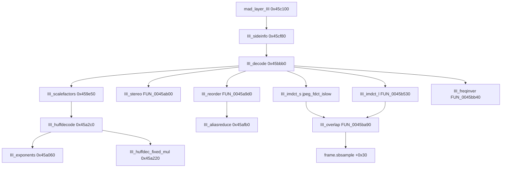

# Round 6 logic — Task 39 Report

## 1. Task

| Field | Value |
|-------|-------|
| **id** | 39 |
| **title** | Logic dispatch_45a_468: 0x0045a060–0x0045c4e0 (18 funcs) |
| **range** | `dispatch_45a_468` (`0x0045a`–`0x00468`) |
| **seed_address** | *(none — slice task)* |

## 2. Status

**PARTIAL** — Full control flow for the embedded **libmad Layer III** decode cluster is proven from `bulanci.ghidra.exe.c` (exported decompile + plate comments) cross-checked against libmad 0.15.1b `layer3.c` and prior xref work ([round5_worker_15_report.md](../struct_recovery/round5_worker_15_report.md), [round4_task_37_report.md](../struct_recovery/round4_task_37_report.md)). **Ghidra MCP disconnected** (`Not connected` / `Connection closed`) before live decompile, `rename_function_by_address`, `set_decompiler_comment`, or `save_program`. No Frida: codec math and call graph are statically sufficient.

**Doc re-verify:**

| Stale doc | Correction (this pass) |
|-----------|-------------------------|
| [libmad_function_map.md](../../formats/libmad_function_map.md) lists `III_decode` @ `0x0045d030` | **`III_decode` @ `0x0045bbb0`** (1348 B); `0x0045d030` is `CDSMpx_MadTimerAccumulate` (R5 w15) |
| Task manifest name `III_scalefactors` @ `0x0045a060` | Body is **`III_exponents`** (global_gain−210, pretab @ `0x0048bec4`/`0x0048bec5`); true bitstream **`III_scalefactors`** is @ `0x00459e50` (out of slice) |
| Ghidra names `jpeg_fdct_ifast` / `jpeg_fdct_islow` | Bodies are **libmad IMDCT** (`imdct36` / `III_imdct_s`), not IJG — only called from `III_decode`, never from JPEG compress paths in this band |

## 3. Functions

| Address | Ghidra name | Role summary | Evidence |
|---------|-------------|--------------|----------|
| `0x0045a060` | `III_scalefactors` *(misnamed)* | **`III_exponents`** — fills 39-entry signed exponent array from channel scalefactors, `global_gain−0xd2`, `scalefac_scale`, pretab for long/mixed/short blocks | Decompile: pretab refs `0x0048bec4`/`0x0048bec5`; sole caller from `III_huffdecode@0x0045a594` as `III_scalefactors(param_3,&local_9c)`; matches libmad `III_exponents()` |
| `0x0045a220` | `III_huffdec_fixed_mul` | Huffman hot-path **requant magnitude** — `rq_table@0x0048bee0`, optional `root_table@0x0049bf64` `mad_f_mul`; same algorithm as libmad `III_requantize(value,exp)` | 9 call sites in `III_huffdecode`; export comment + R5 w48 algorithm proof; distinct from `CDSMpx__mad_layer_III_requantize@0x0045cfc0` |
| `0x0045a2c0` | `III_huffdecode` | Layer III Huffman decode per channel — walks `PTR_DAT_0049d698` tables, calls exponents helper, returns `0x236`/`0x237` on underflow/bad table | 1807 B; calls `III_huffdec_fixed_mul` for each non-zero coef; libmad `layer3.c::III_huffdecode` |
| `0x0045a9d0` | `FUN_0045a9d0` | **`III_reorder`** — permute 576 `mad_fixed_t` lines into subband order for `block_type==2`; mixed-block skips first 36 lines via `sfbwidth` | Called @ `III_decode+0x236` when `pbVar13[1]==2`; 576-dword stack + `memcpy` tail; libmad `III_reorder()` |
| `0x0045ab00` | `FUN_0045ab00` | **`III_stereo`** — joint stereo (intensity + M/S); returns **`0x239`** (`MAD_ERROR_BADSTEREO`) when channel block types / mixed flags disagree | Called @ `III_decode+0x99` when `mode==JOINT_STEREO`; sets `MAD_FLAG_I_STEREO`/`MS_STEREO`; table @ `0x0049c120`; libmad `III_stereo()` |
| `0x0045afb0` | `III_aliasreduce` | Frequency-line alias reduction — butterfly with coef tables `0x0049bf74` / `0x0049bf94`; `lines` in ECX (`576` or `36` mixed) | Called from `III_decode` after reorder; libmad `III_aliasreduce(xr, lines)` |
| `0x0045b080` | `fastsdct` | 9-point fast SDCT building block for 36-point IMDCT | libmad `layer3.c::fastsdct`; callee of misnamed `jpeg_fdct_ifast` |
| `0x0045b250` | `jpeg_fdct_ifast` *(misnamed)* | **`imdct36`** — 18-in → 36-out long-block IMDCT core; calls `fastsdct` ×2, cosine table `0x0049c1a0` | Only xrefs from `III_decode` IMDCT path; libmad `imdct36()` |
| `0x0045b370` | `dctIV` | Type-IV DCT on 18 samples; table `0x0049c1c8` | libmad `dctIV()`; called from `FUN_0045b480` |
| `0x0045b480` | `FUN_0045b480` | IMDCT **window/sign prep** before long-block multiply — calls `dctIV`, negates overlap staging slots | Sole caller `FUN_0045b530@+8`; libmad `imdct36` prologue fragment |
| `0x0045b530` | `FUN_0045b530` | **Long-block IMDCT windowing** — `mad_f_mul` against window table `0x0049c048`/`0x0049c04c`/`0x0049c0d8`/`0x0049c0f0`; `param_1` selects block type branch | 4× per granule from `III_decode`; libmad `III_imdct_l` window stage |
| `0x0045b7a0` | `jpeg_fdct_islow` *(misnamed)* | **`III_imdct_s`** — short-block 18-point IMDCT; tables `0x0049bfb8`, `0x0049c0d8` | Called when `block_type==2` && !mixed in `III_decode` inner loop (pairs with `FUN_0045ba90`) |
| `0x0045ba90` | `FUN_0045ba90` | **`III_overlap`** — overlap-add 36 IMDCT outputs into `frame->sbsample` stride `0x1200` per channel | 4× per granule after IMDCT; writes `param_3 + 0x100 + subband*4`; libmad `III_overlap()` |
| `0x0045bb40` | `FUN_0045bb40` | **`III_freqinver`** — negate odd sample lines in overlap buffer (`+0x80`/`+0x180` strides) | Called on odd subband indices after overlap; libmad `III_freqinver()` |
| `0x0045bbb0` | `III_decode` | **Granule decode driver** — scalefactors (`0x459e50`), huffdecode, stereo, reorder/alias/IMDCT/overlap/freq-invert → `sbsample@frame+0x30`, overlap swap `frame+0x2430` | 1348 B; calls entire slice; libmad `III_decode()` |
| `0x0045c100` | `mad_layer_III` | **Layer III frame entry** — overlap `calloc(0x480,4)`, CRC, `III_sideinfo`, main_data bit reservoir, **`III_decode`**, error codes `0x201`/`0x231`/`0x235` | `g_pfnMpegLayerDecoder[2]`; [round4_task_37](../struct_recovery/round4_task_37_report.md) frame layout |
| `0x0045c480` | `mad_layer_I_sample` | Layer I sample dequant — `linear_table` trick via `g_anMadSfTable` | [status.md](../../formats/status.md) byte-match note |
| `0x0045c4e0` | `mad_layer_I` | Layer I frame decode — 32×12 subbands → `sbsample@+0x30` stride `0x480` | `g_pfnMpegLayerDecoder[0]` |

### Layer III granule pipeline (proven)

Per-channel loop inside `III_decode` (`bulanci.ghidra.exe.c` ~`0x0045bbb0`):

1. Pick `sfbwidth` from `PTR_DAT_0048be58` (+ long/mixed/short variants).
2. Non-LSF: `III_scalefactors@0x459e50` → `III_huffdecode` (which calls **`III_exponents@0x45a060`** internally).
3. Joint stereo: `FUN_0045ab00` (`III_stereo`).
4. Per channel/subband: if short block → `FUN_0045a9d0` reorder (when `block_type==2`); `III_aliasreduce`; then either **`jpeg_fdct_islow` (III_imdct_s)** or **`FUN_0045b530` (III_imdct_l)** + **`FUN_0045ba90` (III_overlap)**; odd bands → **`FUN_0045bb40` (III_freqinver)**; overlap pointer exchange at `frame+0x2430`.

Game reachability: **`CDSMpx` / `.mpx` audio only** — dispatch table `g_pfnMpegLayerDecoder@0x0048b928`; no gameplay `.text` callers ([mpx_audio_format.md](../../formats/mpx_audio_format.md) §3.8).

## 4. Ghidra deltas

**None applied** — MCP unavailable.

**Queued (evidence-backed):**

| Action | Target | Rationale |
|--------|--------|-----------|
| `rename_function_by_address` | `0x0045a060` → `III_exponents` | Decompile body ≠ bitstream scalefactors; duplicate name with `0x459e50` |
| `rename_function_by_address` | `0x0045a9d0` → `III_reorder` | 576-line permute @ `III_decode` short-block path |
| `rename_function_by_address` | `0x0045ab00` → `III_stereo` | `MAD_ERROR_BADSTEREO (0x239)` + joint-stereo flags |
| `rename_function_by_address` | `0x0045b250` → `imdct36` | Calls `fastsdct`; not referenced from IJG |
| `rename_function_by_address` | `0x0045b7a0` → `III_imdct_s` | Short-block path inside `III_decode` only |
| `rename_function_by_address` | `0x0045ba90` → `III_overlap` | Overlap-add into `sbsample` |
| `rename_function_by_address` | `0x0045bb40` → `III_freqinver` | Sign flip on odd lines |
| `set_decompiler_comment` | `III_decode`, misnamed jpeg symbols | Remove stale UNCERTAIN; cite libmad `layer3.c` |
| `set_function_prototype` | `III_aliasreduce(mad_fixed_t *xr, int lines)` | ECX=`lines` in `__fastcall` export |
| `save_program` | `bulanci.exe` | Once after renames |

Skip pending rename until sub-helper proof: `FUN_0045b480` (imdct36 fragment), `FUN_0045b530` (exact upstream symbol may be `III_imdct_l` vs inlined `imdct36` tail).

## 5. Frida

**none** — Layer III pipeline, Huffman tables, and frame field offsets (`sbsample@+0x30`, `overlap@+0x2430`) are proven statically; runtime hooks would not disambiguate remaining symbol names.

## 6. Remaining UNK

| Item | Reason |
|------|--------|
| `FUN_0045b480` / `FUN_0045b530` upstream export names | Window/IMDCT split matches libmad object code but COFF symbol not verified |
| `III_huffdec_fixed_mul` vs `III_requantize` | Same body; R5 w48 used `III_requantize`, manifest uses `III_huffdec_fixed_mul` — pick one canonical name |
| `0x00459e50` `III_scalefactors` | In slice+1 neighbor (task 40); not re-decompiled live this pass |
| Live Ghidra xref refresh | Cached `ghidra_xrefs.jsonl` sparse for this band; MCP disconnect blocked `get_xrefs_to` |
| `libmad_function_map.md` row for `III_decode` | Needs coordinator update to `0x0045bbb0` |
