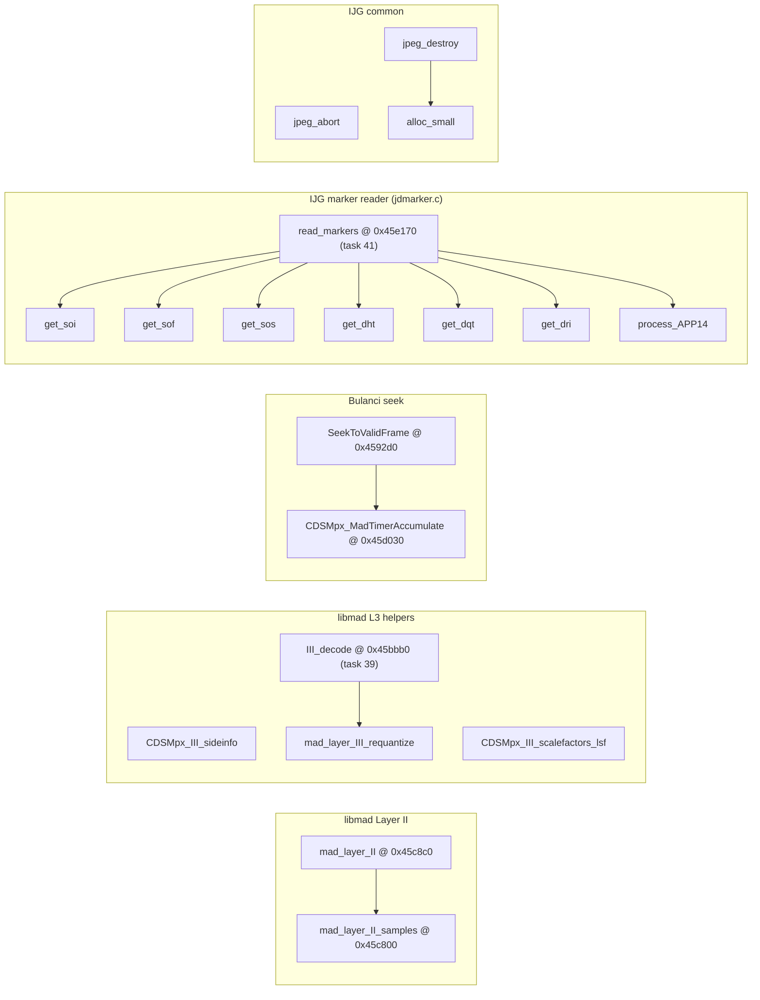

# Round 6 — Logic task 40 report

## Task

| Field | Value |
|-------|-------|
| **id** | 40 |
| **title** | Logic dispatch_45a_468: `0x0045c800`–`0x0045dda0` (18 funcs) |
| **range** | `dispatch_45a_468` |
| **range_note** | `0x0045a`–`0x00468`: embedded libmad Layer I/II/III helpers + libjpeg-6b marker reader/writer tail |
| **seed_address** | — (slice task) |

## Status

**PARTIAL** — All 18 functions documented from `config/bulanci/mapping.csv` plus prior Ghidra rounds (R4/R5) and format docs. **user-ghidra-mcp returned `Not connected`** on every call (`switch_program`, `decompile_function`, `get_function_by_address`); live decompile/xref re-verify and any Ghidra mutations were **not** performed this session.

## Functions

| Address | Ghidra name | Size | Role summary | Evidence |
|---------|-------------|-----:|--------------|----------|
| `0x0045c800` | `mad_layer_II_samples` | 188 B | libmad `layer12.c::II_samples` — requantize one Layer-II sample triplet from the bitstream (`shift = 0x1d - nb` ≡ `MAD_F_FRACBITS - (nb-1)`); scales via `g_anMadSfTable` @ `0x0049c210`. | [status.md](../../formats/status.md), [mpx_audio_format.md](../../formats/mpx_audio_format.md) §3 step 6; mapping.csv |
| `0x0045c8c0` | `mad_layer_II` | 1675 B | libmad `layer12.c::mad_layer_II` — full Layer-II frame: ISO allocation-table pick, bit-allocation/SCFSI/scalefactor read, optional CRC-16 (`mad_bit_crc`), 12×32 subband loop calling `mad_layer_II_samples`; writes `mad_frame.sbsample` @ `frame+0x30`. | mpx_audio_format.md §3 decompilation summary; `g_pfnMpegLayerDecoder[1]` dispatch |
| `0x0045cf80` | `CDSMpx_III_sideinfo` | 21 B | libmad Layer-III side-info bit helper (`layer3.c`, tiny scalar). `__fastcall`. | mapping.csv; [libmad_function_map.md](../../formats/libmad_function_map.md) |
| `0x0045cfa0` | `CDSMpx_III_scalefactors_lsf` | 32 B | libmad LSF scalefactor reader stub for MPEG-2 Layer III. `__stdcall`. | mapping.csv; libmad_function_map.md |
| `0x0045cfc0` | `CDSMpx::mad_layer_III_requantize` | 106 B | libmad `layer3.c::III_requantize` (cold path): `rq_table` @ `0x0048bee0` + optional `root_table` @ `0x0049bf64`. **Distinct** from hot-path `III_requantize` inside `III_huffdecode` @ `0x0045a2c0`. | [round5_worker_48_report.md](../struct_recovery/round5_worker_48_report.md); mapping.csv |
| `0x0045d030` | `CDSMpx_MadTimerAccumulate` | 498 B | Bulanci MAD seek helper: accumulates timer/sample-rate while scanning for a valid frame sync. Caller **`SeekToValidFrame` @ `0x004592d0`** (R5 rename). **Not** `III_decode` (that is @ **`0x0045bbb0`**, 1348 B — task 39 slice). | [round5_worker_15_report.md](../struct_recovery/round5_worker_15_report.md); mapping.csv; **corrects outdated** libmad_function_map.md row for `0x0045d030` |
| `0x0045d160` | `jpeg_abort` | 57 B | IJG-6b `jcomapi.c::jpeg_abort` — abort compress/decompress, reset internal state. | [jpeg_decoder.md](../../formats/jpeg_decoder.md) |
| `0x0045d1a0` | `jpeg_destroy` | 33 B | IJG-6b `jcomapi.c::jpeg_destroy` — tear down `jpeg_(de)compress_struct`. Used from `CDSJpegImage` wrapper paths. | jpeg_decoder.md |
| `0x0045d1d0` | `FUN_0045d1d0` | 30 B | 30 B helper in `jpeg_destroy` / `alloc_small` cluster only; R5 classified as CRT heap shim with no game-band entry — **semantic UNK**. | round5_worker_15_report.md (skipped list) |
| `0x0045d1f0` | `alloc_small` | 30 B | IJG-6b `jmemmgr.c::alloc_small` — small-object pool alloc for marker-reader suspend/resume buffers. | jpeg_decoder.md |
| `0x0045d210` | `get_soi` | 140 B | IJG-6b `jdmarker.c` — parse **SOI** (`0xFFD8`); first marker in `read_markers` @ `0x0045e170` state machine. | mapping.csv; jpeg_decoder.md (`jdmarker.c` cluster) |
| `0x0045d2a0` | `get_sof` | 701 B | IJG-6b `jdmarker.c` — parse **SOF** (`0xC0`–`0xCF`): frame dimensions, component count, sampling factors, Q-table indices. | mapping.csv |
| `0x0045d560` | `get_sos` | 618 B | IJG-6b `jdmarker.c` — parse **SOS** (`0xDA`): scan script, Huffman table selectors, spectral selection/approximation. | mapping.csv |
| `0x0045d7d0` | `get_dht` | 631 B | IJG-6b `jdmarker.c` — parse **DHT** (`0xC4`): Huffman code lengths + symbol lists into `cinfo`. | mapping.csv |
| `0x0045da50` | `get_dqt` | 494 B | IJG-6b `jdmarker.c` — parse **DQT** (`0xDB`): quantization tables. | mapping.csv |
| `0x0045dc40` | `get_dri` | 217 B | IJG-6b `jdmarker.c` — parse **DRI** (`0xDD`): restart interval. | mapping.csv |
| `0x0045dd20` | `FUN_0045dd20` | 122 B | libjpeg marker **writer** helper; sole named caller **`save_marker` @ `0x0045dde0`** (task 41). `__thiscall`. Exact IJG symbol name **UNK**. | round5_worker_15_report.md |
| `0x0045dda0` | `process_APP14` | 54 B | IJG-6b `jdmarker.c::process_APP14` — Adobe APP14 (`0xFFEE`) handler; records color-transform flags on `cinfo`. | mapping.csv |

### Slice control-flow sketch

## Ghidra deltas

**none** — Ghidra MCP unavailable; no `set_function_this_type`, renames, comments, or `save_program bulanci.exe` this session.

Prior rounds already applied (out of scope to re-apply):

- R5: `CDSMpx_MadTimerAccumulate` rename @ `0x0045d030` ([round5_worker_15_results.jsonl](../struct_recovery/round5_worker_15_results.jsonl)).

## Frida

**none** — stock libmad / libjpeg-6b codec bodies; behavior established by prior static decompilation and IJG/libmad source attribution. No runtime-only field semantics in this slice.

## Remaining UNK

1. **Ghidra live re-verify** — all xrefs, prototypes, and decompiler output for this slice pending MCP reconnect (`decompile` + `get_xrefs_to` on each address).
2. **`FUN_0045d1d0` @ `0x0045d1d0`** — confirm CRT-only vs helper role (R5 skipped).
3. **`FUN_0045dd20` @ `0x0045dd20`** — map to exact IJG `jcmarker.c` / `jdmarker.c` symbol (writer-side sibling of `save_marker`).
4. **Doc correction** — [libmad_function_map.md](../../formats/libmad_function_map.md) lists `0x0045d030` as `III_decode`; **`III_decode` is @ `0x0045bbb0`** per mapping.csv and R5W15. Update that doc on next struct pass (not edited here — no new Ghidra proof this session).
5. **`set_function_this_type`** — not evaluated without decompiler; several JPEG marker parsers use non-`cdecl` conventions per mapping.csv (`__stdcall` / `__fastcall` / `__thiscall`) — verify ECX/`this` only after MCP returns.

## Cross-refs

- [mpx_audio_format.md](../../formats/mpx_audio_format.md) — Layer II decode walk-through
- [jpeg_decoder.md](../../formats/jpeg_decoder.md) — IJG-6b fingerprint + partial address map
- [libmad_function_map.md](../../formats/libmad_function_map.md) — upstream file map (note `0x0045d030` row outdated)
- [round5_worker_15_report.md](../struct_recovery/round5_worker_15_report.md) — `CDSMpx_MadTimerAccumulate` rename proof
- [round5_worker_48_report.md](../struct_recovery/round5_worker_48_report.md) — dual `III_requantize` paths
