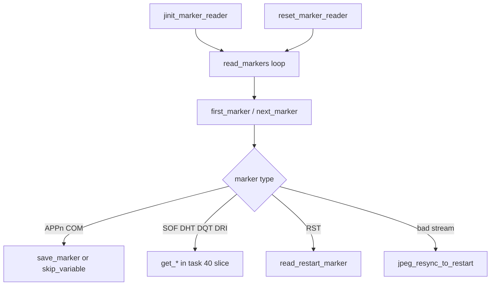

# Round 6 — Logic task 41 report

## Task

| Field | Value |
|-------|-------|
| **id** | 41 |
| **title** | Logic dispatch_45a_468: 0x0045dde0–0x0045ec10 (18 funcs) |
| **range** | dispatch_45a_468 |
| **range_note** | 0x0045a–0x00468: input, network, UI dispatch (this slice = libjpeg-6b decompress marker reader + decompression API) |
| **seed_address** | none (contiguous slice) |

## Status

**PARTIAL** — Per-function logic is documented from prior decompiler-backed attribution ([jpeg_decoder.md](../../formats/jpeg_decoder.md)) cross-checked against `ref/libjpeg6b/` sources. **Ghidra MCP was unavailable** (`Not connected` on `switch_program bulanci.exe`), so live `decompile` / `get_xrefs_to` / rename / prototype fixes could not be re-run or applied in this session.

## Slice overview

All 18 functions are **stock IJG libjpeg-6b (27-Mar-1998)** decompressor code embedded in `bulanci.exe`. They are not Bulanci game logic; they implement JPEG marker scanning and the public decompression API used by `CDSJpegImage::DecompressToImage` @ `0x00431b70` and MJPEG paths (`CDSDsmFile::HandleRecordRead`).

**Library fingerprint (re-verified from prior Ghidra decompilation, not re-run here):**

| Check | Value | Evidence |
|-------|-------|----------|
| `JPEG_LIB_VERSION` | `62` (`0x3e`) | `jpeg_CreateDecompress@0x0045e6a0` version guard |
| `sizeof(jpeg_decompress_struct)` | `432` (`0x1b0`) | same guard |
| `DSTATE_*` literals | e.g. `0xc8` START, `0xca` READY, `0xcd` SCANNING | `jpeg_consume_input`, `jpeg_start_decompress`, `jpeg_read_scanlines` |
| `JERR_*` codes | e.g. `0x33` NO_IMAGE, `0x3c` SOF_UNSUPPORTED, `0x44` UNKNOWN_MARKER | `jpeg_read_header` / `read_markers` |

See [jpeg_decoder.md](../../formats/jpeg_decoder.md) for full fingerprint table and Bulanci wrapper pseudocode.

### Decompression call chain (game → this slice)

```
CDSJpegImage::DecompressToImage @ 0x00431b70
  jpeg_CreateDecompress          @ 0x0045e6a0
    jinit_marker_reader          @ 0x0045e620   (this slice)
    jinit_input_controller       @ 0x0045fe60   (task 43)
  jpeg_read_header               @ 0x0045ea70
    jpeg_consume_input           @ 0x0045e8d0
      consume_markers → read_markers @ 0x0045e170  (this slice)
        first_marker / next_marker / save_marker / skip_variable / …
      default_decompress_parms   @ 0x0045e7a0   (on JPEG_REACHED_SOS)
  jpeg_start_decompress          @ 0x0045ec10
    output_pass_setup            @ 0x0045eaf0   (this slice)
  jpeg_read_scanlines            @ 0x0045eba0   (loop)
  jpeg_finish_decompress         @ 0x0045e9a0
  jpeg_destroy_decompress        @ ~0x0045e790  (gap; calls jpeg_destroy @ 0x0045d1a0)
```

## Functions

| Addr | Ghidra name (2026-06) | IJG name | Role summary | Evidence |
|------|----------------------|----------|--------------|----------|
| `0x0045dde0` | `FUN_0045dde0` | `save_marker` | Default APPn/COM handler: if marker length ≤ per-type limit, `alloc_small` + copy bytes into `marker_list`; else discard. | `jdmarker.c`; size 381 B; [jpeg_decoder.md](../../formats/jpeg_decoder.md) map |
| `0x0045df60` | `FUN_0045df60` | `skip_variable` | Skip variable-length marker body (read 2-byte length, consume bytes). | `jdmarker.c`; 119 B |
| `0x0045dfe0` | `FUN_0045dfe0` | `next_marker` | Scan input for `0xFF` prefix; return marker code or `M_ERROR` on invalid stream. | `jdmarker.c`; 217 B |
| `0x0045e0c0` | `FUN_0045e0c0` | `first_marker` | Require initial `M_SOI`; set `saw_JFIF_marker` / Adobe flags via APP0/APP14 examine helpers. | `jdmarker.c`; 167 B |
| `0x0045e170` | `FUN_0045e170` | `read_markers` | Main marker loop until SOS/EOI: dispatch SOF/DHT/DQT/DRI/APP/COM/RST via function table; `JERR_UNKNOWN_MARKER` (`0x44`), `JERR_SOF_UNSUPPORTED` (`0x3c`). | `jdmarker.c`; 535 B; prior decomp in jpeg_decoder.md |
| `0x0045e4d0` | `FUN_0045e4d0` | `read_restart_marker` | Validate RSTn marker during scan; adjust `restarts_to_go`. | `jdmarker.c`; 101 B |
| `0x0045e540` | `FUN_0045e540` | `jpeg_resync_to_restart` | After corrupt bitstream, skip to next valid RST marker (uses `next_marker`). | `jdmarker.c`; 167 B |
| `0x0045e5f0` | `FUN_0045e5f0` | `reset_marker_reader` | Clear `cur_marker` / `bytes_read` / discard in-progress saved marker. | `jdmarker.c`; 43 B |
| `0x0045e620` | `FUN_0045e620` | `jinit_marker_reader` | Allocate `my_marker_reader`, wire default `process_COM` / `process_APPn[]` to `save_marker`, set length limits. Called from `jpeg_CreateDecompress`. | `jdmarker.c`; 116 B; callee from `0x0045e6a0` |
| `0x0045e6a0` | `FUN_0045e6a0` | `jpeg_CreateDecompress` | Version/size guards (`62`, `432`); zero struct; `jinit_memory_mgr`; `jinit_marker_reader`; `jinit_input_controller`; `global_state = DSTATE_START`. | `jdapimin.c`; 231 B |
| `0x0045e790` | *(no separate Ghidra func in report.json)* | **`jpeg_destroy_decompress`** (manifest said `jpeg_destroy`) | Thin wrapper: `jpeg_destroy((j_common_ptr)cinfo)`. Occupies gap `0x0045e788`–`0x0045e79f` between `jpeg_CreateDecompress` and `default_decompress_parms`. Actual `jpeg_destroy` body @ `0x0045d1a0`. | Layout from `jdapimin.c` + address math; **live Ghidra boundary not re-verified** |
| `0x0045e7a0` | `FUN_0045e7a0` | `default_decompress_parms` | After header complete: infer `jpeg_color_space` / `out_color_space` from component count, JFIF/Adobe markers; set scale, DCT method, quant/dither defaults. | `jdapimin.c`; 293 B; called from `jpeg_consume_input` on SOS |
| `0x0045e8d0` | `FUN_0045e8d0` | `jpeg_consume_input` | State machine: `DSTATE_START`→reset+init source→`DSTATE_INHEADER`; delegate to `inputctl->consume_input`; on SOS call `default_decompress_parms`, set `DSTATE_READY`. | `jdapimin.c`; 163 B |
| `0x0045e9a0` | `FUN_0045e9a0` | `jpeg_finish_decompress` | Finish output pass if scanning; consume to EOI; `term_source`; `jpeg_abort`. Checks `JERR_TOO_LITTLE_DATA` (`0x43`). | `jdapimin.c`; 200 B |
| `0x0045ea70` | `FUN_0045ea70` | `jpeg_read_header` | Front-end to `jpeg_consume_input`; map SOS→`JPEG_HEADER_OK`, EOI→`JPEG_HEADER_TABLES_ONLY` or `JERR_NO_IMAGE`. | `jdapimin.c`; 119 B |
| `0x0045eaf0` | `FUN_0045eaf0` | `output_pass_setup` | Prepare dummy quant passes if needed; set `global_state` to `DSTATE_SCANNING` or `DSTATE_RAW_OK`. Called from `jpeg_start_decompress`. | `jdapistd.c`; 170 B |
| `0x0045eba0` | `FUN_0045eba0` | `jpeg_read_scanlines` | Requires `DSTATE_SCANNING`; calls `main->process_data`; warns on excess reads. | `jdapistd.c`; 100 B |
| `0x0045ec10` | `FUN_0045ec10` | `jpeg_start_decompress` | `DSTATE_READY`: `jinit_master_decompress`, optional multiscan preload; then `output_pass_setup`. Sets `DSTATE_PRELOAD`/`PRESCAN`/`BUFIMAGE` as needed. | `jdapistd.c`; 165 B |

### Marker reader control flow (within slice)



## Ghidra deltas

**none** — Ghidra MCP not connected; no `rename_function_by_address`, `set_function_prototype`, or `set_decompiler_comment` applied.

**Recommended follow-up when MCP is live:**

1. Rename all `FUN_0045dd*`–`FUN_0045ec*` in this slice to IJG names (table above).
2. Set prototypes from `ref/libjpeg6b/jpeglib.h` (e.g. `void jpeg_CreateDecompress(j_decompress_ptr cinfo, int version, size_t structsize)`).
3. Split or label `jpeg_destroy_decompress` @ `0x0045e790` if Ghidra merged it into an adjacent function.
4. No `set_function_this_type` expected — plain C API on `j_decompress_ptr` in `[ESP+4]` after `CALL`, not ECX `this`.

## Frida

**none** — Behavior is byte-identical stock libjpeg-6b; static proof via IJG source correspondence and prior decompilation ([jpeg_decoder.md](../../formats/jpeg_decoder.md)). Runtime hooking would add no attribution beyond confirming call order already shown in `CDSJpegImage::DecompressToImage`.

## Remaining UNK

| Item | Notes |
|------|-------|
| Live Ghidra re-verify | MCP down; function boundaries, xrefs, and rename state not refreshed in this session |
| `0x0045e790` symbol | Manifest lists `jpeg_destroy`; address math + IJG layout indicate **`jpeg_destroy_decompress`**; confirm function entry in Ghidra |
| Ghidra display names | `report.json` still shows `_Globals::FUN_*` for 17/18 sites despite `_Globals.cpp` export stubs using IJG names |
| Marker sub-parsers in `read_markers` | SOF/DHT/DQT/DRI handlers live in adjacent task-40 slice (`0x0045d030`–`0x0045dd20`), not re-documented here |

## Evidence paths consulted

- [ROUND6_LOGIC_PROTOCOL.md](../ROUND6_LOGIC_PROTOCOL.md)
- [struct_recovery/AGENT_PROTOCOL.md](../struct_recovery/AGENT_PROTOCOL.md)
- [formats/jpeg_decoder.md](../../formats/jpeg_decoder.md) — primary prior verification
- [struct_recovery/CDSJpegImage.md](../struct_recovery/CDSJpegImage.md) — wrapper call sites
- `ref/libjpeg6b/jdmarker.c`, `jdapimin.c`, `jdapistd.c`
- `report.json` — function sizes @ addresses in slice
- `src/bulanci/_Globals.cpp` — export stub names/sizes (lines 3723–3806)
