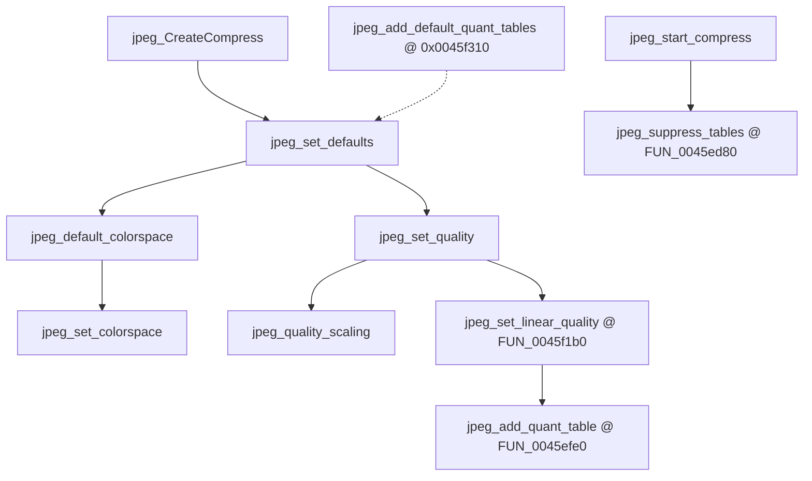

# Round 6 — Logic task 42 report

## Task

| Field | Value |
|-------|-------|
| **id** | 42 |
| **title** | Logic dispatch_45a_468: 0x0045ecc0–0x0045f860 (18 funcs) |
| **range** | dispatch_45a_468 |
| **range_note** | 0x0045a–0x00468 band (this slice = libjpeg-6b **compressor** public API + `jcparam.c` helpers + `jutils.c` arithmetic) |
| **seed_address** | none (contiguous slice) |

## Status

**PARTIAL** — Per-function logic is documented from prior IJG attribution ([jpeg_decoder.md](../../formats/jpeg_decoder.md)), recovered implementations in `src/bulanci/CDSJpegImage.cpp` / `config/bulanci/mapping.csv`, objdiff match percentages, and R5 xref plates ([round5_worker_15_report.md](../struct_recovery/round5_worker_15_report.md)). **This session:** `user-ghidra-mcp` returned `Not connected` / `Connection closed` on `switch_program bulanci.exe`; no live `decompile`, `get_xrefs_to`, rename, `set_function_prototype`, `set_function_this_type`, or `save_program`.

## Slice overview

All 18 functions are **stock IJG libjpeg-6b (27-Mar-1998)** compressor-side code embedded in `bulanci.exe`. They are not Bulanci gameplay dispatch; they implement JPEG **compression** used by `CDSJpegImage::CompressFromImage` @ `0x00431e50` (and tooling that writes `BitmapJpegAnim`).

**Library fingerprint (re-verified from prior Ghidra decompilation + `CDSJpegImage.cpp`, not re-run live):**

| Check | Value | Evidence |
|-------|-------|----------|
| `JPEG_LIB_VERSION` | `62` (`0x3e`) | `jpeg_CreateCompress@0x0045ecc0` version guard |
| `sizeof(jpeg_compress_struct)` | `360` (`0x168`) | same guard |
| `CSTATE_START` | `100` (`0x64`) | `jpeg_set_defaults`, `jpeg_set_colorspace` |
| `CSTATE_SCANNING` | `101` (`0x65`) | `jpeg_start_compress` |
| `JERR_BAD_STATE` | `20` (`0x14`) | `jpeg_set_defaults` |
| `JERR_BAD_STRUCT_SIZE` | `21` (`0x15`) | create-API guards |

See [jpeg_decoder.md](../../formats/jpeg_decoder.md) for full fingerprint table and wrapper pseudocode.

### Compression call chain (game → this slice)

```
CDSJpegImage::CompressFromImage @ 0x00431e50
  jpeg_CreateCompress              @ 0x0045ecc0
  jpeg_set_defaults                @ 0x0045f6e0
    jpeg_set_quality               @ 0x0045f230
      jpeg_quality_scaling         @ 0x0045f1f0
      FUN_0045f1b0                  @ 0x0045f1b0  (jpeg_set_linear_quality)
        FUN_0045efe0                @ 0x0045efe0  (jpeg_add_quant_table body)
  jpeg_start_compress              @ 0x0045eee0
    FUN_0045ed80                   @ 0x0045ed80  (jpeg_suppress_tables; xref plate R5)
  jpeg_write_scanlines             @ 0x0045ef60
  jpeg_finish_compress             @ 0x0045edf0
```

Downstream encoder init (`jinit_compress_master`, Huffman/DCT) lives outside this slice (tasks 43+, 49).

### Parameter-helper flow (within slice)



## Functions

| Addr | Ghidra name (2026-06) | IJG name | Role summary | Evidence |
|------|----------------------|----------|--------------|----------|
| `0x0045ecc0` | `jpeg_CreateCompress` | `jpeg_CreateCompress` | Version (`62`) and struct-size (`360`) guards; zero `jpeg_compress_struct`; `jinit_memory_mgr`; module inits; `global_state = CSTATE_START`. | `jcapimin.c`; [jpeg_decoder.md](../../formats/jpeg_decoder.md); size 190 B (`mapping.csv`) |
| `0x0045ed80` | `FUN_0045ed80` | `jpeg_suppress_tables` | Walk quant + DC/AC Huff tables; set each `sent_table` flag from `write_all_tables` arg. | Recovered in `CDSJpegImage.cpp` (loops `quant_tbl_ptrs[4]`, `dc/ac_huff_tbl_ptrs[4]`); xref plate: callee from `jpeg_start_compress@0x0045ef10` ([round5_worker_15](../struct_recovery/round5_worker_15_report.md)); objdiff 66.4% |
| `0x0045edf0` | `jpeg_finish_compress` | `jpeg_finish_compress` | Finish entropy pass, flush markers, `term_destination`, `jpeg_abort`. | `jcapimin.c`; [jpeg_decoder.md](../../formats/jpeg_decoder.md); size 238 B |
| `0x0045eee0` | `jpeg_start_compress` | `jpeg_start_compress` | Validate `CSTATE_START`; `jinit_compress_master`; optional table emission; enter `CSTATE_SCANNING`. | `jcapimin.c`; wrapper callsite in jpeg_decoder.md |
| `0x0045ef60` | `jpeg_write_scanlines` | `jpeg_write_scanlines` | Requires scanning state; forwards rows to `cinfo->main->process_data`. | `jcapistd.c`; CompressFromImage loop |
| `0x0045efe0` | `FUN_0045efe0` | `jpeg_add_quant_table` | Allocate quant table if needed; scale 64 `basic_table` entries by `scale_factor%`; optional baseline clamp; `sent_table=0`. Guards `CSTATE_START`, table index `<4`, `JERR_BAD_STATE`/`JERR_BAD_QUANT_TABLE`. | Full recovery `CDSJpegImage.cpp`; `CSTATE_START==100`; objdiff 38.0%; called 2× from `FUN_0045f1b0` |
| `0x0045f1b0` | `FUN_0045f1b0` | `jpeg_set_linear_quality` | Embed luminance/chrominance K.1 quant tables; call `FUN_0045efe0` for slots 0 and 1. | `CDSJpegImage.cpp` std tables + dual callee; objdiff **95.2%**; xref plate: caller `jpeg_set_quality@0x0045f248` |
| `0x0045f1f0` | `jpeg_quality_scaling` | `jpeg_quality_scaling` | Map user quality 1..100 → percent scale (piecewise formula). | `CDSJpegImage.cpp` matches `jcparam.c`; objdiff **100%** |
| `0x0045f230` | `jpeg_set_quality` | `jpeg_set_quality` | `jpeg_quality_scaling` then `FUN_0045f1b0`. | `CDSJpegImage.cpp`; CompressFromImage uses quality arg |
| `0x0045f260` | `jpeg_add_quant_table` | **UNK / mislabel?** | Ghidra lists `jpeg_add_quant_table` but `mapping.csv` prototype is `(int*, void*)` — **not** the 5-arg `jpeg_add_quant_table` recovered @ `FUN_0045efe0`. Size 164 B (`0xa4`). | [jpeg_decoder.md](../../formats/jpeg_decoder.md) address map; **live decompile not run** — may be distinct `jcparam.c` helper or wrong name |
| `0x0045f310` | `jpeg_add_default_quant_tables` | `jpeg_add_default_quant_tables` | Install default luminance/chrominance quant tables (+ related Huff setup per IJG). | `jcparam.c`; size 82 B; called from `jpeg_set_defaults` path per jpeg_decoder.md |
| `0x0045f370` | `jpeg_set_colorspace` | `jpeg_set_colorspace` | `SET_COMP` layout per component; set JFIF/Adobe flags; `JERR_BAD_IN_COLORSPACE` on invalid space. | `CDSJpegImage.cpp` partial; objdiff 60.6%; `CSTATE_START` guard |
| `0x0045f660` | `jpeg_default_colorspace` | `jpeg_default_colorspace` | Map `in_color_space` → `jpeg_color_space` (RGB→YCbCr); dispatch `jpeg_set_colorspace`. | `CDSJpegImage.cpp`; `JERR_BAD_IN_COLORSPACE` (`9`) |
| `0x0045f6e0` | `jpeg_set_defaults` | `jpeg_set_defaults` | Fresh compress defaults: precision 8, quality 75, arithmetic tables, DCT method, densities; `jpeg_default_colorspace`. | `CDSJpegImage.cpp` partial; objdiff 77.8%; `JERR_BAD_STATE` (`0x14`) |
| `0x0045f7e0` | `jdiv_round_up` | `jdiv_round_up` | `ceil(a/b)` for nonnegative integers. | [jpeg_decoder.md](../../formats/jpeg_decoder.md); objdiff **100%**; `jutils.c` |
| `0x0045f7f0` | `FUN_0045f7f0` | `jround_up` (proposed) | Round `a` up to next multiple of `b` (`a += b-1; return a - a%b`). | **Layout proof:** immediately follows `jdiv_round_up@0x0045f7e0` (IJG `jutils.c` order); size 24 B; xref plate: callee from `jinit_d_*_controller` / `jinit_upsampler` ([round5_worker_15](../struct_recovery/round5_worker_15_report.md)); objdiff 12.7% (stub not implemented in `_Globals.cpp`) |
| `0x0045f810` | `jcopy_sample_rows` | `jcopy_sample_rows` | Copy `num_rows` of sample data between `JSAMPARRAY`s. | [jpeg_decoder.md](../../formats/jpeg_decoder.md); size 71 B |
| `0x0045f860` | `FUN_0045f860` | **UNK** | `(void*, void*, int)` — candidate `jcopy_block_row` per IJG `jutils.c` (3-arg, pointer row copy). Not same as `FUN_0045f880` row-buffer alloc (R5). | `mapping.csv` signature; size 27 B; objdiff 14% — **no C recovery stub** |

## Ghidra deltas

**none** — Ghidra MCP not connected; no `rename_function_by_address`, `set_function_prototype`, `set_decompiler_comment`, or `set_function_this_type` applied.

**Recommended follow-up when MCP is live:**

1. Rename proven `FUN_*` → IJG names: `FUN_0045ed80` → `jpeg_suppress_tables`, `FUN_0045efe0` → `jpeg_add_quant_table`, `FUN_0045f1b0` → `jpeg_set_linear_quality`, `FUN_0045f7f0` → `jround_up` (after disasm confirms modulo path).
2. Decompile `0x0045f260` and resolve conflict with `FUN_0045efe0` (duplicate `jpeg_add_quant_table` label vs distinct helper).
3. Set prototypes from `jpeglib.h` on public entries (`jpeg_compress_struct *`, not ECX `this`).
4. No `set_function_this_type` expected — stdcall/cdecl C API on `j_compress_ptr` in stack args.

## Frida

**none** — Stock libjpeg-6b; static proof via IJG source correspondence, `CDSJpegImage.cpp` recovery, and objdiff on implemented stubs. Runtime hooks would only repeat the call order already documented for `CompressFromImage`.

## Remaining UNK

| Item | Notes |
|------|-------|
| Live Ghidra re-verify | MCP down; boundaries, xrefs, and rename state not refreshed |
| `0x0045f260` vs `FUN_0045efe0` | Both associated with `jpeg_add_quant_table` in different artifacts; prototypes differ — needs live decompile |
| `FUN_0045f860` | No recovery stub; candidate `jcopy_block_row` not proven |
| `FUN_0045f7f0` → `jround_up` | Strong layout + xref evidence; pending disasm confirmation |
| Public API stubs in Ghidra | Several symbols already named (`jpeg_*`); five `FUN_*` remain in slice |

## Evidence paths consulted

- [ROUND6_LOGIC_PROTOCOL.md](../ROUND6_LOGIC_PROTOCOL.md)
- [struct_recovery/AGENT_PROTOCOL.md](../struct_recovery/AGENT_PROTOCOL.md)
- [formats/jpeg_decoder.md](../../formats/jpeg_decoder.md)
- [struct_recovery/round5_worker_15_report.md](../struct_recovery/round5_worker_15_report.md)
- `src/bulanci/CDSJpegImage.cpp`, `config/bulanci/mapping.csv`
- `build/__r6_t42_jpeg.json`, `build/__r6_t42_globals.json` (objdiff, this session)
