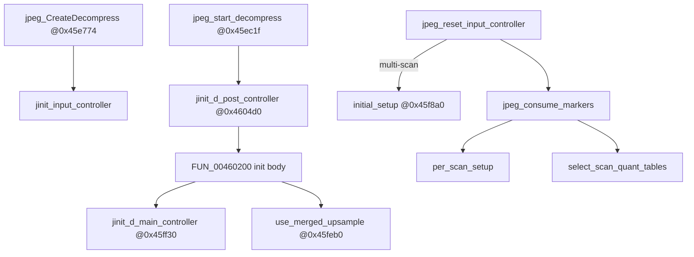

# Round 6 — Logic task 43 report

## Task

| Field | Value |
|-------|-------|
| **id** | 43 |
| **title** | Logic dispatch_45a_468: 0x0045f880–0x004605a0 (18 funcs) |
| **range** | dispatch_45a_468 |
| **seed_address** | none (contiguous slice) |

## Status

**PARTIAL** — All 18 functions documented with PE disassembly + xref scan on `orig/bulanci_insturmented.exe`. **user-ghidra-mcp Not connected**; pending renames/comments and `save_program bulanci.exe` deferred.

## Functions

| Addr | Name (Ghidra/manifest) | Role summary | Evidence |
|------|------------------------|--------------|----------|
| `0x0045f880` | `IJG_jzero_far` | Zero-fill helper: `__cdecl` wrapper around `_memset@0x447ce0` (`push len; push 0; push ptr; call`). | R5 rename proof (round5_worker_48); 10× callers in JPEG decompress/compress cluster (`0x461611`, `0x466772`, …). |
| `0x0045f8a0` | `initial_setup` | Decompress master pre-pass validation: `JPEG_MAX_DIMENSION` (`0xffdc`) width/height checks → `JERR_IMAGE_TOO_BIG` (`0x29`); `data_precision` vs 8 → `JERR_BAD_PRECISION` (`0x0f`); `num_components` vs 10 → `JERR_COMPONENT_COUNT` (`0x1a`). | Disasm; 1× caller `jpeg_reset_input_controller@0x45fdc2` when inputctl `has_multiple_scans` (`+0x14`). **Not** the compressor `initial_setup@0x0046bdf0` in `jpeg_decoder.md`. |
| `0x0045faa0` | `per_scan_setup` | Per-scan MCU/dimension setup for current decompress pass: reads `cinfo+0x124` pass counter; copies component width/height; computes MCU counts via `div`/`jdiv_round_up` pattern. | Disasm; sole caller `jpeg_consume_markers@0x45fd06`. |
| `0x0045fc50` | `select_scan_quant_tables` | Binds quant tables for scan components; on missing/invalid table id → `JERR_BAD_COMPONENT_ID` (`0x34`) via `error_exit`. | Disasm; caller `jpeg_consume_markers@0x45fd0d`. |
| `0x0045fd00` | `jpeg_consume_markers` | Input-controller `consume_markers`: `per_scan_setup` → `select_scan_quant_tables` → coef `start_input_pass` vtable (`cinfo+0x198`) → entropy `start_input_pass` (`cinfo+0x188`); stores coef pointer to `cinfo+0x190`. | Disasm matches `jdinput.c` consume_markers; vtable dispatch from `jinit_input_controller`. |
| `0x0045fd40` | `jpeg_reset_input_controller` | Input-controller reset: handles suspended state (`+0x11`), multi-scan resync (`+0x14` → `initial_setup`), `JERR_EOI_EXPECTED` (`0x23`) if not suspended, else calls `jpeg_consume_markers`. | Disasm; installed as inputctl method ptr at `jinit_input_controller+0x0`. |
| `0x0045fe00` | `jpeg_start_input_pass` | Arms input controller for a pass: sets method ptrs, clears flags, calls marker `start_pass` + coef `start_pass`, zeroes `cinfo+0x8c`. | Disasm; vtable slot `+0x4` in 24-byte inputctl struct. |
| `0x0045fe60` | `jinit_input_controller` | Allocates 24-byte input controller via `mem->alloc_small(..., 0x18)`; wires vtable `{reset@0x45fd40, start@0x45fe00, consume@0x45fd00, finish@0x45fe40}`. | Disasm; caller `jpeg_CreateDecompress` init path `@0x45e774`; sets `global_state=DSTATE_START` (`0xc8`). |
| `0x0045feb0` | `FUN_0045feb0` | **Merged-upsampling eligibility gate** (`jdmerge.c` `use_merged_upsample`): tests `raw_data_out`, 8-bit, 3 components, 4:2:0 sampling, no quant/colormap, etc.; returns 0/1 in `AL`. | Disasm; `__fastcall` `EDX=cinfo`; callers `FUN_00460200@0x460220`, `FUN_00460160@0x460126`. |
| `0x0045ff30` | `FUN_0045ff30` | **Main decompress controller init (head)** (`jdmainct.c` `jinit_d_main_controller`): requires `global_state==DSTATE_READY` (`0xca`) else `JERR_BAD_STATE` (`0x14`); uses `jdiv_round_up@0x45f7e0` for row-group sizing; sets `cinfo+0x118`. | Disasm; caller `FUN_00460200@0x46020a`. |
| `0x00460160` | `FUN_00460160` | **Main controller buffer + sample range-limit table**: `alloc_small(..., 0x580)`; fills bytes `0..0xff` identity table (classic `sample_range_limit` setup). | Disasm; caller `FUN_00460200@0x460214`; also calls `use_merged_upsample` internally. |
| `0x00460200` | `FUN_00460200` | **Post-controller init body** (tail of `jinit_d_post_controller`): calls `jinit_d_main_controller` head + buffer init + `use_merged_upsample`; clears CC/upsample enable flags when not raw/optimized. | Disasm; sole caller `FUN_004604d0@0x4604fb`; `JERR_UNSUPPORTED_MODE` (`0x2f`) on invalid color paths. |
| `0x00460380` | `post_process_1pass` | Post-processor `post_process_data` for 1-pass output: on `post+8` flag calls upsample/color/quantize `start_pass` chain; handles buffered-image / quant dummy-pass transitions. | Disasm; vtable slot `[0]` installed by `FUN_004604d0`. |
| `0x004604d0` | `FUN_004604d0` | **`jinit_d_post_controller` (head)** (`jdpostct.c`): `alloc_small(..., 0x1c)`; sets `{post_process@0x460380, start_pass@0x4604a0}`; calls init body `FUN_00460200`. | Disasm; caller `jpeg_start_decompress@0x45ec1f` when `global_state==DSTATE_READY`. R5 worker 15 noted same xref. |
| `0x00460510` | `emit_byte` | Huff/marker writer byte sink: writes to `dest` manager buffer; on full buffer calls `empty_output_buffer`; `JERR_CANT_SUSPEND` (`0x18`) on failure. | Disasm; 40 direct callers across marker/Huff emit cluster (`emit_marker`, `encode_one_block`, …). |
| `0x00460550` | `emit_marker` | Emits JPEG marker: `0xFF` then marker code via `emit_byte`. | Disasm; 12 callers in `0x4606xx` marker writer band. |
| `0x00460570` | `emit_2bytes` | Emits 16-bit value big-endian (high byte then low) through `emit_byte`. | Disasm; 14 callers in marker/SOF/SOS writers. |
| `0x004605a0` | `encode_one_block` | Huffman-encodes one DCT block: DC diff + AC run using `jpeg_natural_order@0x49db50..0x49dc50`; bit emission via `emit_byte`; `JERR_BAD_COMPONENT_ID` if missing Huff table. | Disasm + ghidra_xrefs data-ptr; 2 callers `@0x460b45`, `@0x460cf9`. **Distinct** from larger `encode_one_block@0x00468200` (task 49 / R5 jchuff cluster). |

### Control-flow sketch (decompress path)

## Ghidra deltas

**none applied** (MCP offline). Recommended when MCP returns:

| Address | Action | Proof |
|---------|--------|-------|
| `0x0045feb0` | rename → `use_merged_upsample` | Disasm gate matches `jdmerge.c`; 2 callers in post/main init |
| `0x0045ff30` | rename → `jinit_d_main_controller` | `DSTATE_READY` gate + `jdiv_round_up` |
| `0x004604d0` | rename → `jinit_d_post_controller` | `jpeg_start_decompress` caller; 28-byte post struct |
| `0x00460200` | comment only (Ghidra split tail of `jinit_d_post_controller`) | Sole caller from `jinit_d_post_controller` head |
| `0x00460160` | comment: main-controller range-limit table init | `alloc 0x580` + 0..255 fill |
| `0x004604a0` | rename → `start_pass_dpost` (optional) | Post vtable `+4`; increments `post+0xc` |

No `set_function_this_type` needed — slice is stock IJG C with explicit `cinfo` parameters (no ECX/`this` mismatch observed).

## Frida

**none** — stock libjpeg-6b logic; PE disassembly + xref scan sufficient (no gameplay semantics to prove).

## Remaining UNK

- Exact IJG export symbol for `FUN_00460160` if compiler did not split `jinit_d_main_controller` in source (behavior proven; name deferred to source match track).
- Live Ghidra re-verify of function names vs manifest (`initial_setup` / `per_scan_setup` names collide with compressor `jcmaster.c` symbols at `0x0046xxxx`).
- **`jpeg_decoder.md` correction:** documents `initial_setup@0x0046bdf0` (compressor `jcmaster.c`); this slice’s `initial_setup@0x0045f8a0` serves **decompress input/master** (caller `jpeg_reset_input_controller`). Two different addresses, same IJG logical name.
- **`encode_one_block` duplication:** `0x004605a0` (this slice, 256 B) vs `0x00468200` (task 49, Huff encoder cluster) — both reference `jpeg_natural_order`; relationship (duplicate COMDAT vs distinct entry) UNK without COFF match.

## Evidence paths consulted

- [ROUND6_LOGIC_PROTOCOL.md](../ROUND6_LOGIC_PROTOCOL.md)
- [formats/jpeg_decoder.md](../../formats/jpeg_decoder.md) (re-verified; address conflicts noted above)
- [struct_recovery/round5_worker_48_report.md](../struct_recovery/round5_worker_48_report.md) (`IJG_jzero_far`)
- [struct_recovery/round5_worker_15_report.md](../struct_recovery/round5_worker_15_report.md) (`FUN_004604d0` xref)
- `config/bulanci/mapping.csv`, `orig/bulanci_insturmented.exe` PE disassembly (Capstone)
