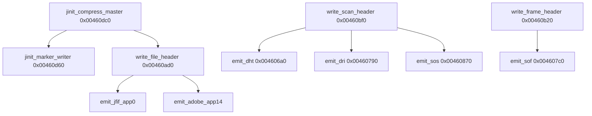

# Round 6 — Logic task 44 report

## Task

| Field | Value |
|-------|-------|
| **id** | 44 |
| **title** | Logic dispatch_45a_468: 0x004606a0–0x00461540 (18 funcs) |
| **range** | dispatch_45a_468 |
| **range_note** | VA band label says “input/network/UI”; **this slice is libjpeg-6b compressor marker writer + compress-master tail + decompress main-buffer helpers** (re-verify per [round5_worker_04_report.md](../struct_recovery/round5_worker_04_report.md)) |
| **seed_address** | none (contiguous slice) |

## Status

**PARTIAL** — All 18 functions have per-function logic notes from **PE disassembly** (`orig/bulanci.exe`, Capstone, Jun 2026) and prior Ghidra export (`bulanci.ghidra.exe.c`). **`user-ghidra-mcp` was not connected** (no live decompile, xref tool, rename, `set_function_this_type`, or `save_program`). Manifest symbol names for two marker-writer slots are **wrong** (corrected below).

## Slice overview

Stock **IJG libjpeg-6b** compressor marker emission (`jcmarker.c`) and `jinit_compress_master` orchestration (`jcinit.c`), plus **decompressor main-controller buffer helpers** (`jdmainct.c` / `jcprepct.c` locals) that share the same `.text` cluster. Game entry remains `CDSJpegImage::CompressFromImage` / `DecompressToImage` ([jpeg_decoder.md](../../formats/jpeg_decoder.md)).

### Compress marker-writer vtable (`jinit_marker_writer` @ `0x00460d60`)

Allocates **0x20** bytes at `cinfo+0x14c` and installs method pointers (disasm + decompiler agree):

| Offset | VA | Correct IJG role | Manifest / Ghidra name (stale) |
|--------|-----|------------------|--------------------------------|
| +0 | `0x00460ad0` | `write_file_header` | `FUN_00460ad0` |
| +4 | `0x00460b20` | `write_frame_header` | `LAB_00460b20` |
| +8 | `0x00460bf0` | `write_scan_header` | **`start_pass_huff`** (misnamed — not `jchuff.c`) |
| +0xc | `0x00460cc0` | `write_file_trailer` (EOI `0xD9`) | `LAB_00460cc0` |
| +0x10 | `0x00460cd0` | `write_tables_only` | `write_tables_only` |
| +0x14 | `0x00460a70` | `write_marker_header` | **`emit_dri`** (misnamed — second `emit_dri` in JSON) |
| +0x18 | `0x00460ab0` | `write_marker_byte` | `LAB_00460ab0` |

`jinit_compress_master` @ `0x00460dc0` ends with `(*cinfo->marker->write_file_header)(cinfo)` via vtable slot **+0** (`call [eax]` @ `0x00460e6e` after `jinit_marker_writer`).

### `jinit_compress_master` callee order (proven disasm @ `0x00460dc0`)

Matches `jcinit.c` / [task 42](round6_logic_task_42_report.md) compressor chain:

1. `FUN_0046c8f0` — `jinit_c_master_control`
2. If `!raw_data_in`: `jinit_color_converter@0x46bbc0`, `FUN_0046b590`, `FUN_0046acf0`
3. `jpeg_jinit_inverse_dct@0x46a750`
4. Huffman vs arithmetic / progressive branches (`jinit_huff_encoder@0x468d70`, `FUN_00469900`, …)
5. `FUN_00467dc0` — `jinit_c_coef_controller`
6. `FUN_00467600` — `jinit_c_main_controller`
7. `jinit_marker_writer@0x460d60`
8. `realize_virt_arrays` + `write_file_header`

**Caller:** `jpeg_start_compress` path @ `0x0045ef2a` (`call 0x00460dc0`).

## Functions

| Addr | Ghidra / export name | IJG / role (proven) | Role summary | Evidence |
|------|---------------------|---------------------|--------------|----------|
| `0x004606a0` | `emit_dht` | `emit_dht` (`jcmarker.c`) | Emit DHT (`0xC4`) for DC/AC derived table; `param_2` selects quant tbl slot; `JERR_NO_HUFF_TABLE` (`0x32`) if missing. | Decompiler; callers `write_scan_header`, `write_tables_only`; marker `0xC4` @ disasm |
| `0x00460790` | `emit_dri` | `emit_dri` | Emit DRI (`0xDD`) + 4 length bytes via `emit_2bytes`. | Decompiler `emit_marker(0xdd)`; caller `write_scan_header@0x00460c9d` |
| `0x004607c0` | `emit_sof` | `emit_sof` | Emit SOF/SOFn (`in_AL`); `JERR_IMAGE_TOO_BIG` (`0x29`) if dims > `0xFFFF`. | Decompiler; tail calls from `write_frame_header@0x00460bb2+` |
| `0x00460870` | `emit_sos` | `emit_sos` | Emit SOS (`0xDA`) + scan script bytes; progressive/arith table index rules. | Decompiler `emit_marker(0xda)`; `write_scan_header` tail `jmp` |
| `0x00460940` | `emit_jfif_app0` | `emit_jfif_app0` | APP0 JFIF (`0xE0`, `"JFIF\0"`). | Decompiler; `write_file_header` when `[cinfo+0xc4]` |
| `0x004609e0` | `emit_adobe_app14` | `emit_adobe_app14` | APP14 Adobe (`0xEE`, `"Adobe"`). | Decompiler; color transform byte from `[cinfo+0x40]` |
| `0x00460a70` | `emit_dri` (duplicate) | **`write_marker_header`** | Generic marker header: `JERR_BAD_LENGTH` (`0xb`) if `param_3 > 0xFFFD`; `emit_marker(param_2)` + length. | Vtable slot `+0x14` @ `0x00460d9c`; disasm `cmp edi,0xfffd` |
| `0x00460ad0` | `FUN_00460ad0` | **`write_file_header`** | SOI `0xD8`; reset `marker->last_restart_interval`; optional JFIF/Adobe. | Vtable `+0`; decompiler matches IJG `write_file_header` |
| `0x00460bf0` | `start_pass_huff` | **`write_scan_header`** | For each component: `emit_dht` DC/AC; optional `emit_dri` if restart interval changed; `emit_sos`. | Vtable `+8`; calls `0x4606a0`, `0x460790`, `jmp 0x460870` |
| `0x00460cd0` | `write_tables_only` | `write_tables_only` | Transcode tables-only: SOI, optional `encode_one_block` DQT, DHT loops, EOI. | Decompiler; SOI/D9 + `emit_dht` |
| `0x00460d60` | `jinit_marker_writer` | `jinit_marker_writer` | Alloc marker writer object; wire seven method pointers (+ pad `+0x1c=0`). | Disasm pointer stores; `jcmarker.c` layout |
| `0x00460dc0` | `jinit_compress_master` | `jinit_compress_master` (`jcinit.c`) | Full compression module init; SOI via `write_file_header` at end. | Disasm callee list; caller `0x0045ef2a` |
| `0x00460e80` | `FUN_00460e80` | **jcprepct.c local** (`create_context_buffer` head) | Alloc per-component row pointer tables at workspace `+0x38/+0x3c`. | Decompiler comment; caller `FUN_00461460@0x004614c6` when context rows needed |
| `0x00460f30` | `FUN_00460f30` | **jcprepct.c local** (context edge expand) | Mirror/replicate edge rows for downsampling context. | Decompiler; vtable `LAB_004613e0` @ `0x0046142e` |
| `0x00461080` | `FUN_00461080` | **jcprepct.c local** (h/v expand) | Replicate sample rows for expansion factors. | Decompiler; called from `FUN_00461460` buffer setup |
| `0x00461160` | `FUN_00461160` | **jcprepct.c local** (row shift) | Shift rows before edge expand; sets workspace `+0x48`. | Decompiler; call chain `0x00461331` → `0x0046142e` |
| `0x00461460` | `FUN_00461460` | **jdmainct.c / buffer init** (split tail) | Alloc **0x50** object at `cinfo+0x184`, vtable `@0x004613e0`; per-component `alloc_large` buffers; calls `FUN_00460e80` when prep needs context rows. | Disasm; **sole direct caller** `FUN_00460200@0x00460354` when `[cinfo+0x41]==0` |
| `0x00461540` | `FUN_00461540` | **decompress_data row window** (leaf) | Sets `cinfo+0x188` workspace `+0x14/+0x18/+0x1c` for MCU row strip (1 vs 2 rows). | Decompiler; callers `jpeg_decompress_data@0x004617a9`, `0x00461993` (R5 plate) |

### Control-flow (compress markers)

### Decompress glue (same slice, different path)

`FUN_00460200` (decompress master init, task 43) calls `jinit_d_coef_controller` then **`FUN_00461460`** when not raw output (`[cinfo+0x41]==0`), wiring main-controller sample buffers before `realize_virt_arrays`.

## Ghidra deltas

**none** — MCP offline; no `rename_function_by_address`, `set_function_prototype`, `set_decompiler_comment`, or `save_program`.

### Pending when Ghidra MCP is available

| Action | Address | Target |
|--------|---------|--------|
| Rename | `0x00460ad0` | `write_file_header` |
| Rename | `0x00460bf0` | `write_scan_header` (remove `start_pass_huff`) |
| Rename | `0x00460a70` | `write_marker_header` (remove duplicate `emit_dri`) |
| Rename | `0x00460b20` / `0x00460cc0` / `0x00460ab0` | `write_frame_header` / `write_file_trailer` / `write_marker_byte` |
| Plate comment | `0x00461460` | `decompress master buffer init; caller FUN_00460200@0x00460354` |
| Plate comment | `0x00460e80`–`0x00461160` | `jcprepct.c context-buffer locals` |
| Namespace | `0x00460d60`, `0x00460dc0` | Consider `_Globals::` vs `CDSJpegImage::` to match `mapping.csv` / IJG |

No `set_function_this_type` required for this slice: `emit_dht` already uses ECX=`jpeg_compress_struct*` in disasm (`mov ecx,esi`); marker helpers use explicit `cinfo` parameter or stdcall/fastcall as exported.

## Frida

**none** — marker bytes and vtable wiring are fully visible statically; runtime hooking would not add symbol names beyond IJG source matching.

## Remaining UNK

| Item | Why still UNK |
|------|----------------|
| Exact COFF export names for `FUN_00460e80` / `FUN_00460f30` / `FUN_00461080` / `FUN_00461160` | Behavior matches `jcprepct.c` locals; no byte-level diff to `ref/libjpeg6b` in-repo |
| Whether `FUN_00461460` should merge with `jinit_d_main_controller@0x0045ff30` | Compiler split across objects; behavior proven, export label deferred |
| Live Ghidra vtable labels vs `bulanci.ghidra.exe.c` export | Re-verify after MCP reconnect |

## Evidence

| Claim | Source |
|-------|--------|
| Library identity | [jpeg_decoder.md](../../formats/jpeg_decoder.md) |
| Sizes / calling conventions | `config/bulanci/mapping.csv` |
| Decompiler bodies | `bulanci.ghidra.exe.c` |
| Vtable layout, call graph, insn proof | PE disasm `orig/bulanci.exe` (Capstone, Jun 2026) |
| `FUN_00461540` xref | [round5_worker_15_report.md](../struct_recovery/round5_worker_15_report.md); `jpeg_decompress_data` @ `0x004617a9` |
| Band = codecs not UI dispatch | [round5_worker_04_report.md](../struct_recovery/round5_worker_04_report.md) |

## Doc corrections (manifest / prior labels)

1. Task JSON lists **`emit_dri` twice** (`0x00460790` and `0x00460a70`) — only the former is `emit_dri`; `0x00460a70` is **`write_marker_header`**.
2. **`start_pass_huff` @ `0x00460bf0`** is **`write_scan_header`** (marker writer), not Huffman encoder `start_pass_huff` (`jchuff.c` lives near `0x00468200`, task 49).
3. **`FUN_00460ad0`** is the **`write_file_header`** method installed at marker vtable offset 0, not an anonymous helper.
