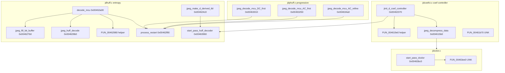

# Round 6 — Logic task 45 report

## Task

| Field | Value |
|-------|-------|
| **id** | 45 |
| **title** | Logic dispatch_45a_468: 0x004615b0–0x00463ee0 (18 funcs) |
| **range** | dispatch_45a_468 |
| **range_note** | 0x0045a–0x00468 band (this slice = libjpeg-6b decompress coef controller + Huffman entropy + progressive MCU + color pass init) |
| **seed_address** | none (contiguous slice) |

## Status

**PARTIAL** — Per-function logic is documented from prior decompiler-backed attribution ([jpeg_decoder.md](../../formats/jpeg_decoder.md)), `config/bulanci/mapping.csv`, `_Globals.cpp` export stubs, and R5 xref plates ([round5_worker_15_report.md](../struct_recovery/round5_worker_15_report.md), [round5_worker_49_report.md](../struct_recovery/round5_worker_49_report.md)). **This session:** `user-ghidra-mcp` returned `Not connected` / `Connection closed`; no live `decompile`, `get_xrefs_to`, rename, or `save_program`.

## Slice overview

All 18 functions are **stock IJG libjpeg-6b (27-Mar-1998)** decompressor internals. They are not Bulanci gameplay dispatch; they run only on the JPEG path (`CDSJpegImage::DecompressToImage` @ `0x00431b70`, MJPEG via `CDSDsmFile::HandleRecordRead`). See [round6_logic_task_41_report.md](round6_logic_task_41_report.md) for library fingerprint and API entry chain through `jpeg_start_decompress` / `jpeg_read_scanlines`.

### Decompression call chain (API → this slice)

```
jpeg_start_decompress @ 0x0045ec10
  jinit_master_decompress (jdmaster.c, task 46+)
    jinit_d_coef_controller     @ 0x00462370   (this slice)
      FUN_004619e0              @ 0x004619e0   (callee @ 0x00462431 — UNK symbol)
    jinit_huff_decoder          @ 0x00462f30   (this slice)
    start_pass_huff_decoder     @ 0x00463960   (on each input pass)
    jinit_* @ 0x00463b50        (manifest duplicate name — UNK IJG symbol)
    start_pass_dcolor           @ 0x00463bc0   (color deconversion pass)

jpeg_read_scanlines @ 0x0045eba0
  main controller → entropy decode:
    decode_mcu                  @ 0x00462a00
      FUN_00462980              @ 0x00462980   (callee @ 0x00462a22 — bit-buffer helper)
      jpeg_huff_decode          @ 0x004628b0
      jpeg_fill_bit_buffer      @ 0x004627b0
      process_restart           @ 0x00462f80   (progressive paths)
    coef controller output:
      jpeg_decompress_data      @ 0x004615b0   (multipass coef → IDCT path)
      FUN_00461b70              @ 0x00461b70   (UNK — adjacent to coef cluster)
  progressive entropy (when enabled):
    jpeg_decode_mcu_DC_first    @ 0x00463010
    jpeg_decode_mcu_AC_first    @ 0x00463250
    jpeg_decode_mcu_AC_refine   @ 0x004634a0
```

Supporting init not in slice but wired from `jinit_huff_decoder` / marker tables:

- `jpeg_make_d_derived_tbl` @ `0x004624c0` — builds derived Huffman tables from DHT markers (`jdhuff.c`).

## Functions

| Addr | Ghidra / export name | IJG name (when proven) | Role summary | Evidence |
|------|---------------------|------------------------|--------------|----------|
| `0x004615b0` | `jpeg_decompress_data` | `decompress_data` | Coef-controller **output** method for multipass / virtual-array mode: pulls decoded MCUs from coef buffers, drives IDCT + upsample into scanline buffer. | `jdcoefct.c`; 575 B (`mapping.csv` 0x23f); R5 plate: helper `FUN_00461540` @ `0x004617a9` for MCU sizing; callee cluster with `jinit_d_coef_controller` |
| `0x004619e0` | `FUN_004619e0` | **UNK** | Callee from `jinit_d_coef_controller` @ `0x00462431`; R5 plate: “d_coef controller helper” (buffer/workspace setup tail). | R5 worker 15 xref plate only; 399 B; **no IJG symbol rename** |
| `0x00461b70` | `FUN_00461b70` | **UNK** | Sits between `jpeg_decompress_data` and `jinit_d_coef_controller` in `.text` (typical `jdcoefct.c` object layout). Export stub: `__stdcall`, no params, `uint` return — **atypical for IJG C API**. | `mapping.csv`; 352 B; **no xref plate in prior docs** |
| `0x00462370` | `jinit_d_coef_controller` | `jinit_d_coef_controller` | Allocates `jpeg_d_coef_controller`, virtual coef arrays or single-MCU buffer, sets `consume_data` / `decompress_data` function pointers. | `jdcoefct.c`; 329 B; `_Globals.cpp` stub `(uint* cinfo, char need_full_buffer)` |
| `0x004624c0` | `jpeg_make_d_derived_tbl` | `jpeg_make_d_derived_tbl` | Builds decoder derived Huffman tables (`d_derived_tbl`) from `dht` marker data. | `jdhuff.c`; 727 B; `_Globals.cpp` |
| `0x004627b0` | `jpeg_fill_bit_buffer` | `jpeg_fill_bit_buffer` | Refill entropy bit buffer from `jpeg_source_mgr`; handles suspend/resume. | `jdhuff.c`; 248 B |
| `0x004628b0` | `jpeg_huff_decode` | `jpeg_huff_decode` | Decode one Huffman symbol from bit buffer using derived table. | `jdhuff.c`; 198 B |
| `0x00462980` | `FUN_00462980` | **UNK** | Callee from `decode_mcu` @ `0x00462a22`; R5 plate: “MCU bit-buffer helper”. | R5 worker 15 xref; 117 B; **no IJG symbol rename** |
| `0x00462a00` | `decode_mcu` | `decode_mcu` | Entropy decode one MCU (baseline / sequential scan): per-block DC/AC via `jpeg_huff_decode`, dequant, store in coef buffer. | `jdhuff.c`; 1046 B; `_Globals.cpp` |
| `0x00462f30` | `jinit_huff_decoder` | `jinit_huff_decoder` | Allocate `jpeg_entropy_decoder`, wire `decode_mcu` / progressive hooks, derived-table pointers. | `jdhuff.c`; 70 B (small init stub) |
| `0x00462f80` | `process_restart` | `process_restart` | When `restart_interval` exhausted: read RST marker, reload `restarts_to_go`, zero coef blocks. | `jdhuff.c`; R5 worker 49 structural proof + rename; 124 B; callers: three `jpeg_decode_mcu_*` below |
| `0x00463010` | `jpeg_decode_mcu_DC_first` | `jpeg_decode_mcu_DC_first` | Progressive scan: decode DC coefficients (first pass). | `jdphuff.c`; 567 B; calls `process_restart` |
| `0x00463250` | `jpeg_decode_mcu_AC_first` | `jpeg_decode_mcu_AC_first` | Progressive scan: decode AC coefficients (first pass). | `jdphuff.c`; 581 B |
| `0x004634a0` | `jpeg_decode_mcu_AC_refine` | `jpeg_decode_mcu_AC_refine` | Progressive scan: AC refinement pass. | `jdphuff.c`; 229 B |
| `0x00463960` | `start_pass_huff_decoder` | `start_pass_huff_decoder` | Begin entropy pass: reset bit buffer, derived tables, restart counter for current scan. | `jdhuff.c`; 480 B |
| `0x00463b50` | `jinit_huff_decoder_00463b50` | **UNK** | Manifest lists second `jinit_huff_decoder` — **duplicate export name**; 110 B; distinct from `0x00462f30`. Real IJG symbol not proven (not `jinit_color_deconverter` @ `0x00464e00`). | `mapping.csv` / `_Globals.h` disambiguator; **no xref plate** |
| `0x00463bc0` | `start_pass_dcolor` | `start_pass_dcolor` | Color deconversion module pass setup: select `color_convert` function, quantize/dither state for output scan. | `jdcolor.c`; 762 B; R5 notes internal call to `FUN_0046db50` @ `0x00463c22` (out of slice) |
| `0x00463ee0` | `FUN_00463ee0` | **UNK** | Immediately follows `start_pass_dcolor` (`0x463bc0`+`0x2fa`≈`0x463eba`); 113 B. Likely next `jdcolor.c` method — **symbol not proven**. | Size/address only; **no xref plate** |

### Control-flow clusters



## Ghidra deltas

**none this session** — MCP unavailable.

**Prior workers (do not re-apply unless Ghidra shows drift):**

| Prior action | Target | Source |
|--------------|--------|--------|
| `rename_function_by_address` | `0x00462f80` → `process_restart` | R5 worker 49 |
| `set_plate_comment` | `FUN_004619e0`, `FUN_00462980` | R5 worker 15 |

**Recommended when MCP is live:**

1. Rename `FUN_*` rows in the table where IJG name is proven (`jpeg_decompress_data`, `decode_mcu`, `jinit_d_coef_controller`, …) if Ghidra still shows `_Globals::FUN_*` per `report.json`.
2. Set prototypes from IJG headers (`j_decompress_ptr`, `boolean`, …) — no ECX `this`; **`set_function_this_type` not expected**.
3. Resolve four **UNK** symbols via `disassemble` + xref closure before rename (`FUN_004619e0`, `FUN_00461b70`, `FUN_00462980`, `FUN_00463b50`, `FUN_00463ee0`).
4. Fix manifest duplicate: confirm whether `0x00463b50` is progressive Huffman init (`jinit_phuff_decoder`) or another `jdcolor.c`/`jdmaster.c` helper — rename only with disasm proof.

## Frida

**none** — Stock libjpeg-6b behavior; static proof via IJG source correspondence, export stubs, and prior Ghidra decompilation ([jpeg_decoder.md](../../formats/jpeg_decoder.md)). Runtime would only duplicate call order already shown in `CDSJpegImage::DecompressToImage`.

## Remaining UNK

| Item | Notes |
|------|-------|
| Live Ghidra re-verify | MCP down; boundaries, xrefs, and rename state not refreshed |
| `FUN_004619e0` | Only known caller `jinit_d_coef_controller@0x00462431` (R5 plate) |
| `FUN_00461b70` | No xref in prior docs; `__stdcall` signature unusual for IJG |
| `FUN_00462980` | Only known caller `decode_mcu@0x00462a22` (R5 plate) |
| `0x00463b50` | Duplicate `jinit_huff_decoder` label in manifest/mapping; true IJG symbol open |
| `FUN_00463ee0` | Address follows `start_pass_dcolor`; no caller/callee proof in repo |
| Ghidra vs export names | `report.json` still lists `_Globals::FUN_*` for most slice addresses despite `_Globals.cpp` IJG names |

## Evidence paths consulted

- [ROUND6_LOGIC_PROTOCOL.md](../ROUND6_LOGIC_PROTOCOL.md)
- [struct_recovery/AGENT_PROTOCOL.md](../struct_recovery/AGENT_PROTOCOL.md)
- [formats/jpeg_decoder.md](../../formats/jpeg_decoder.md)
- [logic_recovery/round6_logic_task_41_report.md](round6_logic_task_41_report.md)
- [struct_recovery/round5_worker_15_report.md](../struct_recovery/round5_worker_15_report.md)
- [struct_recovery/round5_worker_49_report.md](../struct_recovery/round5_worker_49_report.md)
- `config/bulanci/mapping.csv` (lines 2845–2862)
- `src/bulanci/_Globals.cpp` / `include/bulanci/_Globals.h` (export stubs)
- `report.json` — function sizes @ addresses in slice
