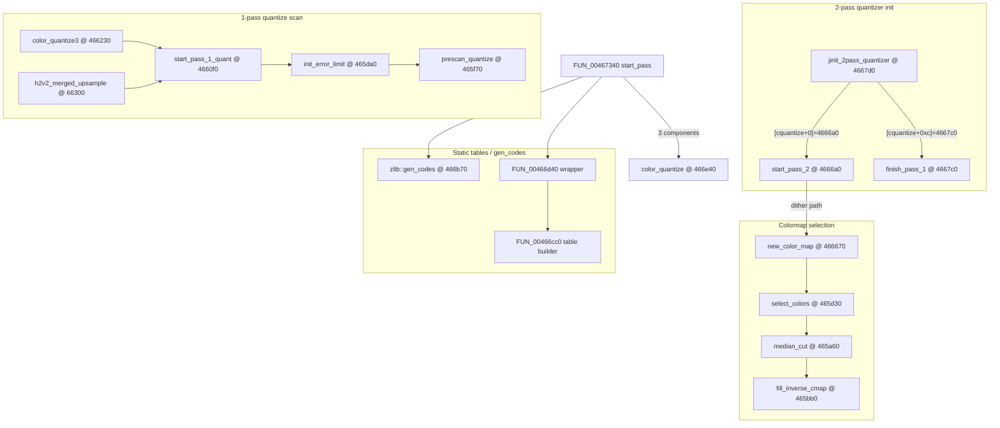

# Round 6 — Logic task 47 report

## Task

| Field | Value |
|-------|-------|
| **id** | 47 |
| **title** | Logic dispatch_45a_468: `0x00465bb0`–`0x00466e40` (18 funcs) |
| **range** | `dispatch_45a_468` |
| **range_note** | `0x0045a`–`0x00468`: embedded **IJG libjpeg-6b** colormap quantizer (`jquant1.c` / `jquant2.c` / `jdmerge.c`) plus **zlib `gen_codes`** and static Huffman-table builders reused from the 1-pass quantizer `start_pass` path |
| **seed_address** | — (slice task) |

## Status

**PARTIAL** — All 18 slice entry points documented with **PE static disassembly** of `orig/bulanci_insturmented.exe` (Capstone + `mapping.csv` sizes/calling conventions). **user-ghidra-mcp returned `Not connected`** on every call; live decompile/xref re-verify, `set_function_this_type`, renames, and `save_program bulanci.exe` were **not** applied this session.

## Method

1. Loaded task 47 from [agent_todos_50_r6_logic.json](../agent_todos_50_r6_logic.json).
2. Cross-checked manifest names vs [mapping.csv](../../../config/bulanci/mapping.csv) and prior rounds ([round5_worker_15_report.md](../struct_recovery/round5_worker_15_report.md) for `FUN_004665c0` / `FUN_004666a0`).
3. Disassembled each function body and scanned `.text` for direct `CALL` sites (image base `0x00400000`).
4. Traced **function-pointer installs** (`mov dword ptr [edi+disp], imm32`) inside `jinit_2pass_quantizer`, `start_pass_2`, and `FUN_00467340`.

## Functions

| Address | Ghidra name | Size | Role summary | Evidence |
|---------|-------------|-----:|--------------|----------|
| `0x00465bb0` | `FUN_00465bb0` | 371 B | **IJG `fill_inverse_cmap`** (jquant2.c) — builds one inverse-colormap slice; sole direct caller **`select_colors+0x54`** in a loop after `median_cut` returns a positive colormap count. | PE disasm: loop at `0x465d80`–`0x465d94` calls `0x465bb0` with colormap index in `EBX`; no other `CALL 0x465bb0` in `.text` |
| `0x00465d30` | `select_colors` | 109 B | **IJG `select_colors`** — allocates a color box via cinfo allocator (`call [edx]` on `[edi+4]`), initializes 6-int box bounds, calls **`FUN_00465650` → `median_cut@0x465a60` → `fill_inverse_cmap` loop**, stores final count at `[cquantize+0x70]`. | PE disasm full body; also reached from **`0x466670`** (`new_color_map` wrapper) |
| `0x00465da0` | `FUN_00465da0` | 455 B | **IJG `init_error_limit`** (jquant1.c) — large stack frame **`sub esp,0x428`**; first callee of **`FUN_004660f0` (`start_pass_1_quant`)** at `+0x77`. | `__thiscall` per mapping.csv; call order in `FUN_004660f0` prologue |
| `0x00465f70` | `FUN_00465f70` | 370 B | **IJG `prescan_quantize`** — initializes prescan state (`mov eax,0x7fffffff`, `mov ecx,0x80`, zero-fill loop); second callee of **`FUN_004660f0`** at `+0x92`. | PE disasm prologue; mapping.csv 7-arg cdecl signature matches prescan driver |
| `0x004660f0` | `FUN_004660f0` | 318 B | **IJG `start_pass_1_quant`** — calls **`init_error_limit` → `prescan_quantize` → `__security_check_cookie@0x447bd5`**; shared setup for one-pass quantize paths. | Direct callers: **`color_quantize3+0x8d`**, **`h2v2_merged_upsample+0x1be`** |
| `0x00466230` | `color_quantize3` | 200 B | **IJG `color_quantize3`** (jquant1.c) — per-scanline 3-component quantizer; loads `[cinfo+0x1a8]` quantizer object and calls **`start_pass_1_quant`**. | PE disasm; installed as output method by **`start_pass_2`** (`mov [edi+4],0x466230`) |
| `0x00466300` | `h2v2_merged_upsample` | 699 B | **IJG `h2v2_merged_upsample`** (jdmerge.c) — merged 2h2v upsample + quantize; also calls **`start_pass_1_quant`**. | PE disasm; installed when `[cinfo+0x4c]==2` in **`start_pass_2`** (`mov [edi+4],0x466300`) |
| `0x004665c0` | `FUN_004665c0` | 166 B | **2-pass quantizer inverse-cmap table init** — allocates **`0x7fc`** bytes via cinfo allocator, fills 16/48/255-index acceleration tables (nested init loops). Called from **`FUN_004666a0+0xe2`**. | R5 plate: “2-pass quantizer pass 1”; PE disasm table-init loops |
| `0x004666a0` | `FUN_004666a0` | 280 B | **IJG `start_pass_2`** (jquant2.c) — zeros workspace via **`IJG_jzero_far@0x45f880`**, runs **`FUN_004665c0`**, installs quantizer method pointers on `[cquantize+4]` / `[+8]`: dither pair **`accumulate_histogram@0x465570` + `new_color_map@0x466670`**, or **`h2v2_merged_upsample`**, or **`color_quantize3`**. | Pointer stores at `0x4666c7`–`0x4666f5`; R5: “2-pass quantizer pass 2” |
| `0x004667d0` | `jinit_2pass_quantizer` | 322 B | **IJG `jinit_2pass_quantizer`** — allocates **`0x2c`**-byte `cquantize` via cinfo allocator, sets **`[cquantize+0]=start_pass_2`**, **`[cquantize+0xc]=finish_pass_1@0x4667c0`**, allocates **`0x80`** colormap entries. | PE disasm; sole direct caller **`FUN_00460200+0x94`** (`call 0x4667d0`) when `[cinfo+0x59]`/`[0x5a]` indicate colormap quantization |
| `0x00466920` | `FUN_00466920` | 226 B | **zlib / ordered-dither helper** — scans alphabet size (`imul`/`cmp` loop), **`rep stosd`** fill, raises IJG error **`0x38`** on bad parameters; called from **`FUN_00466a50+0x1a`**. | PE disasm; exact zlib symbol name **UNK** (not byte-matched to upstream `trees.c` in this session) |
| `0x00466a10` | `FUN_00466a10` | 21 B | **Fixed-point scale helper** — `imul ecx,0xff; sar eax,1` (divide-by-255-ish biasing); called from **`FUN_00466a50+0x8b`**. | PE disasm; 21 B `__fastcall` |
| `0x00466a30` | `FUN_00466a30` | 19 B | **Integer divide helper for bit-length assignment** — `imul eax,0x1fe; idiv ecx`; called twice from **`zlib::gen_codes`**. | PE disasm at `0x466c1c`, `0x466c37` |
| `0x00466a50` | `FUN_00466a50` | 276 B | **Huffman code assignment driver** — calls **`FUN_00466920`** then iterates code lengths using **`FUN_00466a10`**; caller **`FUN_00467460+0x7b`** (outside slice). | PE disasm call graph |
| `0x00466b70` | `zlib::gen_codes` | 316 B | **zlib `gen_codes`** (trees.c) — builds canonical codes; uses **`FUN_00466a30`** twice. Callers: **`FUN_00467340+0xb0`**, **`FUN_00467460+0x81`**. | Ghidra name in manifest; PE disasm |
| `0x00466cc0` | `FUN_00466cc0` | 104 B | **Static Huffman extra-bits table builder** — allocates via cinfo allocator (`push 0x400`), walks **`.rdata` `0x49de50`–`0x49df50`**, applies `imul edx,0x1fe; idiv ebx` per 16-byte chunk (16 iterations), writes derived table. | [ghidra_xrefs.jsonl](../../asset_catalog/_cache/ghidra_xrefs.jsonl) data-ptr hits; PE disasm loop |
| `0x00466d40` | `FUN_00466d40` | 80 B | **`__stdcall` wrapper** — calls **`FUN_00466cc0`**; invoked from **`FUN_00467340+0xc0`** during 1-pass quantizer `start_pass` when `[cquantize+0x34]==0`. | PE disasm single `call 0x466cc0` |
| `0x00466e40` | `FUN_00466e40` | 184 B | **IJG 1-pass `color_quantize` output** — reads RGB triplet stream, indexes through colormap planes (`movzx`/`add`/`mov byte`), writes 8-bit indices; installed as **`[cquantize+4]=0x466e40`** by **`FUN_00467340`** when **`[cinfo+0x64]==3`**. | PE disasm RGB→index loop; pointer install at `0x46740f` |

### Adjacent helpers (outside slice, required for control-flow)

| Address | Name | Role |
|---------|------|------|
| `0x00465650` | `FUN_00465650` | **`select_colors` prep** — first callee after box bounds init; reads `[ecx+0x1a8]` quantizer state. Exact IJG symbol **UNK**. |
| `0x00465570` | *(unnamed in DB)* | **`accumulate_histogram`** — RGB scanline histogram (`shr`/`shl` index math, `add word ptr [edx+eax*2],1`); pointer-installed by **`start_pass_2`**. |
| `0x00466670` | *(unnamed in DB)* | **`new_color_map`** — thin wrapper calling **`select_colors`**, sets `[cinfo+0x1c]=1`. |
| `0x004667c0` | *(unnamed in DB)* | **`finish_pass_1`** — 14 B stub setting `[cquantize+0x1c]=1`; stored at **`[cquantize+0xc]`** by **`jinit_2pass_quantizer`**. |
| `0x00467340` | `FUN_00467340` | **1-pass quantizer `start_pass`** — switches on `[cinfo+0x4c]` / `[0x64]`; may call **`gen_codes` + `FUN_00466d40`**, installs **`color_quantize` / `color_quantize3` / `h2v2_merged_upsample`** method pointers. No direct `CALL` xrefs (vtable slot only). |
| `0x00460200` | `FUN_00460200` | **JPEG compress input-controller helper** (task 43 slice) — calls **`jinit_2pass_quantizer`** at `+0x94` when colormap quantization is enabled. |

### Control-flow sketch

## Ghidra deltas

**none** — Ghidra MCP unavailable; recommended pending mutations (apply when MCP live):

| Address | Recommended action | Proof |
|---------|-------------------|-------|
| `0x00465bb0` | `rename_function_by_address` → `fill_inverse_cmap` | Sole caller `select_colors` post-`median_cut` loop |
| `0x00465570` | rename → `accumulate_histogram` | RGB histogram body; installed by `start_pass_2` |
| `0x00465650` | defer (exact IJG name UNK) | Only `select_colors` prep callee |
| `0x00465da0` | rename → `init_error_limit` | First callee of `start_pass_1_quant`, `sub esp,0x428` |
| `0x00465f70` | rename → `prescan_quantize` | Second callee of `start_pass_1_quant` |
| `0x004660f0` | rename → `start_pass_1_quant` | Calls init_error_limit + prescan; callers CQ3 + merged upsample |
| `0x004665c0` | rename → `init_inverse_cmap` (or keep R5 “pass 1” plate) | 0x7fc alloc + index table init |
| `0x004666a0` | rename → `start_pass_2` | Pointer installs + `IJG_jzero_far` |
| `0x00466670` | rename → `new_color_map` | Calls `select_colors` |
| `0x004667c0` | rename → `finish_pass_1` | Stored at `[cquantize+0xc]` by `jinit_2pass_quantizer` |
| `0x00466e40` | rename → `color_quantize` | RGB→index scanline; installed by `FUN_00467340` |
| `0x00465da0`, `0x004660f0` | `set_function_this_type` → `jpeg_decompress_struct *` (or quantizer sub-struct) | `__thiscall`; `[ecx+0x1a8]` quantizer module pattern |

## Frida

**none** — behavior is fully reachable from static PE disassembly of embedded IJG/zlib; no gameplay runtime state required.

## Remaining UNK

- **`FUN_00465650`** — proven `select_colors` preprocessor; IJG source symbol not matched byte-for-byte in this session.
- **`FUN_00466920` / `FUN_00466a50`** — proven helpers on the `gen_codes` / `FUN_00467460` path; exact zlib identifier UNK without upstream object diff.
- **`FUN_00467340` / `FUN_00467300`** — proven 1-pass quantizer `start_pass` cluster (task 48 slice); no direct `CALL` xrefs — slot assignment only.
- **`[start_pass_2] mov [edi+8],0x467430`** — mapping.csv labels `0x467430` as 1-byte `CDSApp_PreCreateHook`; likely **Ghidra boundary artifact** on a larger quantizer method — re-verify in live Ghidra before typing.
- **Live Ghidra re-verify** — manifest names for `select_colors`, `color_quantize3`, `h2v2_merged_upsample`, `jinit_2pass_quantizer`, `zlib::gen_codes` assumed correct from prior rounds; MCP down prevented confirmation.

## Cross-refs

- [jpeg_decoder.md](../../formats/jpeg_decoder.md) — IJG cluster map (`0x45d`–`0x46x`)
- [round5_worker_15_report.md](../struct_recovery/round5_worker_15_report.md) — `FUN_004665c0` / `FUN_004666a0` plates
- [round6_logic_task_40_report.md](round6_logic_task_40_report.md) — adjacent IJG marker reader band
- Task 48 slice (`0x00466f00+`) — `FUN_00467340`, `jpeg_compress_data`, deflate encoder tail
