# Round 6 — Logic task 48 report

## Task

| Field | Value |
|-------|-------|
| **id** | 48 |
| **title** | Logic dispatch_45a_468: 0x00466f00–0x004681d0 (18 funcs) |
| **range** | dispatch_45a_468 |
| **range_note** | Manifest band label; **re-verified:** slice is **libjpeg-6b (IJG 6b)** decompressor merged-upsampler + compressor coef/Huffman helpers — **not** gameplay input/network/UI dispatch ([jpeg_decoder.md](../../formats/jpeg_decoder.md), [formats/status.md](../../formats/status.md)) |
| **seed_address** | — (contiguous slice) |

## Status

**PARTIAL** — All 18 entry points documented with control-flow, caller chains, and IJG role classification from `bulanci.ghidra.exe.c` (saved Ghidra export) + `config/bulanci/mapping.csv` + PE pointer-ref scan on `orig/bulanci.exe`. **Ghidra MCP disconnected** (`switch_program` → `Not connected`); no live `get_xrefs_to` / `force_decompile` / renames / `save_program bulanci.exe`. Two high-confidence `jchuff.c` renames deferred (see Ghidra deltas).

## Slice classification (band re-verify)

| Claim | Verdict | Evidence |
|-------|---------|----------|
| Slice is UI/input dispatch | **False** | No `CDSApp_Dispatch*` / `WndProc` / gameplay xrefs; closure is `FUN_00460200` (decompress master), `jinit_compress_master@~0x00460dc0`, `encode_one_block@0x00468200`, `jinit_huff_encoder` |
| Slice is stock IJG-6b | **True** | `IJG_jzero_far`, `jpeg_compress_data`, `compress_first_pass`, `jpeg_make_c_derived_tbl`, `JERR_*` guards; library fingerprint in [jpeg_decoder.md](../../formats/jpeg_decoder.md) |
| `CDSApp_PreCreateHook@0x00467430` is app hook | **False** | 1-byte `RET`; 20× LE32 in binary (vtable slots); export comment: shared **IDSStream::Flush** no-op ([formats/status.md](../../formats/status.md) L172) |

## Functions

| Address | Ghidra name | Role summary | Evidence |
|---------|-------------|--------------|----------|
| `0x00466f00` | `FUN_00466f00` | **Decompress merged-upsample row worker** (non-RGB / `num_components != 3`): zero row (`IJG_jzero_far`), AC-table gather with ring index `& 0xf` at upsampler `+0x30` | Decompile export L159375; **fn ptr** installed @ `FUN_00467340` when `cinfo[0x13]==1` and `num_components!=3` (L159636–641); not direct-CALL |
| `0x00467020` | `FUN_00467020` | **Decompress merged-upsample row worker** (RGB / 3 components): per-pixel sum of three AC tables + 3-byte chroma walk | Decompile L159437; fn ptr when `cinfo[0x13]==1` && `num_components==3` (L159637–638); sibling `FUN_00466f00` |
| `0x00467150` | `FUN_00467150` | **Decompress fancy-upsample pass** (`cinfo[0x13]==2`): short row workspace `+0x44`, colormap @ `cinfo+0x120`, toggles `upsample+0x54` scan direction | Decompile L159497; fn ptr @ L159659; distinct from `h2v2_fancy_upsample@0x00464660` (named elsewhere) |
| `0x00467300` | `FUN_00467300` | **Merged-upsampler buffer alloc:** loops `num_components`, `alloc_small` per component into `upsample+0x44[]` | Decompile L159587; callers `FUN_00467340` (L159662), `FUN_00467460` when `progress_mode==2` (L159723); Ghidra shows `unaff_ESI` (calling-convention artifact — should be `jpeg_decompress_struct *cinfo`) |
| `0x00467340` | `FUN_00467340` | **Merged-upsampler `start_pass`:** picks upsample method ptr at `upsample+4` from `cinfo[0x13]` / `num_components`; may call `zlib__gen_codes`, `FUN_00466d40`, `FUN_00467300` | Decompile L159614; fn ptr stored @ `FUN_00467460` `*puVar1 = FUN_00467340` (L159705) |
| `0x00467430` | `CDSApp_PreCreateHook` | **Misnamed shared no-op** (`return;`) — **IDSStream vtable Flush** for memory/queue streams; linker dedupe | Decompile L159687 + export comment L159679–685; 20 LE32 refs in PE (vtable/data), 0 direct CALL |
| `0x00467460` | `FUN_00467460` | **`jinit_merged_upsampler` family:** `alloc_large(0x58)`, vtable `start_pass=FUN_00467340`, flush no-op @ slot 2, `LAB_00467440` @ slot 3; validates component count / width | Decompile L159695; **caller** `FUN_00460200@0x00460200` when merged upsample enabled (L154774); R5 w15 caller note |
| `0x00467600` | `CDSJpegImage::FUN_00467600` | **Compressor scanline-controller init:** `alloc_small(0x40)` → `cinfo[0x50]`, vtable `LAB_004675b0`, per-component row buffers via mem mgr | Decompile L159732; **callers** `jinit_compress_master` path (L155370); mapping.csv `CDSJpegImage::` namespace |
| `0x00467690` | `FUN_00467690` | **Coef-controller scan cursor reset** after iMCU pass (`cinfo+0x148`): advances `+0xc`/`+0x10`/`+0x14` or reloads from compptr `+0x48` | Decompile L159773; tail-call from `jpeg_compress_data` (L159900) and `FUN_00467930` (L159998); `__fastcall` in mapping (ECX=cinfo) |
| `0x004676e0` | `jpeg_compress_data` | **IJG `jpeg_write_scanlines` coef path / compress_data:** nested MCU loops, DCT forward via `cinfo+0x158`, buffer zero/duplicate via `IJG_jzero_far` | Decompile L159800; fn ptr installed by `FUN_00467d10` mode 0 (L160134) |
| `0x00467930` | `FUN_00467930` | **Compressor multi-scan MCU coordinator** (between row blits and coef controller): `request_virt_sarray` per component, fills coef buffer pointers, calls coef `process_data` vfn | Decompile L159908; **caller** `compress_first_pass` tail (L160111); fn ptr mode 2 @ `FUN_00467d10` (L160154) |
| `0x00467af0` | `compress_first_pass` | **IJG first-pass downsample/DCT feed:** per-component `sample_rows`, edge padding, `FUN_00467930` finish | Decompile L160004; fn ptr mode 3 @ `FUN_00467d10` (L160147) |
| `0x00467d10` | `FUN_00467d10` | **Compressor coef `start_pass` dispatcher:** resets coef ctl; wires `jpeg_compress_data` / `FUN_00467930` / `compress_first_pass` by `pass_mode` arg | Decompile L160118; vtable entry `*puVar2 = FUN_00467d10` @ `FUN_00467dc0` (L160177) |
| `0x00467dc0` | `CDSJpegImage::FUN_00467dc0` | **`jinit_c_coef_controller`:** `alloc_large(0x68)` → `cinfo+0x148`, workspace stripes or per-comp buffer table | Decompile L160162; caller `jinit_compress_master` (L155369) |
| `0x00467ed0` | `jpeg_make_c_derived_tbl` | **IJG derived Huffman table build** (`JERR_BAD_HUFF_TABLE` / code 8): counts → codes → `ehufco`/`ehufsi` arrays in 0x500-byte block | Decompile L160216; callers `jinit_huff_encoder` cluster (export ~L160994, L161577) |
| `0x004680f0` | `FUN_004680f0` | **`emit_byte_s` (dest-mgr refill):** when `free_in_buffer==0`, calls `dest_mgr->empty_output_buffer`; reloads `next_output_byte` / `free_in_buffer` | Decompile L160321; **caller** `emit_bits_s` @ L160379/389; R5 w49 pending rename |
| `0x00468120` | `emit_bits_s` | **IJG `jchuff.c` short bit emitter:** `put_buffer@+8`, `put_bits@+0xc`, `0xFF` stuff, `JERR_HUFF_MISSING_CODE (0x28)` | Decompile L160343; R5 w49 renamed + [jpeg_decoder.md](../../formats/jpeg_decoder.md) L214 |
| `0x004681d0` | `FUN_004681d0` | **`flush_bits_s` pattern:** `emit_bits_s(this,0x7f)` then zero `+8`/`+0xc`; callers `encode_one_block@0x00468200` tail (L160518) and gather finish (L160653) | Decompile L160404; R5 w49 noted as flush cluster |

### Caller / install graph (proven)

```mermaid
flowchart TD
  subgraph decompress
    A[FUN_00460200 decompress master]
    B[FUN_00467460 jinit_merged_upsampler]
    C[FUN_00467340 start_pass merged]
    D[FUN_00466f00 / FUN_00467020 / FUN_00467150 upsample methods]
    E[FUN_00467300 alloc sample rows]
    A --> B --> C
    C --> D
    C --> E
    B --> E
  end
  subgraph compress
    F[jinit_compress_master]
    G[FUN_00467dc0 coef controller]
    H[FUN_00467600 scanline ctl]
    I[FUN_00467d10 start_pass coef]
    J[jpeg_compress_data]
    K[compress_first_pass]
    L[FUN_00467930 MCU coordinator]
    F --> G --> H
    G --> I
    I --> J
    I --> K --> L
    J --> M[FUN_00467690 reset]
    L --> M
  end
  subgraph huff
    N[encode_one_block]
    O[emit_bits_s]
    P[FUN_004680f0 emit_byte_s]
    Q[FUN_004681d0 flush_bits_s]
    N --> O --> P
    N --> Q --> O
  end
```

## Ghidra deltas

**none applied** — MCP unavailable.

**Recommended when MCP returns** (evidence above; skip if already done):

| Action | Address | New symbol / fix |
|--------|---------|------------------|
| `rename_function_by_address` | `0x004680f0` | `emit_byte_s` |
| `rename_function_by_address` | `0x004681d0` | `flush_bits_s` |
| `rename_function_by_address` | `0x00467460` | `jinit_merged_upsampler` (verify body vs `ref/libjpeg6b` if tree added) |
| `set_function_prototype` | `0x00467300` | `void merged_upsample_alloc_rows(jpeg_decompress_struct *cinfo)` — fix `unaff_ESI` |
| `set_plate_comment` | `0x00467430` | Reinforce IDSStream Flush no-op (do **not** rename to `CDSApp::*`) |

`emit_bits_s@0x00468120` — **already renamed** (R5 worker 49); no action.

## Frida

**none** — Behavior is static IJG codec plumbing; no gameplay-visible state. Runtime JPEG round-trip already blocked on sample assets per [formats/status.md](../../formats/status.md), not on understanding these helpers.

## Remaining UNK

| Item | Status |
|------|--------|
| Exact IJG export names for `FUN_00466f00` / `FUN_00467020` / `FUN_00467150` | **UNK** — upsample method bodies match `jdmerge.c` family but no COFF-exact symbol map in repo |
| `FUN_00467340` / `FUN_00467300` precise `jdmerge.c` symbol | **UNK** — control-flow proof only |
| `FUN_00467600` / `FUN_00467930` precise `jcmainct.c` / `jccoefct.c` symbol | **UNK** — role proven, name not byte-matched |
| `CDSJpegImage::` vs `_Globals::` namespace on `FUN_00467600` / `FUN_00467dc0` | **Cosmetic** — mapping.csv mixed; no behavior change |
| Live Ghidra xref counts vs export | **BLOCKED** — MCP down |
| Apply pending renames + `save_program` | **BLOCKED** — MCP down |
