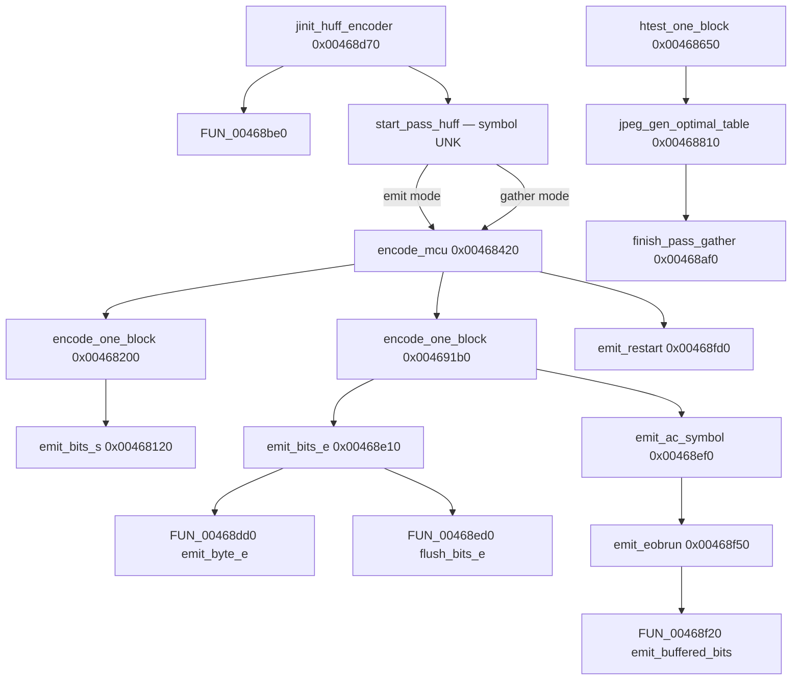

# Round 6 — Logic task 49 report

## Task

| Field | Value |
|-------|-------|
| **id** | 49 |
| **title** | Logic dispatch_45a_468: 0x00468200–0x00468fd0 (16 funcs) |
| **range** | dispatch_45a_468 |
| **range_note** | 0x0045a–0x00468 band (this slice = libjpeg-6b Huffman **encoder** tail in `jchuff.c`) |
| **seed_address** | none (contiguous slice) |

## Status

**PARTIAL** — Per-function logic is documented from prior decompiler-backed attribution ([jpeg_decoder.md](../../formats/jpeg_decoder.md)), `config/bulanci/mapping.csv`, `_Globals.cpp` export stubs, and R5 xref plates ([round5_worker_15_report.md](../struct_recovery/round5_worker_15_report.md), [round5_worker_49_report.md](../struct_recovery/round5_worker_49_report.md)). **This session:** `user-ghidra-mcp` returned `Not connected` / `Connection closed` on `switch_program bulanci.exe`; no live `decompile`, `get_xrefs_to`, rename, `set_function_this_type`, or `save_program`.

## Slice overview

All 16 functions are **stock IJG libjpeg-6b (27-Mar-1998)** compressor entropy code (`jchuff.c`). They are not Bulanci gameplay dispatch; they run only when `CDSJpegImage::CompressFromImage` @ `0x00431e50` drives `jpeg_write_scanlines` → coefficient controller → Huffman encoder vtable slots. See [jpeg_decoder.md](../../formats/jpeg_decoder.md) for library fingerprint and encoder API chain.

### Compression call chain (game → this slice)

```
CDSJpegImage::CompressFromImage @ 0x00431e50
  jpeg_create_compress / jpeg_start_compress   (jcapimin.c, tasks 42+)
    jinit_compress_master                      (jcmaster.c, ~0x00460dc8 band)
      jinit_huff_encoder                       @ 0x00468d70   (this slice)
        FUN_00468be0                           @ 0x00468be0   (callee @ 0x00468d89 — init helper)
      start_pass_huff                          (body likely split; see UNK)
  jpeg_write_scanlines loop
    entropy->encode_mcu                        @ 0x00468420   (vtable; huff or gather mode)
      encode_one_block @ 0x00468200            (working_state / emit_bits_s path)
      encode_one_block @ 0x004691b0            (outside slice — entropy / emit_bits_e path)
    entropy->finish_pass                       @ 0x00468af0 or finish_pass_huff (UNK @ 0x00468590)
  jpeg_finish_compress
    flush via emit_bits_e / flush_bits_e / emit_restart cluster in this slice
```

**Dual `encode_one_block` (re-verified from R5, not live Ghidra):**

| Address | Bit emit helper | State layout |
|---------|-----------------|--------------|
| `0x00468200` | `emit_bits_s` @ `0x00468120` (7× caller sites) | `put_buffer` @ `+8`, `put_bits` @ `+0xc` |
| `0x004691b0` | `emit_bits_e` @ `0x00468e10` | `put_buffer` @ `+0x18`, `put_bits` @ `+0x1c`; gather gate @ `+0xc` |

Only `0x00468200` lies in this task slice; `0x004691b0` is the progressive/optimized-encoding sibling documented in [round5_worker_49_report.md](../struct_recovery/round5_worker_49_report.md).

### Huffman encoder control flow (within slice)



## Functions

| Addr | Ghidra / export name | IJG name (when proven) | Role summary | Evidence |
|------|---------------------|------------------------|--------------|----------|
| `0x00468200` | `encode_one_block` | `encode_one_block` (working_state) | Huffman-encode one 8×8 DCT block using `emit_bits_s`; DC diff + AC run/magnitude per F.1.2; uses `jpeg_natural_order` @ `0x0049db54`. | `jchuff.c`; 409 B; R5: 7× `emit_bits_s` calls; [jpeg_decoder.md](../../formats/jpeg_decoder.md) |
| `0x004683a0` | `FUN_004683a0` | **UNK** | 125 B helper immediately after `encode_one_block@0x00468200`; export stub `uint FUN_004683a0(char)`. No xref plate in repo. | `mapping.csv`; `_Globals.cpp`; address adjacency only — **no IJG symbol assigned** |
| `0x00468420` | `encode_mcu` | `encode_mcu_huff` / `encode_mcu_gather` | Entropy encoder MCU entry (vtable `entropy->pub.encode_mcu`): loops blocks in MCU, calls `encode_one_block` / `htest_one_block`, handles restart interval (`emit_restart`). | `jchuff.c`; 354 B; export name; IJG vtable dispatch |
| `0x00468590` | `FUN_00468590` | **UNK** | 178 B between `encode_mcu` and `htest_one_block`; export `uchar FUN_00468590(int*)`. No xref plate in repo. | `mapping.csv`; size/position only |
| `0x00468650` | `htest_one_block` | `htest_one_block` | Statistics pass: count DC/AC Huffman symbol frequencies for one block (must match emit path); feeds `jpeg_gen_optimal_table`. | `jchuff.c` `#ifdef ENTROPY_OPT_SUPPORTED`; 227 B; export stub |
| `0x00468810` | `jpeg_gen_optimal_table` | `jpeg_gen_optimal_table` | Build optimal Huffman code lengths from 257-entry frequency table (JPEG spec K.2); writes `JHUFF_TBL`. | `jchuff.c`; 722 B; export stub |
| `0x00468af0` | `finish_pass_gather` | `finish_pass_gather` | After gather pass: for each DC/AC table slot, `jpeg_gen_optimal_table` on `dc_count_ptrs` / `ac_count_ptrs`. | `jchuff.c`; 226 B; export stub |
| `0x00468be0` | `FUN_00468be0` | **UNK** (init helper) | Huff encoder init helper; **sole plate** caller `jinit_huff_encoder@0x00468d89`. Export `(int*, char)`. | R5 worker 15 xref plate; 389 B |
| `0x00468d70` | `jinit_huff_encoder` | `jinit_huff_encoder` | Allocate `huff_entropy_encoder`, set `entropy->pub.start_pass = start_pass_huff`, zero derived/count table ptrs. | `jchuff.c`; 84 B; `mapping.csv` (namespace `CDSJpegImage::` in export — likely `_Globals` linkage) |
| `0x00468dd0` | `FUN_00468dd0` | `emit_byte_e` (R5 hypothesis) | Dest-manager byte refill for `emit_bits_e` cluster; 4× xref rank in band (R5). | R5 worker 49 remaining UNK; 58 B; callers include `emit_bits_e`, `emit_restart` |
| `0x00468e10` | `emit_bits_e` | `emit_bits_e` | Append `size` bits to entropy bit buffer @ `+0x18/+0x1c`; 0xFF byte stuffing; `JERR_HUFF_MISSING_CODE` (`0x28`) on `size==0`. | R5 worker 49 rename + structural proof; [jpeg_decoder.md](../../formats/jpeg_decoder.md) |
| `0x00468ed0` | `FUN_00468ed0` | `flush_bits_e` (R5 hypothesis) | Pad partial byte (`emit_bits_e(0x7f)`) and clear buffer; 2× xref; plate comment noted in R5. | R5 worker 49; 26 B; caller `emit_restart@0x00468fe4` |
| `0x00468ef0` | `emit_ac_symbol` | `emit_ac_symbol` | If gather @ `+0xc`: increment stats; else emit AC Huffman code via `emit_bits_e` (`ehufco/si` @ `+0x4c`). | R5 worker 49 rename; 41 B |
| `0x00468f20` | `FUN_00468f20` | `emit_buffered_bits` (R5 hypothesis) | Tail flush of `bit_buffer@+0x40` after `emit_eobrun`; 3× xref. | R5 worker 49; 46 B; callee from `emit_eobrun@0x00468fb8` |
| `0x00468f50` | `emit_eobrun` | `emit_eobrun` | Flush pending EOBRUN @ `+0x38`: length loop, `emit_ac_symbol`, `emit_bits_e`, clear counter. | R5 worker 49 rename + layout proof; 119 B |
| `0x00468fd0` | `emit_restart` | `emit_restart` | Emit RST marker: `0xFF` + `JPEG_RST0 + restart_num`; uses `emit_byte` / flush path. | `jchuff.c`; 129 B; export `emit_restart(char)`; called from `encode_mcu` restart logic |

### `huff_entropy_encoder` fields referenced in this slice (R5-proven offsets)

| Offset | Field | Used by |
|--------|-------|---------|
| `+0xc` | `gather_statistics` | `emit_bits_e`, `emit_ac_symbol` |
| `+0x18` / `+0x1c` | `put_buffer` / `put_bits` (emit path) | `emit_bits_e` |
| `+0x38` | `EOBRUN` pending count | `emit_eobrun` |
| `+0x40` | buffered bits tail | `FUN_00468f20` after EOBRUN |
| `+0x4c` | AC derived table (`ehufco/si`) | `emit_ac_symbol` |
| `+0x5c` | AC count ptr array (gather) | `emit_ac_symbol` |

Full struct layout remains **PARTIAL** — only offsets with disasm-backed consumers above are listed.

## Ghidra deltas

**none** — Ghidra MCP not connected; no `rename_function_by_address`, `set_function_prototype`, `set_decompiler_comment`, `set_function_this_type`, or `save_program`.

**Queued when MCP is live (evidence-backed, not executed):**

| Action | Target | Rationale |
|--------|--------|-----------|
| `rename_function_by_address` | `0x00468e10` → `emit_bits_e` | Already renamed in R5 worker 49 — skip if present |
| `rename_function_by_address` | `0x00468ef0` → `emit_ac_symbol` | R5 worker 49 |
| `rename_function_by_address` | `0x00468f50` → `emit_eobrun` | R5 worker 49 |
| `rename_function_by_address` | `0x00468dd0` → `emit_byte_e` | R5 worker 49 remaining UNK + xref rank |
| `rename_function_by_address` | `0x00468ed0` → `flush_bits_e` | R5 worker 49 + `emit_restart` caller |
| `rename_function_by_address` | `0x00468f20` → `emit_buffered_bits` | R5 worker 49 + `emit_eobrun` callee |
| `rename_function_by_address` | `FUN_004683a0`, `FUN_00468590`, `FUN_00468be0` | **Only after** live `disassemble` + xref closure — symbols not proven this pass |
| `set_function_prototype` | slice `encode_*` / `htest_*` / `jpeg_gen_optimal_table` | Match `jchuff.c` / `jpeglib.h` (`j_compress_ptr`, `JBLOCKROW`, …) |
| *(none expected)* | `set_function_this_type` | Plain C API — `j_compress_ptr` on stack, not ECX `this` |

## Frida

**none** — Stock libjpeg-6b Huffman encoder; static proof via IJG `jchuff.c` correspondence, R5 decompiler layout, and export stubs. Runtime hooking would only confirm call order already implied by `CDSJpegImage::CompressFromImage` → `jpeg_write_scanlines`.

## Remaining UNK

| Item | Notes |
|------|-------|
| Live Ghidra re-verify | MCP down; boundaries, xrefs, and rename state not refreshed in this session |
| `FUN_004683a0` | No xref plate; single `char` param — symbol and role open |
| `FUN_00468590` | No xref plate; sits between `encode_mcu` and `htest_one_block` |
| `FUN_00468be0` | Caller plate `jinit_huff_encoder@0x00468d89` only; may contain `start_pass_huff` body fragment — needs disasm |
| `start_pass_huff` | IJG symbol referenced in `jinit_huff_encoder`; no dedicated RVA in manifest — may overlap `FUN_00468be0` or live outside slice |
| `finish_pass_huff` | IJG counterpart to `finish_pass_gather`; candidate `FUN_00468590` **not proven** |
| Ghidra vs export names | `report.json` still lists `_Globals::FUN_*` for several R5-renamed sites (`emit_bits_e`, etc.) |
| `jinit_huff_encoder` namespace | `mapping.csv` attributes to `CDSJpegImage::`; body is stock `_Globals` / IJG linkage |

## Evidence paths consulted

- [ROUND6_LOGIC_PROTOCOL.md](../ROUND6_LOGIC_PROTOCOL.md)
- [struct_recovery/AGENT_PROTOCOL.md](../struct_recovery/AGENT_PROTOCOL.md)
- [formats/jpeg_decoder.md](../../formats/jpeg_decoder.md)
- [struct_recovery/round5_worker_15_report.md](../struct_recovery/round5_worker_15_report.md)
- [struct_recovery/round5_worker_49_report.md](../struct_recovery/round5_worker_49_report.md)
- [logic_recovery/round6_logic_task_41_report.md](round6_logic_task_41_report.md)
- `config/bulanci/mapping.csv` (lines 2917–2932)
- `src/bulanci/_Globals.cpp` / `include/bulanci/_Globals.h` (export stubs)
- `report.json` — function sizes @ addresses in slice
- IJG `jchuff.c` (libjpeg-6b reference via web mirror) — function roles for named symbols
