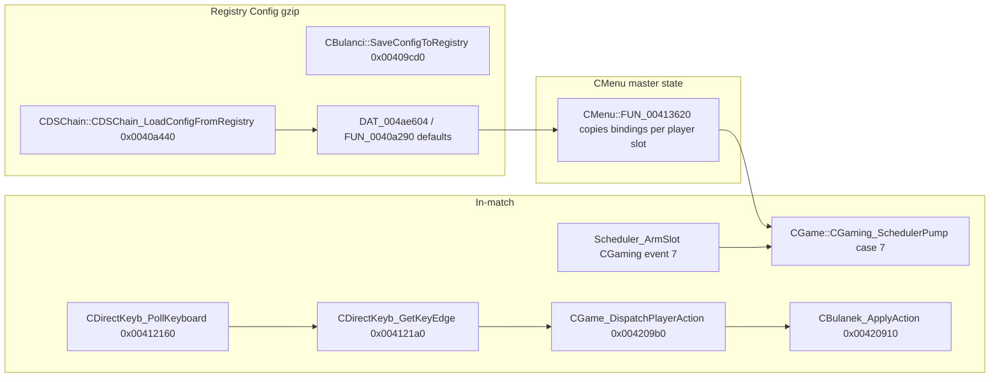

# Player Controls & Input (bulanci.exe v1.0)

Reverse-engineering notes for keyboard polling, the six in-game actions, registry-backed bindings, and related vtables. Addresses are VA for the PE image base `0x00400000`.

---

## 1. Pipeline overview

| Stage | Function | Address |
|--------|----------|---------|
| DirectInput keyboard ctor | `CDirectKeyb_ctor` | `0x004121d0` |
| Poll + edge detect | `CDirectKeyb_PollKeyboard` | `0x00412160` |
| Key transition | `CDirectKeyb_GetKeyEdge` | `0x004121a0` |
| Scheduler pump (event **7** = keyboard) | `CGame::CGaming_SchedulerPump` | `0x00416030` |
| Per-player scan table base | `CGame_GetControlBindingTable` | `0x00413160` |
| Action gate + dispatch | `CGame_DispatchPlayerAction` | `0x004209b0` |
| Player response | `CBulanek_ApplyAction` | `0x00420910` |
| Match start: arm event 7 | `CGame_StartGame` | `0x00413f30` (`Scheduler_AckSlot` then modal `CGaming`) |
| Setup UI (volume focus → label) | `CSetupDlg_OnVolumeFocus` | `0x0040e5b0` |

**CGaming scheduler event 7** is registered on `CGame` construction with **1 ms** period (`Scheduler_RegisterEventSlot(this, 7, 1, 7)` @ `0x00414a80`). During live play, `CGame_StartGame` arms slot 7 after the loading modal; each tick calls `CDirectKeyb_PollKeyboard` on the `CDirectKeyb` at `CGaming+0x204`, then loops **actions 0..5** for the active local player (`CGaming+0x32`) and any additional local seats (`CGaming+0x33` count).

---

## 2. `CDirectKeyb` (DirectInput keyboard)

| Field | Offset | Size | Role |
|--------|--------|------|------|
| vtable | `+0x00` | 4 | `0x00481a40` (4 slots) |
| `m_keyState` | `+0x04` | `0x100` | Current `GetDeviceState(256)` buffer |
| `m_prevKeyState` | `+0x104` | `0x100` | Previous frame (copied before poll) |
| `m_pDI` | `+0x204` | 4 | `IDirectInput*` |
| `m_pKeyboard` | `+0x208` | 4 | `IDirectInputDevice*` |

**Object size:** `0x20c` (524 bytes). Allocated in `CGame_StartGame` and stored at `CBulanci/CMenu+0x208` for the duration of the match modal.

`CDirectKeyb_GetKeyEdge(this, scanCode)`:

- Returns `0` if current == previous (no edge).
- Returns `1` if newly pressed (current set, bit `0x80` clear in DIK sense).
- Returns `2` if newly released.

Poll uses `IDirectInputDevice::GetDeviceState(0x100, this+4)` after shifting prior current → previous.

### `CDirectKeyb` vtable `@ 0x00481a40`

| Slot | Address | Symbol |
|------|---------|--------|
| 0 | `0x00412340` | Type descriptor accessor |
| 1 | `0x00412440` | Scalar deleting dtor |
| 2 | `0x004245c0` | `CDSObject_ReleaseViaVtable` |
| 3 | `0x00434b10` | Shared stub |

`DAT_004b36ec` is the **RTTI/type name** pointer returned by `FUN_00412340`, not the vtable itself.

---

## 3. Six in-game actions (`CGame_DispatchPlayerAction`)

`CGame_DispatchPlayerAction(CGame* cg, byte playerSlot, byte actionIndex, char pressed)` resolves the `CBulanek` with `CGaming_GetObjectAtSlotUnchecked(cg, playerSlot)`, gates via `FUN_004174a0` (alive + scheduler rules; fire/weapon switch need timer slot 0 armed), then calls `CBulanek_ApplyAction`.

| `actionIndex` | `CBulanek_ApplyAction` behaviour |
|---------------|----------------------------------|
| **0–3** | Movement / facing: `FUN_004197b0` → `SetCurrentTrack` + footstep audio |
| **4** | **Fire:** `CBulanek_TriggerPrimaryActionAndBroadcast` |
| **5** | **Cycle weapon:** `FUN_0041eca0` (advance pickup slot with ammo) |

Network: press paths often emit `CGame_NetSendPlayerState_t0d`; release on movement uses `param_1 + 4` in the state byte.

---

## 4. Binding matrix (defaults)

### 4.1 Global config (`CBulanci` instance)

Six tuples at **`CBulanci + 0x0d + i*6`** (`i = 0..5`), serialized in gzip `Config` blob:

| Offset in tuple | Type | Meaning |
|-----------------|------|---------|
| `+0` | `u8` | DirectInput **scan code** (DIK) |
| `+1` | `u8` | Flags / secondary byte (often `0`; `1` seen on defaults 4–5) |
| `+2` | `CDSString` | Display name (UI); not used for gameplay lookup |

**Factory defaults** (`CBulanci::FUN_0040a290` @ `0x0040a290`, from `.data`):

| Action | Role (inferred) | DIK `@DAT_004ae604` | Flag `@DAT_004ae60c` | DIK name |
|--------|-----------------|----------------------|----------------------|----------|
| 0 | Move / track 0 | `0x00` | `0x00` | *(unset)* |
| 1 | Move / track 1 | `0x02` | `0x00` | `1` |
| 2 | Move / track 2 | `0x02` | `0x04` | `1` *(same primary; flag differs)* |
| 3 | Move / track 3 | `0x00` | `0x00` | *(unset)* |
| 4 | Fire | `0x00` | `0x01` | *(unset primary; flag=1)* |
| 5 | Weapon cycle | `0x03` | `0x01` | `2` |

Localized label pointers default through `PTR_DAT_004ae614` (wstring literals in `.data` near `0x004803xx`).

**Scan-code hint table** for setup UI (`DAT_004af774`, used by `CStartGame2::FUN_004224a0`):  
`0xCB 0xCD 0xC8 0xD0 0x39 …` → Left, Right, Up, Down, Space, … (arrow + space cluster).

### 4.2 Per-player runtime (`CMenu` / `CGame`)

`CMenu::FUN_00413620` copies the six global tuples into each active player row:

- Stride **`0x23` (35)** bytes per player starting at **`param_1 + 0xde`**
- Bytes at **`row - 2` / `row - 1`**: DIK + flag
- **`CGame_GetControlBindingTable(CGame* this, byte playerIndex)`** →  
  `*(int*)(this + 0xaa + this[playerIndex*0x23 + 0xdd] * 4)`  
  i.e. a byte index into a side table selects one of several **6-byte scan lists** used during polling (`scan = table[actionIndex]`).

Player count for binding copy: `*(byte*)(menu + 0x37)`; profile index from `FUN_00412640` (depends on `menu+0x37` being 2→slot 1, 3→slot 3, else 0).

---

## 5. Registry `Config` blob (bindings slice)

Documented in [`registry.md`](registry.md). Relevant fragment of **`CBulanci::SaveConfigToRegistry` / `LoadConfigFromRegistry`**:

1. Signature byte `0xB4` at `CBulanci+4`
2. Profile count + `6`-byte profile records
3. **Six 6-byte key-binding tuples** at `+0x0d`
4. 14-byte options, palette DWORDs, trailing string

After failed/missing registry load, **`FUN_0040a290`** reinstalls `DAT_004ae604` defaults.

---

## 6. `CSetupDlg` rebind UX

| Item | Address |
|------|---------|
| ctor | `CSetupDlg::CSetupDlgCtor` `0x0040e4d0` |
| Type desc | `0x0040e4d0` → `DAT_004b3690` |
| Volume slider focus → SFX preview + label | `CSetupDlg_OnVolumeFocus` `0x0040e5b0` |
| Label refresh | `CSetupDlg::FUN_0040e4e0` `0x0040e4e0` |
| Bridge from volume widget | `FUN_0040e590` `0x0040e590` |

`CSetupDlg_OnVolumeFocus`: on focus event `7` for the `CVolume` child, reads selected binding index from `volume+0xb0`, calls `FUN_004223e0` (pan preview) and updates the static text via `FUN_0040e4e0`.

Full **key capture** uses `CKeybShow` (`0x0040edb0`, scan stored at `+0x6c`) from the shared edit pipeline — see [`widgets.md`](../widgets.md) §11.

---

## 7. Related input classes — vtables

Source: [`vftable_methods.csv`](vftable_methods.csv).

### `CGunMouse` (menu sniper cursor, `0x218` bytes)

| Vtable @ | Slots | Notable methods |
|----------|-------|-----------------|
| `0x00483794` | 5 | `CGunMouse_OnMouseMove` `0x00423900`, `CGunMouse_OnAnimTick` `0x00423bd0` |
| `0x004837ac` | 4 | Chain / stream |
| `0x004837c0` | 5 | `CGunMouse_Activate` `0x00423b50`, `CGunMouse_Deactivate` `0x004238e0` |

### `CDSMouse` / `CDSImageMouse` (base mouse)

| Class | Primary vtable | Size (slots) |
|-------|----------------|--------------|
| `CDSMouse` | `0x00483548`, `0x0048355c` | 4 + 7 |
| `CDSImageMouse` | `0x00486f68`, `0x00486f7c` | 4 + 7 |

### `CGame` / `CGaming` (scheduler host)

| Class | Vtable @ | Slot 4 (scheduler hook) |
|-------|----------|-------------------------|
| `CGame` | `0x00481a80` | **`CGaming_SchedulerPump` `0x00416030`** |
| `CGaming` | `0x00482704` | `CGaming_OnSchedulerTimer` `0x0041f050` |

`CGame` also carries vtables `0x00481a6c`, `0x00481a98` (chain / refcount).

### `CSetupDlg` (`0x00481744` primary, 28 slots)

Standard `CWindow`/`CDSView` layout: slot 27 = `CSetupDlg_OnVolumeFocus`, slot 14 = `CWindow_Render`.

---

## 8. `DAT_004aeb20` / `DAT_004aef24` (not bindings)

| Symbol | Address | Actual role |
|--------|---------|-------------|
| `DAT_004aeb20` | `0x004aeb20` | **256×4-byte color LUT** copied by `CGame_BuildPaletteLut` (`0x00413220`) |
| `DAT_004aef24` | `0x004aef24` | **Per-profile palette seed DWORDs** via `CGame_CopyDefaultPaletteSeed` (`0x00413200`) |

Ghidra plate comments added at both addresses to avoid confusing them with key maps.

---

## 9. Ghidra renames applied (this pass)

| Address | New name |
|---------|----------|
| `0x004121d0` | `CDirectKeyb_ctor` |
| `0x00412160` | `CDirectKeyb_PollKeyboard` |
| `0x004121a0` | `CDirectKeyb_GetKeyEdge` |
| `0x00413160` | `CGame_GetControlBindingTable` |
| `0x00416030` | `CGame::CGaming_SchedulerPump` *(comment already present)* |
| `0x004209b0` | `CGame_DispatchPlayerAction` |
| `0x00420910` | `CBulanek_ApplyAction` |
| `0x00413200` | `CGame_CopyDefaultPaletteSeed` |
| `0x00413220` | `CGame_BuildPaletteLut` |
| `0x0040e5b0` | `CSetupDlg_OnVolumeFocus` |

---

## 10. Open points

- Exact semantics of binding **flag byte** (`tuple+1`) for duplicate DIK `0x02` on actions 1–2.
- Complete mapping of `CGame+0xaa` side table indices to player colour/profile rows.
- Whether action 0/3 defaults (`DIK 0`) are filled from arrow keys at runtime or only via user rebind.
