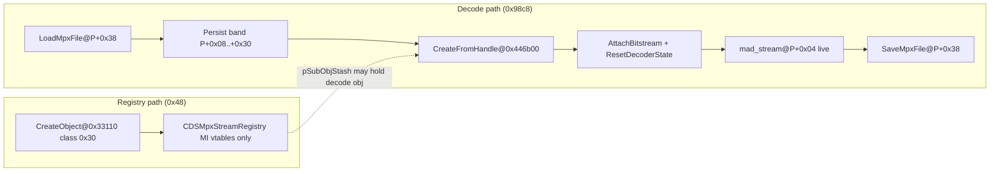

# CDSMpxStream

## Status

**DONE (map)** — MPEG resource wrapper: primary base is **`CDSMpx`** (`0x98c8` decoder). Persistence uses **`IDSChained`** at **`P+0x38`** (`SaveMpxFile` / `LoadMpxFile`). Registry shell is **`0x48`** (`CDSMpxStreamRegistry`); full decode via **`CDSMpx::CreateFromHandle`**. **Not** `CDSQueueStream_CreateObject@0x0043c160` (class **`0x4b`**). Pass report: [pass_r4_CDSMpxStream_report.md](./pass_r4_CDSMpxStream_report.md).

## Size proof

| Claim | Address | Evidence |
|-------|---------|----------|
| `sizeof == 0x98c8` (decoder body) | `0x00446b38` | `CreateFromHandle@0x00446b00` → `OperatorNewWithBadAlloc(0x98c8)` then `AttachBitstream` |
| `get_struct_layout` | Ghidra | `CDSMpxStream` → **39112 (0x98c8)**; `CDSMpx` same size |
| Primary base destroyed as `CDSMpx` | `0x004330b0` | `CDSMpxStream_dtor` → `CDSMpx_dtor(this)` |
| Tail cleanup at `+0x3c` | `0x004330b0` | `IDSChainedTail_ClearSubObjStash(&stashFacet@P+0x3c)`; `pSubObjStash@+0x40` |
| Registry factory alloc **`0x48`** | `0x00433112` | `CDSMpxStream_CreateObject@0x00433110` → `OperatorNewWithBadAlloc(0x48)`; class **`0x30`** — `CDSMpxStream_StaticClassRegister@0x0047cec0`; MI `@0x0047cef0`; `_atexit` `CDSMpxStream_StaticClassRegister_atexit@0x0047e900` |

## Factory distinction (class `0x4b` trap — round 3 task 36)

| Address | Symbol | `OperatorNew` | Registry class | Notes |
|---------|--------|---------------|----------------|-------|
| `0x00433110` | `CDSMpxStream_CreateObject` | **`0x48`** | **`0x30`** | MPx stream **MI shell** only; zeros `+0x14`, `+0x20`, `+0x40`; `nRefcount=1` @ `+0x1c` |
| `0x00446b00` | `CDSMpx::CreateFromHandle` | **`0x98c8`** | — | Uses persist band on `ctx@P+4`; not the registry factory |
| `0x0043c160` | `CDSQueueStream_CreateObject` | **`0x24`** | **`0x4b`** @ `0x0047daa0` | Queue `IDSStream` — **unrelated** to MPx decode |
| `0x00432070` | `CDSJpegImage_CreateObject` | **`0x64`** | **`0x15`** | JPEG wrapper; dword **`0x4b`** @ wrapper `+0x60` is **quality**, not queue class id |

## Object lifecycle

1. **Optional:** `LoadMpxFile` fills persist band from `.mpx` file stream.
2. **`CreateFromHandle`:** `Seek64` on `pPayloadStream@P+0x20` with `payloadStart@P+0x28/+0x2c`; alloc **`0x98c8`**; `AttachBitstream(stream, dwPayloadBytes@P+0x30)`.
3. **Decode:** `ResetDecoderState` / `mad_stream_buffer` — bytes `P+0x04..` are libmad (see [CDSMpx.md](./CDSMpx.md)); MI vptrs at `+0x04`/`+0x18` overlay `buffer`/`this_frame` until `CDSMpx_dtor`.
4. **`SaveMpxFile`:** writes `dwPayloadBytes` + 12-byte `mpxFormatTail` + bitstream copy — persist semantics only.

## Multiple-inheritance map (primary base `P`)

| Offset | Interface | Vtable | Evidence |
|--------|-----------|--------|----------|
| `+0x00` | `IDSReferenced` (primary) | `0x00487394` | `CDSMpxStream_CreateObject@0x00433130`; scalar dtor `0x00433160` |
| `+0x04` | `face_8slots` | `0x00487370` | ctor `MOV [EAX+0x4],0x487370` @ `0x00433136`; adjustor `SUB ECX,0x4` @ `0x00433030`; `CreateFromHandle` ctx |
| `+0x18` | `IDSEventHandler` | `0x0048735c` | ctor `MOV [EAX+0x18],0x48735c` @ `0x0043313d`; adjustor `SUB ECX,0x18` @ `0x00432ff0` |
| `+0x38` | `IDSChained` (persist) | `0x00487340` | ctor `MOV [EAX+0x38],0x487340` @ `0x00433144`; adjustor `SUB ECX,0x38` @ `0x00433000`; `SaveMpxFile` / `LoadMpxFile` |
| `+0x3c` | `IDSChained` (stash) | `0x00487328` | ctor `MOV [EAX+0x3c],0x487328` @ `0x0043314b`; adjustor `SUB ECX,0x3c` @ `0x00433020`; `IDSChainedStashFacet` + `pSubObjStash@+0x40` |

`CreateFromHandle` (`CDSMpx` vtable `0x00487308` / `0x00487384`) allocates **`0x98c8`** and rewrites **`+0x00`** in `AttachBitstream` (decoder face). Stream MI vtables at `+0x04` / `+0x18` / `+0x38` / `+0x3c` match registry ctor stamps.

## Layout (primary `P`, decoder `0x98c8`)

Ghidra type **`CDSMpxStream`** (39112 B) = persist/MI head + **`CDSMpx`** body from `+0x44`. Libmad interior: **[CDSMpx.md](./CDSMpx.md)** only.

| Offset | Size | Type | Name | Evidence (func@addr) |
|-------|------|------|------|----------------------|
| 0x0000 | 4 | `void *` | `pVftable` | `AttachBitstream@0x00446a00`; `CDSMpx_dtor@0x00432f40` |
| 0x0004 | 4 | `void *` | `pVftable_face8` | Registry ctor; decode: `mad_stream.buffer` (task 39) |
| 0x0008 | 12 | `MpxFormatTail_persist` | `mpxFormatTail` | `SaveMpxFile`/`LoadMpxFile` `this-0x30`; on-disk header tail |
| 0x0014 | 12 | — | `pad_mad_overlap_14` | `mad_stream.freerate` + `this_frame` + `next_frame` @ `P+0x14..+0x1f`; not in 12-byte file tail |
| 0x0020 | 4 | `IDSStream *` | `pPayloadStream` | `this-0x18`; `CreateFromHandle` `*(ctx+0x1c)`; aliases `main_bit` while decoding |
| 0x0028 | 4 | `uint` | `payloadStartLo` | `this-0x10`; `CreateFromHandle` / Save `Seek64` low |
| 0x002c | 4 | `uint` | `payloadStartHi` | `this-0x0c`; Load `Tell64` high |
| 0x0030 | 4 | `uint` | `dwPayloadBytes` | `this-0x08`; `AttachBitstream` limit; on-disk `dwDataSize` |
| 0x0034 | 4 | — | `pad_before_persist_chained` | Gap before persist `IDSChained` vslot |
| 0x0038 | 4 | `void *` | `pVftable_IDSChainedPersist` | Registry ctor `0x487340` |
| 0x003c | 8 | `IDSChainedStashFacet` | `stashFacet` | vptr + `pSubObjStash@+0x40`; dtor `IDSChainedTail_ClearSubObjStash` |
| 0x0044 | 0x98c4 | `CDSMpx` tail | `decoder` | `mad_stream` @ `+0x04` rel body — see CDSMpx.md (`frame@+0x44`, …) |

### `SaveMpxFile` / `LoadMpxFile` adjustor map (`this = P + 0x38`)

| Adjustor expr | Absolute | Field |
|---------------|----------|-------|
| `this - 0x30` | `P+0x08` | `mpxFormatTail` (12 bytes) |
| `this - 0x18` | `P+0x20` | `pPayloadStream` |
| `this - 0x10` | `P+0x28` | `payloadStartLo` |
| `this - 0x0c` | `P+0x2c` | `payloadStartHi` |
| `this - 0x08` | `P+0x30` | `dwPayloadBytes` |

On-disk order (disasm @ `SaveMpxFile@0x00432eb0`): **`[dwPayloadBytes@P+0x30][mpxFormatTail@P+0x08][mpeg bitstream]`** — 4 B size first (`LEA ESI-8`), then 12 B format (`LEA ESI-0x30`), then `Seek64` on `pPayloadStream@P+0x20` with `payloadStartLo/Hi@P+0x28/+0x2c` and copy `dwPayloadBytes` bytes. Same read order in `LoadMpxFile@0x00433180`. Equivalent to `[dwDataSize][12-byte format][bitstream]` in `mpx_audio_format.md`.

### Persist band `P+0x08..+0x30` vs live `mad_stream` (tasks 37–38)

`mad_stream` is embedded at **`P+0x04`**. Persistence I/O uses the **same physical bytes** with different semantics:

| `P+off` | Persist field | Save/Load (`this=P+0x38`) | Live decode (`mad_stream` @ `P+0x04`) |
|---------|---------------|---------------------------|----------------------------------------|
| `+0x04` | — | not in 16-byte header | `buffer` (+ MI `pVftable_MI_audio` before decode — task 39) |
| `+0x08..+0x13` | `mpxFormatTail` (12 B) | `this-0x30`, R/W 12 B | `bufend`+`skiplen`+`sync` |
| `+0x14..+0x1f` | — | not in 12-byte tail | `freerate`+`this_frame`+`next_frame` |
| `+0x20` | `pPayloadStream` | `this-0x18` | `main_bit` first dword |
| `+0x28` | `payloadStartLo` | `this-0x10` | `anc_bit` bytes 0..3 |
| `+0x2c` | `payloadStartHi` | `this-0x0c` | `anc_bit` bytes 4..7 |
| `+0x30` | `dwPayloadBytes` | `this-0x08`, R/W 4 B | `aux` |

**Typing:** Ghidra uses `MpxFormatTail_persist` at `+0x08` so persistence and decode layouts stay distinct in the type manager.

## Registry shell (`CDSMpxStreamRegistry`, logical `0x44` / heap `0x48`)

`CDSMpxStream_CreateObject@0x00433110` allocates **`0x48`** and stamps MI vtables only — **not** the `0x98c8` decoder body.

| Offset | Field | Evidence |
|--------|-------|----------|
| `+0x00` | `pVftable_IDSReferenced` `0x487394` | ctor `*puVar1` @ `0x00433130` |
| `+0x04` | `pVftable_face8` `0x487370` | `puVar1[1]` @ `0x00433136` |
| `+0x14` | zero | `puVar1[5]` |
| `+0x18` | `pVftable_IDSEventHandler` `0x48735c` | `puVar1[6]` @ `0x0043313d` |
| `+0x1c` | `nRefcount = 1` | `puVar1[7]` |
| `+0x20` | zero | `puVar1[8]` |
| `+0x38` | `pVftable_IDSChainedPersist` `0x487340` | `puVar1[0xe]` @ `0x00433144` |
| `+0x3c` | `pVftable_IDSChainedStash` `0x487328` | `puVar1[0xf]` @ `0x0043314b` |
| `+0x40` | `pSubObjStash` | `puVar1[0x10]`; dtor clears via stash facet |

Full decode instances: **`CDSMpx::CreateFromHandle@0x00446b00`** (`OperatorNew(0x98c8)` + `AttachBitstream`).

## Function leaf map

| Symbol | Address | Role |
|--------|---------|------|
| `CDSMpxStream_CreateObject` | `0x00433110` | Registry shell; class **`0x30`** |
| `CDSMpxStream_dtor` | `0x004330b0` | Stash clear `@+0x3c`; `CDSMpx_dtor` |
| `CDSMpxPersistFacet::SaveMpxFile` | `0x00432eb0` | `ECX = P+0x38` |
| `CDSMpxPersistFacet::LoadMpxFile` | `0x00433180` | `ECX = P+0x38` |
| `CDSMpx::CreateFromHandle` | `0x00446b00` | `0x98c8` decoder instance |
| `CDSMpx::AttachBitstream` | `0x00446a00` | Wires `inputStream@+0x5898`; `ResetDecoderState` |
| `CDSQueueStream_CreateObject` | `0x0043c160` | **Not** MPx — class **`0x4b`** queue stream |
| MI adjustor thunks | `0x00433000`–`0x00433030` | `SUB ECX,0x38/0x3c/0x18/0x4` |

## Ghidra apply

**R3 task 38:** `MpxFormatTail_persist`; `CDSMpxPersistFacet`; plates @ Save/Load.

**R4 task 38 / pass R4 (2026-05-30):** `recreate_struct` head — `pPayloadStream@+0x20`, `payloadStart*@+0x28/+0x2c`, `dwPayloadBytes@+0x30`, `IDSChainedStashFacet stashFacet@+0x3c`; `set_function_prototype` + `set_function_this_type` Save/Load → `CDSMpxPersistFacet *`; plates @ `0x00433110`, `0x00446b00`; `save_program bulanci.exe`.

**R5 worker 29 (2026-05-30):** Re-verified persist band via disasm (`SaveMpxFile`/`LoadMpxFile`/`CreateFromHandle`). `modify_struct_field` rename `pad_mad_overlap_14@+0x14`, `payloadStartLo/Hi`, `pad_before_persist_chained@+0x34` (MCP OK; `get_struct_layout` export may still show `pPad_*` / `dwPayloadStart*` auto-prefix). Decompiler comments @ `0x00432ec0`/`0x00432ecf`/`0x00432edd`/`0x0043318f`; plates @ `0x00432eb0`, `0x00433180`, `0x00446b00`. `get_struct_layout CDSMpxStream` → **39112 (0x98c8)**. `save_program bulanci.exe`.

**Decompiler note:** `CDSMpxPersistFacet` is 8 B — facet-relative `this+N` in decompiler does not show named persist fields; use disasm adjustor table and plates.

**R5 worker 41 (2026-05-30):** `set_decompiler_comment` @ `0x00433110`, `0x00446b00` — registry `0x48` vs decode `0x98c8` split; `save_program bulanci.exe`.

## UNK

- **PROVEN (R5 worker 41):** Registry shell and decode body are **separate heap objects** — `CDSMpxStream_CreateObject@0x00433110` `OperatorNew(0x48)`; `CDSMpx::CreateFromHandle@0x00446b00` `OperatorNew(0x98c8)` on a **different** pointer after reading persist band via `ctx@P+4` (face8 adjustor). Dtor `CDSMpxStream_dtor@0x004330b0` runs `CDSMpx_dtor` on the **0x98c8** primary, not an in-place grow of the shell.
- **BLOCKED (R5 worker 41):** `stashFacet.pSubObjStash` / registry `pSubObjStash@+0x40` — sole program write is **null** in `CDSMpxStream_CreateObject@0x0043312d` (`MOV [EAX+0x40], ECX` with `ECX=0`); `IDSChainedTail_ClearSubObjStash@0x00434250` only runs teardown when non-null. No concrete payload type to name on the MPx path in this binary.
- **BLOCKED:** Sub-byte WAVEFORMAT ↔ dword alias inside `mpxFormatTail` during decode overlay (dual-purpose bytes documented in persist vs `mad_stream` table; PCM `WAVEFORMATEX` bit layout not isolated by xref).
