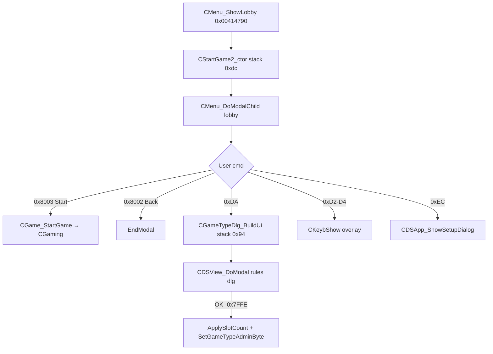

# CStartGame2

## Status

**PARTIAL** — stack/embedded size **`0xdc` (220 B)** verified; `CWindow` shell + `CDSUpdatedItem` scheduler facet + up to **four** cached slot pointers (`pSlotNameEdit` / `pSlotColorSet`). Lobby modal owned by `CMenu_ShowLobby`; **not** a heap `OperatorNew` class (reuses `CMenu` registry slot @ `DAT_004b3984`). Related embeds: **`CGameTypeDlg`** stack modal (`0x94`, cmd `0xDA`); **`CGameCounter`** is **not** on this object (loading HUD only — see [CGameCounter.md](./CGameCounter.md)).

## Size proof

| Claim | Address | Evidence |
|-------|---------|----------|
| `sizeof(CStartGame2) == 0xdc` | `0x00414790` | `CMenu_ShowLobby`: stack `local_dc` / `CStartGame2_ctor` + `CStartGame2_dtor` |
| Tail ends at `+0xbd` | `0x004104f0` | `CStartGame2_ctor` clears `bLobbyFlag_bc` / `bLobbyFlag_bd` @ `+0xbc`/`+0xbd` |
| `CWindow` prefix `0x70` | `0x004104f0` | `CWindow_BuildAt(this, 0xe6, 0x32, 0x2f8, 0x230, 0)` |
| `CDSUpdatedItem` @ `+0x70` | `0x004104f0`, `0x0040bb90` | `CDSUpdatedItem_ctor(&this->updated)`; dtor `CDSUpdatedItem_dtor(this+0x70)` |

## Class / vtables

| Claim | Address | Evidence |
|-------|---------|----------|
| Primary vtable | `0x00480d4c` | `g_pCStartGame2_vftable_primary`; ctor patches `this`, `+0x4`, `+0x10`, `+0x18`, `updated` |
| Tick slot 13 | `0x0040f610` | `CStartGame2_Tick_CheckDuplicateNames` (scheduler event **7**, 500 ms) |
| Not own `classId` | `0x004245b0` | `Singleton` returns `&DAT_004b3984` (shared with `CMenu`) |

## Layout

| Offset | Size | Type | Name | Evidence (func@addr) |
|--------|------|------|------|----------------------|
| 0x00 | 0x70 | `CWindow` | `win` | `CStartGame2_ctor@0x004104f0` `CWindow_BuildAt` |
| 0x40 | 4 | `dword` | `dwChainHead_40` | `CWindow` chain head ([CWindow.md](./CWindow.md)); `UpdateDuplicateSerialWarning@0x0040d520` **reuses** as optional `CStaticText *` — no writer xref (R5 w40) |
| 0x4C | 1 | `byte` | `bParentByte0_serialPending` | Low byte of `CWindow.pParent` @ `+0x4c`; cleared by `UpdateDuplicateSerialWarning@0x0040d520` — no setter xref (R5 w40) |
| 0x70 | 0x18 | `CDSUpdatedItem` | `updated` | ctor/dtor; `Scheduler_RegisterEventSlot(&this->updated,0,500,7)` @ admin path |
| 0x88 | 16 | `CEdit *[4]` | `pSlotNameEdit` | `OnCustomMsg@0x0040d6b0` case `0xDD`: `pSlotNameEdit[slot]`; ctor stores name editor per slot |
| 0x98 | 16 | `CColorSet *[4]` | `pSlotColorSet` | ctor `ppCVar16[4]` when `ppCVar16=&pSlotNameEdit[0]` ≡ `pSlotColorSet[i]`; `OnCustomMsg` case `0xDE` |
| 0xA8 | 4 | `CMenu *` | `pParentState` | ctor `this->pParentState = pParentState`; level loop reads `parent+0xbc`/`+0xc4` |
| 0xAC | 4 | `CStaticText *` | `pGamemodeCaption` | `UpdateGamemodeCaption@0x0040d570` lazy-create @ `+0xac` |
| 0xB0 | 4 | `CDSView *` | `pPressStartHint` | ctor admin branch; `OnCustomMsg` case `0xE3` enables `pBtnBack` / acks scheduler |
| 0xB4 | 4 | `CLevelList *` | `pLevelList` | ctor `OperatorNew(0xe4)` + `CLevelList_ctor`; non-admin hidden via focus path |
| 0xB8 | 4 | `CButton *` | `pBtnBack` | ctor caches Back @ `(0x28,0x1d2)` cmd `0x8002` |
| 0xBC | 1 | `byte` | `pad_bc` | ctor zero @ `0x004104f0`; **not** `CNumEdit` min (that is heap `CNumEdit+0xbc`) |
| 0xBD | 1 | `byte` | `pad_bd` | ctor zero; **not** `CNumEdit` max |
| 0xBE | 0x1E | `byte[30]` | `pad_be` | no `.text` consumer (R5 w40) |

## Per-slot children (heap, not embedded)

Built in `CStartGame2_ctor` for `teamTint < pParentState->slot_count` (`+0xd8`). Row X advances **`0x82`** pixels per column (not struct stride).

| Widget | Size | Builder | Bitmap / resource |
|--------|------|---------|-------------------|
| Pillar | `0x70` | `CColorSet_ctor_slotPillar@0x0040ffd0` | **`0x10013`** ([CColorSet.md](./CColorSet.md)) |
| Avatar stage | `0x98` | `CGameView_ctor@0x004191a0` | drawable cast `DAT_004b826c` (static face; see [CBulPicture.md](./CBulPicture.md) chain) |
| Walker | `0xd4` | `CDSAnim::ParameterizedCtor` + `CBulAnim` vtables | FLX ids **`0x100b4`–`0x100b7`** (`g_dwLobbyWalkerResIds`) |
| Name | `0xb8` | `CEdit_BuildAt` | style `0x100af` |
| Kick (admin) | `0x98` | `CButton_BuildAt` | label pool `+0xc4` |

Right column: `CStartGame2_BuildLobbyChatPanel@0x004102d0` (if `pParentState+0x1dc` DirectPlay) — `CColorSwitch`, chat static, `CChatList`, `CChatEdit`.

## Menu / modal flow

| Handler | Address | Role |
|---------|---------|------|
| `CStartGame2_OnCmd` | `0x0040fc20` | `0xDA` → `CGameTypeDlg` modal; `0xD2`–`0xD4` keyboard help; `0xEC` setup |
| `CStartGame2_OnCustomMsg` | `0x0040d6b0` | `0xDD` name→edit; `0xDE` color→pillar; `0xE0` gamemode caption; `0xE3` enable Start |
| `CStartGame2_OnBroadcast` | `0x0040d7e0` | `0xD0` level; `0xD1` avatar; `0xD6` rename |
| `CStartGame2_Tick_CheckDuplicateNames` | `0x0040f610` | Scheduler tick; duplicate-name `CMsgDialog` |
| `CStartGame2_UpdateDuplicateSerialWarning` | `0x0040d520` | `IDSEventHandler` vft `0x00480ce8` slot 4; toggles widget via `+0x40`, pending via `+0x4c` byte — **orphan** (no assign xref) |
| `CStartGame2_SelectPlayerByName` | `0x0040d3f0` | **`CLevelList *`** `this`; walks `listViewer.nItemCount` / `pItems`; called from `OnCustomMsg` `0xDF` with `this->pLevelList` |

### `CGameTypeDlg` embed (not a field on `CStartGame2`)

| Claim | Evidence |
|-------|----------|
| Stack `CGameTypeDlg local_110` (`0x94`) | `CStartGame2_OnCmd@0x0040fc20` case **`0xDA`** |
| Build | `CGameTypeDlg_BuildUi(&local_110, this->pParentState)` @ `0x0040d930` |
| Persist rules | `CDSView_LoadData` / `SaveData` from `pParentState+0xb9` stash; OK → `CStartGame2_ApplySlotCountIfChanged` + `CStartGame2_SetGameTypeAdminByte` |

See [CGameTypeDlg.md](./CGameTypeDlg.md).

### `CGameCounter` (separate from lobby shell)

Used on **`CGame::StartGame`** loading path (`CGameCounter_ctor@0x00410e20`, `OperatorNew(0x80)`), not stored on `CStartGame2`. Pack bitmap refs `0x10022`–`0x10024` — see [CGameCounter.md](./CGameCounter.md).

## Ghidra apply

**Applied (pass R4 CStartGame2, 2026-05-30):** `recreate_struct` **220 B** — `CWindow win` @0, lobby overlay `pDuplicateSerialWarning`/`bDuplicateSerialPending` @0x40/0x4C, `updated` @0x70, `pSlotNameEdit[4]` @0x88, `pSlotColorSet[4]` @0x98, tail pointers `pParentState`…`pBtnBack`, flags @0xBC/0xBD. `set_function_this_type` + prototypes on `CStartGame2_ctor`, `OnCmd`, `OnCustomMsg`, `OnBroadcast`, `Tick_CheckDuplicateNames`, `UpdateDuplicateSerialWarning`, `BuildLobbyChatPanel`. Decompile: `this->pSlotNameEdit[i]`, `this->pSlotColorSet[i]`, `&this->updated`. `save_program bulanci.exe`.

**Applied (R5 worker 40, 2026-05-30):** Renamed `+0x40..+0x4c` to `CWindow` names; `pad_bc`/`pad_bd`; `set_function_this_type` **`CLevelList *`** on `SelectPlayerByName@0x0040d3f0`; `UpdateGamemodeCaption` → `__thiscall`; decompile `0xDF` → `CLevelList::…SelectPlayerByName(this->pLevelList, name)`. See [round5_worker_40_report.md](./round5_worker_40_report.md).

## UNK

- **Duplicate-serial hook** (`UpdateDuplicateSerialWarning@0x0040d520`) — no code assigns non-null `+0x40` or sets `+0x4c` pending; vtable xref only. Live clash UX is duplicate-**name** via `Tick_CheckDuplicateNames` → `CMsgDialog` @ `0x0040f2c0`.
- Exact `CMenu` field name at `pParentState+0xcc` (stash for `OnCustomMsg` `0xDF` name); `+0xd8` / `+0x36` / `+0xbc` / `+0xc4` on parent — see [CMenu.md](./CMenu.md) / [CLevelList.md](./CLevelList.md).
