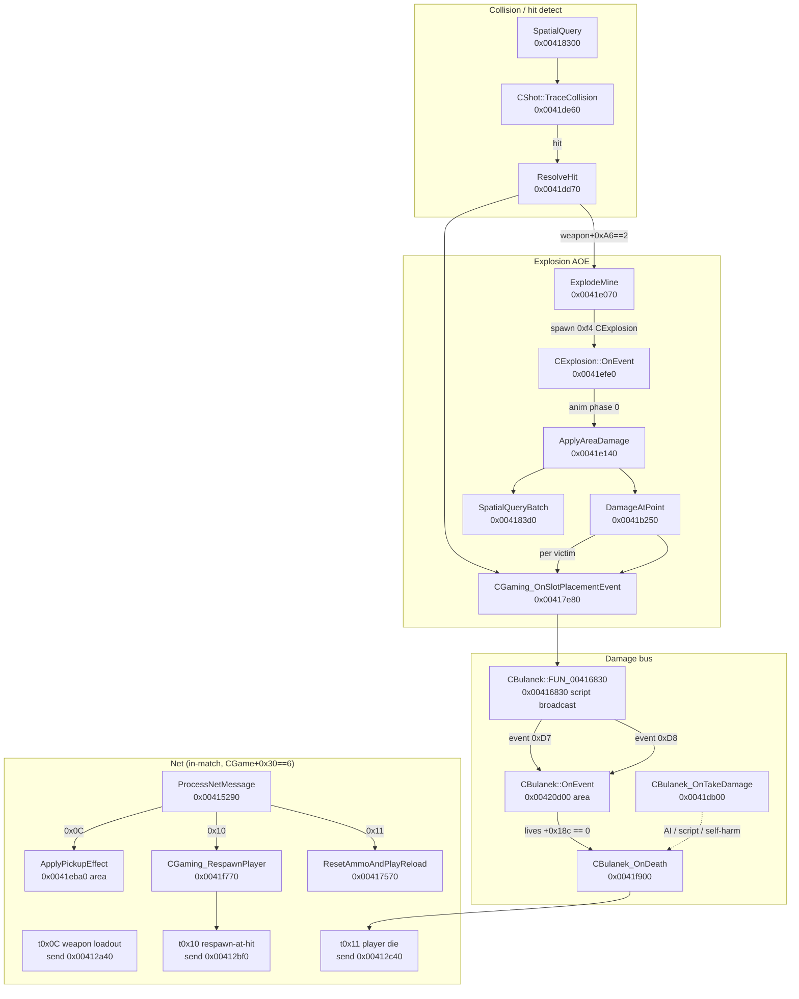

# Hit Resolution, Damage & Death Pipeline

Reverse-engineering notes for `bulanci.exe` combat damage. Complements [`combat_projectiles.md`](combat_projectiles.md) and [`../netcode/net_protocol.md`](../netcode/net_protocol.md).

---

## 1. End-to-end flow (addresses)

### Path A — projectile / mine contact

| Step | Function | Address |
|------|----------|---------|
| Enumerate entities in rect | `_Globals::SpatialQuery` | `0x00418300` |
| Sub-step trace (×4) | `CShot::TraceCollision` | `0x0041de60` |
| Hit resolution | `_Globals::ResolveHit` | `0x0041dd70` |
| Damage event fan-out | `_Globals::CGaming_OnSlotPlacementEvent` | `0x00417e80` |
| Script → victim | `CBulanek::FUN_00416830` event **`0xD7`** | `0x00416830` |
| Script → killer score | same, event **`0xD8`** | |
| Death if no lives left | `CBulanek::CBulanek_OnDeath` | `0x0041f900` |

`ResolveHit` branches on `CShot+0xA6`:

- **`0x02`** (grenade): allocate `CExplosion` (`0xF4`), ctor `0x0041ce30`, `AddEntity` — no immediate script damage.
- **Else**: `CGaming_TryGetPlayerCoords` on hit entity slot `entity+0x70`, then `CGaming_OnSlotPlacementEvent(cgaming, victimSlot, shooterId+0xA5, dir+0xA4, xy, authoritative=1)`.

### Path B — explosion

| Step | Function | Address |
|------|----------|---------|
| Mine stepped (`event 0xF2`) | `_Globals::ExplodeMine` | `0x0041e070` |
| FX start (`OnEvent` phase `0`) | `CExplosion::ApplyAreaDamage` | `0x0041e140` |
| Collect entities in blast AABB | `CExplosion::FUN_004183d0` | `0x004183d0` |
| Epicenter + 8-ray sweep | `CExplosion::DamageAtPoint` | `0x0041b250` |
| Chain mines | `ExplodeMine` via `FUN_0041a2f0` | `0x0041a2f0` |

Blast padding: **±0x3C (60 px)** on `CExplosion+0x20..0x2C`. Ray directions: `UNK_004828c0` / `UNK_004828c4`, **15 steps** per octant.

### Path C — direct `OnTakeDamage` (secondary)

`CBulanek_OnTakeDamage` (`0x0041db00`) is **not** the main PvP bullet path. Callers:

| Caller | Address | When |
|--------|---------|------|
| `CLevelScriptOpExt_KillObject` | `0x0041da50` | Script kill |
| `CLevelScriptOpExt_TeleportPlayerTo` | `0x0041da80` | Script teleport-with-hit |
| `CWeapon::Fire` | `0x004212b0` | AI mine self-hit; random self-harm on empty fire |

Guards: `+0xFC==0` (no corpse), `+0x16A==0` (not already hit-stunned), `CGaming` active, human flag `entity+0x44 & 1`, match not paused (`cgaming+0x44`).

On success: `FUN_0041d090` builds **teleport gate pair** for respawn, pain SFX bank **0x24**, may call `CBulanek_IsInKnockdownAnimBand` @ `0x00416490` (anim band @ `+0x70` only — **not** life decrement), `CBulanek_SetFacingTrack` @ `0x004197b0`, sets **`+0x16A`**, arms scheduler `CBulanek_ArmFireDelayScheduler` @ `0x00417260`. **Lives** (`+0x18C`) drop only on script event **0xD7** (`CBulanek_OnEvent`), not on raw `OnTakeDamage`.

---

## 2. Script events (local, not net opcodes)

| Event | ID | Role |
|-------|-----|------|
| Bullet impact / damage | `0xD7` | Victim `OnEvent`: decrement `+0x18C` lives; call `OnDeath` when zero |
| Kill credit | `0xD8` | Killer score `+0x128`, per-opponent table `+0x12C` |
| Out-of-ammo | `0xD9` | Posted from `CWeapon::Fire` |
| Hit quip audio | `0xDB` | Pain barks while alive |

`CBulanek::OnEvent` dispatcher: `0x00420d00` region (case `0xD7` @ `0x00420d73`).

---

## 3. Death & respawn

### `CBulanek_OnDeath` (`0x0041f900`)

- Copies lives `+0x18C` ← `+0x190`, sets respawn timer `+0x140 = 100`.
- `CDSView__Hide`, `+0x69 = 0`, stores killer `+0x144`.
- Spawns corpse entity `+0xFC` (`FUN_00419a00`, `0x108` bytes); tournament slots `0x20..0x23` also spawn tombstone `+0x100`.
- Clears weapon bytes `+0x121..+0x125`.
- **`+0x16B` guard**: `CGaming_SpawnSpecialPickupIfAllowed` (shotgun-only special respawn).
- `CGaming_TickRoundStateAndScoring`.

### Respawn timer → net die

`CBulanek::FUN_00420b30` scheduler case **0**: after **16 ticks** (`+0x9A`), if human (`FUN_00416720`), calls `CBulanek_ResetAmmoAndPlayReload` and **`CGame_NetSendPlayerDie_t11`**.

### `CGaming_RespawnPlayer` (`0x0041f770`)

Called from net **`0x10`** (`CGame::OnNetMsg_t10_RespawnAtHit`):

- Removes corpse/tombstone entities, `CDSView__Show`, `+0x69 = 1`.
- Local authority path: random weapon via `ApplyPickupEffect`, safe spawn, `FUN_004197b0`, **`CGame_NetSendHit_t10`** (re-broadcast hit coords).
- Remote path: teleport to packet `(x,y)`.

---

## 4. Network messages `0x0C` / `0x10` / `0x11`

All gated on **`CGame+0x30 == 6`** (in-match). Dispatcher: `CGame::CGame_ProcessNetMessage` @ `0x00415290`.

| Type | Send | Recv handler | Semantics (verified) |
|------|------|--------------|----------------------|
| **`0x0C`** | `CBulanek::CGame_NetSendDamage_t0c` `0x00412a40` | `CGame::OnNetMsg_t0c_ApplyWeaponLoadout` `0x0041f210` | **3 bytes**: `[0x0C, attackerSlot, weaponKind]`. Remote runs `ApplyPickupEffect(victim, kind)` — syncs weapon widget + ammo refill, **not** raw HP damage. Emitted from `ApplyPickupEffect` when `FUN_00416720` (human/local). |
| **`0x10`** | `CGame_NetSendHit_t10` `0x00412bf0` | `CGame::OnNetMsg_t10_RespawnAtHit` `0x00420510` | **7 bytes**: `[0x10, shooter, victim, x, y]`. Calls `CGaming_RespawnPlayer(victim, remote=0, anim, &xy)` — **respawn at impact**, not “confirm damage only”. |
| **`0x11`** | `CGame_NetSendPlayerDie_t11` `0x00412c40` | `CGame::OnNetMsg_t11_PlayerDie` `0x004180c0` | **2 bytes**: `[0x11, slot]`. `CBulanek_ResetAmmoAndPlayReload` — end of death countdown, reload ammo. |

Related (same pipeline): **`0x0F`** shot spawn, **`0x0D`** player state — see net_protocol.md.

---

## 5. Vtables & damageable layout

### Shared: bounds slot `vtable+0x70`

`SpatialQuery` / `DamageAtPoint` call `(**entity)(+0x70)` to fill an `int[4]` AABB before `rect_Intersect`. Any active `CDSView` entity with `+0x69 != 0` participates.

### `CExplosion` (`0xF4`, ctor `0x0041ce30`)

| Object offset | Vtable label | `.rdata` |
|---------------|--------------|----------|
| `+0x00` | IDSImage / primary | `0x00482684` |
| `+0x04` | IDSChained | `0x00482668` |
| `+0x10` | IDSEventHandler | `0x00482650` |
| `+0x18` | IDSReferenced | `0x0048263c` |
| `+0x88` | IDSUpdated | `0x00482628` |
| `+0x8C` | IDSAnim | `0x00482610` |
| `+0x98` | chain thunk | `0x004825FC` |

Owner slot for kill credit: **`CExplosion+0xF0`**.

### `CBulanek` (player, ctor `0x0041e4b0`)

| Object offset | Vtable label | `.rdata` |
|---------------|--------------|----------|
| `+0x00` | CGameView / CDSChained primary | `0x00481E54` |
| `+0x04` | secondary | `0x00481E38` |
| `+0x10` | IDSEventHandler | `0x00481E20` |
| `+0x18` | IDSReferenced | `0x00481E0C` |
| `+0x88` | IDSUpdated (scheduler `@+0x88`) | `0x00481DF4` |
| `+0xA0` | ODSImage / weapon overlay | `0x00481DDC` |

Combat-relevant fields:

| Offset | Meaning |
|--------|---------|
| `+0x44` | Flags (`&1` = human player) |
| `+0x69` | Active/visible in world |
| `+0x6A` | Skipped when `SpatialQuery` **param_5 != 0** |
| `+0x70` | Network / script slot id |
| `+0x16A` | Hit-stun / damaged flag |
| `+0x16B` | Shotgun-only special-pickup guard |
| `+0x18C` | Lives remaining (death at 0) |
| `+0xFC` | Corpse `CBulAnim` while dead |

### `CGameView` family (shots, mines, pickups)

`CShot` / `CMina` / generic views use the **`0x0048257C`** vtable cluster (see `FUN_0041a990` / `FUN_0041c010` in xref cache) — same `+0x70` bounds convention.

---

## 6. Ghidra renames & comments (applied)

| Address | Name |
|---------|------|
| `0x00418300` | `_Globals::SpatialQuery` |
| `0x00404730` | `CDSRect_Overlaps` |
| `0x0042f7c0` | `CDSChained_GetFirstChildView` |
| `0x0042f920` | `CDSChained_GetNextSiblingView` |
| `0x00433280` | `rect_Intersect` |
| `0x0041dd70` | `_Globals::ResolveHit` |
| `0x0041e070` | `_Globals::ExplodeMine` |
| `0x0041f210` | `CGame::OnNetMsg_t0c_ApplyWeaponLoadout` |
| `0x00420510` | `CGame::OnNetMsg_t10_RespawnAtHit` |
| `0x004180c0` | `CGame::OnNetMsg_t11_PlayerDie` |

### `SpatialQuery` parameters (`0x00418300`)

| param | Meaning (decomp-verified) |
|-------|---------------------------|
| `param_4 == 0` | Require `CDSRect_Overlaps(param_2, entity bounds)` **false** (movement / tile collision) |
| `param_4 != 0` | Skip `CDSRect_Overlaps` gate (respawn, shots) |
| `param_5 != 0` | Skip entities with `+0x6a != 0` |
| `param_5 == 0` | Include `+0x6a` entities |

Call sites: `CBulanek_ClampMoveRectByCollision` `(0,0)`; `CGaming_RespawnPlayerAtSafeLocation` `(1,0)`; `CShot::TraceCollision` / `CShot_Ctor` `(1,1)`.

Decompiler PRE comment + bookmark @ `0x00418330` (“entity walk loop”). Plate/disasm notes on callers.

Program saved in Ghidra (`bulanci.exe`).

---

## 7. Open questions

1. Exact mapping of `DamageAtPoint` `param_5` octant bits → `UNK_004828c0` ray index (low 2 bits of loop counter observed).
2. ~~Whether `FUN_00404730` is tile LOS~~ — **resolved:** `CDSRect_Overlaps` @ `0x00404730`; invoked only when `SpatialQuery` **`param_4 == 0`** (query rect must not overlap solid tiles in `param_2`). Not a ray LOS test.
3. Host authority: who may emit `0x10` first — always victim client after local `OnDeath` timer, or host-only.
