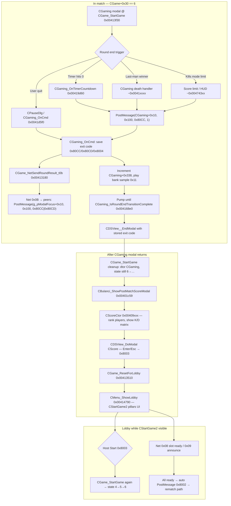

# Post-Match Lobby ("Pillars") and Scoring Summary

Reverse-engineered from `bulanci.exe`. This is the **same screen as pre-match lobby**
(`CStartGame2`), reused after a round ends. The distinctive vertical **slot pillars** are
`CColorSet` widgets (resource `0x10013`). The full-screen **scoring summary** is a separate
modal dialog, `CScore`, shown between `CGaming` teardown and return to `CStartGame2`.

Related docs: `main_menu.md` §4 (`CStartGame2` layout), `match_orchestration.md`
(state machine), `net_protocol.md` (msg `0x0B`, `0x08`/`0x09`), `lobby_ui.md` (pre-game
session browser only).

---

## 1. End-to-end flow (addresses)



### State byte `CGame+0x30`

| Value | Meaning in this flow |
|------:|---------------------|
| `6` | In `CGaming` modal; net handlers `0x0A`–`0x19` and `0x0B` active |
| `5` | Loading (`CLoadingLevel`) during `CGame_StartGame` |
| `4` | Initializing `CGaming` |
| `0` | After `CGame_ResetForLobby` — back in lobby/menu networking |

Net message `0x0B` is **ignored unless** `CGame+0x30 == 6` (`CGame_ProcessNetMessage` case `0x0B` @ `0x00415290`).

---

## 2. Round-end triggers → modal codes `0x80CC` / `0x80CD`

These are **not** dialog resource IDs; they are **engine command codes** posted to the active
modal view (`CDSView__PostMessage`, `msg_id=0x100`).

| Code | Set when | `CGame_NetSendRoundResult_t0b` `isWin` byte |
|------|----------|---------------------------------------------|
| `0x80CC` | Win / round complete (host posts with `arg0=1` on timer=0, last-man, kill limit) | `1` |
| `0x80CD` | Loss / abort (`CPauseDlg` Continue → `0x8003` maps to `0x80CD` with `arg0=1`) | `0` |
| `0x8004` | App-level quit (from score screen or menu) | (often not sent; local exit) |

**Host-only net send:** `CGame_NetSendRoundResult_t0b` @ `0x00413180` only calls
`CDSDirectPlay_Send` when `param_1 != 0` (local machine initiated end). Payload: 2 bytes —
`0x0B`, `isWin`. Receiver posts:

```c
CDSView__PostMessage(g_pModalFocus + 0x10, 0x100,
                     0x80CD - (isWin != 0), 0, 0);  // win → 0x80CC, loss → 0x80CD
```

**`CGaming_OnCmd` @ `0x0041d5f0`** (commands with `param_1 & 0x8000`):

1. First high-bit cmd while `CGaming+0x364 == -1`: store exit code, optionally send `0x0B`,
   bump `CGaming+0x338`, play sample `0x11`, wait on `CGaming_IsRoundEndTransitionComplete`
   (`CGaming+0x338 == 0`, decremented when poem/transition child finishes — see
   `CGaming_OnCustomEvent` case `1` in `match_orchestration.md`).
2. `CDSView__EndModal(this, exit_code)`.

**Poem / transition:** Round-end path shares the scrolling `CPoemScroller` transition
documented in `main_menu.md` / `match_orchestration.md` (`CGaming_OnCmd` wait loop).

---

## 3. Post-match scoring modal — `CScore`

| Item | Address / detail |
|------|------------------|
| Constructor | `CBulanci::CScoreCtor` @ `0x00409xxx` (decomp comment @ ~`0x00409b20` region) |
| Shown from | `CBulanci_ShowPostMatchScoreModal` @ `0x00401c59` (after `CGame_StartGame` returns) |
| Window | Full screen `800×600`, modal flag `0` |
| Dismiss | `CScore::OnKeyPress` @ `0x0040acxx` — Esc/Enter → `EndModal(0x8003)` |
| Vtables | `CScore` @ `0x00481000` … `0x0048104c` (`master_vtable_catalog.csv`) |

### Ranking algorithm

1. For each player `p` in `0 .. CGame+0xd8-1`, compute
   `score = CGameGetPlayerScoreForRanking(CGame, p)` @ `0x004126e0`.
2. `qsort` pairs `(playerIndex, score)` with comparator `FUN_0040abd0` (descending by score).
3. Layout one **column per rank** using `gAScoreRowAvatarXOffsets[]` and
   `gAScoreRowAnimHeights[]`.

### `CGameGetPlayerScoreForRanking` / per-mode stats

Uses `CGame+0x19c` (**gamemode index**):

| `CGame+0x19c` | Ranking score (`CGameGetPlayerScoreForMode`) | Tie-break in mode 2 |
|---------------|---------------------------------------------|---------------------|
| `0` | Kills only: `player+0xe6` | — |
| `1` | K-D: `player+0xe6 - player+0xfa` | — |
| `2` | Last-man: `CGame+0x1a6 - player+0xfa` (lives left) | If score==0, use `player+0xfe - 4` |

Per-player record (`0x23` bytes each, base `CGame+0xdc`):

| Offset | Field |
|--------|--------|
| `+0xe6` | Kills (also written during match) |
| `+0xfa` | Deaths |
| `+0xfe` | Lives / last-man state (values `4` = alive at lobby reset) |
| `+0xea..+0xf9` | Per-opponent kill matrix (4×`int`, used for tinted count labels) |

Caption strings: static pool indices `+0x184` (KILLS), `+0x16c` (DEATHS).

### Single-player extras

If `CGame+0xd8 == 1`: after ranking UI, loads `CLevelScore` via
`CGame_GetOrCreateLevelScore` and renders top-6 **level high scores** with column headers from
`gAScoreboardColumnLabelStringIds` / `gAScoreboardHighScoreColumnX`.

After `CScore` modal: `CLevelScore_AddPlayerScore` @ `0x00409b10` called from
`CGame_GetOrCreateLevelScore` path @ `0x00414280` with local player's kills/deaths.

Trophy anim at `(0x78, 0x32)` + `TriggerBankSample(2, 0x1d)`.

---

## 4. Return to pillars lobby — `CStartGame2`

| Item | Address |
|------|---------|
| Show lobby | `CMenu_ShowLobby` @ `0x00414790` |
| Lobby ctor | `CStartGame2_ctor` / `CMenu::CStartGame2_ctor` @ `0x004104f0` |
| Reset before re-show | `CGame_ResetForLobby` @ `0x00413510` |
| Lobby modal child | `CMenu_DoModalChild` @ `0x00413030`; active view stored at `CGame+500` (`0x1f4`) |

`CGame_ResetForLobby`:

- Sets `CGame+0x30 = 0`, clears demo/script hooks, sets `CGame+0x86 = 1` (lobby-active),
  frees scheduler children (`FUN_004130e0`), tears down DirectPlay wrapper side (`FUN_00412460`).

### "Pillars" UI structure

Each player slot column (up to `CGame+0xd8`):

| Widget | Class | Builder | Resource / notes |
|--------|-------|---------|------------------|
| **Pillar** | `CColorSet` | `CColorSet_ctor_slotPillar` @ `0x0040ffd0` | **`0x10013`** BitmapSpecial — tinted by team color @ `+0x69`, optional highlight frame when `+0x68 != 0xff` |
| Avatar stage | `CGameView` | `CGameView` @ `0x004191a0` | — |
| Walker | `CBulAnim` | `CDSAnim` + avatar tracks `0x100b4..0x100b7` | Random facing frame |
| Name | `CEdit` | `CEdit_BuildAt` | Pool `0x100af` |
| Kick (admin) | `CButton` | — | Pool index `0xc4` |

`CColorSet_Render` @ `0x0040aed0`: `BlitDispatch` pillar bitmap with palette alpha from
`WidgetStateFlags_ToTintColor`, then `FUN_00436530` selection rectangle on 4×4 grid inside pillar.

**Right column (multiplayer):** `CStartGame2_BuildLobbyChatPanel` @ `0x004102d0` — color switch,
chat label, `CChatList` + `CChatEdit` (only if `CGame+0x1dc` DirectPlay active).

**Gamemode caption:** `CStartGame2_UpdateGamemodeCaption` @ `0x0040d570` — formats string from
`DAT_004ae6fc + mode*4` via `CGameGetModeAndScoreLimit`.

**Bottom controls:**

| Control | Cmd | Position |
|---------|-----|----------|
| Back | `0x8002` | `(40, 466)` — disabled for admin |
| Start | `0x8003` | `(140, 466)` |
| Level list | — | `CLevelList` @ `this+0xb4` |

---

## 5. Network messages (lobby phase)

From `CGame_ProcessNetMessage` @ `0x00415290`:

| Type | Layout | Lobby effect |
|------|--------|--------------|
| `0x08` | `slot`, `newState` (2=loaded) | `CGame[slot*0xd + 0x16f] = state`; if all peers ready (`FUN_004125f0`), `PostMessage(CStartGame2+0x10, 0x100, 0x8002)` |
| `0x09` | `slot=1`, `value=0` | `BroadcastEvent(0xe3)` → chat/status line in `CChatList` |
| `0x07` | countdown byte | `CGame+0x1e8`; event `0xe2` to lobby UI |
| `0x0B` | `isWin` | Only in state `6`; forces `0x80CC`/`0x80CD` on **game** modal (not lobby) |

**Rematch:** Clients receiving `0x8002` on `CStartGame2` enter the same path as "all players
ready" (documented in `main_menu.md` §4.3) → `CGame_StartGame` @ `0x00413f30`.

**Host start:** `CGame_NetSendAdminByte_t64` (`0x64`) when admin commits; countdown via `0x07`.

---

## 6. Host vs client behavior

| Action | Host (`CGame+0x36 == 0`) | Client |
|--------|--------------------------|--------|
| End round (gameplay) | May send `0x0B` from `CGaming_OnCmd` | Receives `0x0B`, posts `0x80CC`/`0x80CD` locally |
| Timer expiry | `CGaming_OnTimerCountdown` sends `0x12` + posts `0x80CC` | Receives timer + result msgs |
| Last-man win detect | Posts `0x80CC` when one survivor | Same via net |
| Score screen | Local `CScore` modal after every match | Same |
| Level high-score write | `CLevelScore_AddPlayerScore` on local profile | Same (local registry) |
| Pick level | `CLevelList` visible; `0x05` SetLevel | List hidden; receives `0x05` |
| Start rematch | Start button → `0x64` + `CGame_StartGame` | Waits for `0x08`/`0x8002` chain |
| Back | `0x8002` exits lobby modal | Same (if enabled) |

Admin poll: `Scheduler_RegisterEventSlot(CStartGame2+0x70, 0, 500ms, event 7)` — drives
ready-state UI (`FUN_0040d520` toggles "duplicate serial" warning @ `this+0x40`).

---

## 7. Vtables (result / summary dialogs)

| Class | Primary vtable | Role |
|-------|--------------|------|
| `CScore` | `0x0048104c` | Post-match full-screen summary |
| `CScoreItem` | `0x00480488` | High-score row (`Serialize`/`Deserialize`) |
| `CLevelScore` | `0x00480450` | Per-level top-6 list (used inside `CScore` SP branch) |
| `CGameCounter` | (see catalog) | Loading screen only — **not** post-match |
| `CKeybShow` | via `CStartGame2::FUN_0040f7d0` | Control-help overlay (cmd `0xDA`/`0xD2-D4`) |
| `CColorSet` | `0x00480914` | Slot pillar |
| `CStartGame2` | `0x00480d4c` | Lobby shell |

---

## 8. Ghidra renames (this pass)

| Address | New name |
|---------|----------|
| `0x0040ffd0` | `CColorSet_ctor_slotPillar` |
| `0x0040aed0` | `CColorSet_Render` |
| `0x004102d0` | `CStartGame2_BuildLobbyChatPanel` |
| `0x0040d570` | `CStartGame2_UpdateGamemodeCaption` |
| `0x00413510` | `CGame_ResetForLobby` |
| `0x00401c59` | `CBulanci_ShowPostMatchScoreModal` |
| `0x004168e0` | `CGaming_IsRoundEndTransitionComplete` |

Already named elsewhere: `CGame_NetSendRoundResult_t0b`, `CGaming_OnCmd`, `CScoreCtor`,
`CMenu_ShowLobby`, `CGame_StartGame`, `CGame_ProcessNetMessage`.

---

## 9. Open questions

1. **`CGaming_ProcessRoundStateAndScoring` (`0x0041f350`)** — referenced in
   `map_slots_spawner.md` but not yet renamed/decompiled in export; likely central kill-limit
   and multi-player win detection before `0x80CC`.
2. **Exact `CStartGame2` command dispatcher** for `0x8002`/`0x8003` — buttons post
   `0x100`/cmd to parent; full handler may be inlined in `CDSView_DispatchEvent` /
   `CMenu` stack rather than a single `OnCmd` function.
3. **Whether `0x80CC`/`0x80CD` ever reach `CStartGame2`** — decomp shows them forwarded from
   setup dialog (`CBulanci` @ `0x004024xx`) and processed on **CGaming** modal; lobby uses
   `0x8002`/`0x8003` instead.
4. **Client scoreboard sync** — no net message updates kill matrix for remote `CScore`; all
   stats come from `CGame` player records updated during match (`0x0C` damage, deaths, etc.).
5. **Event `0xe2`/`0xe3` UI mapping** — countdown digit display and "player ready" chat lines;
   need xref on `CStartGame2::FUN_0040d6b0` cases `0xe0`–`0xe3`.

---

## 10. Quick reference diagram (UI layers)

```
[ CMenu modal stack ]
  └── CStartGame2  (760×560 @ 230,50)  ← "pillars" lobby
        ├── CColorSet × N   (res 0x10013)  ← pillars
        ├── CGameView + CBulAnim × N
        ├── CEdit (names), CButton (kick)
        ├── CLevelList, chat panel
        └── Back 0x8002 / Start 0x8003

[ Between matches — sibling modal ]
  └── CScore  (800×600 fullscreen)
        ├── ranked columns (avatar, name, K/D, kill matrix)
        ├── optional CLevelScore table (SP)
        └── trophy anim + sting
```
